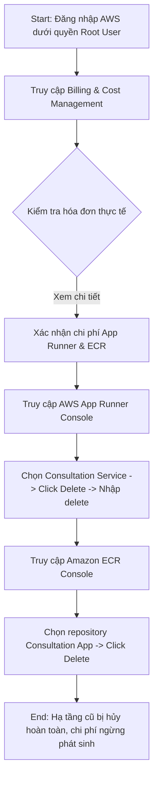
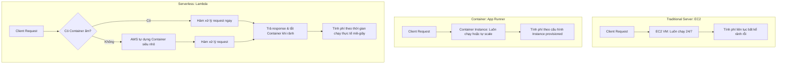
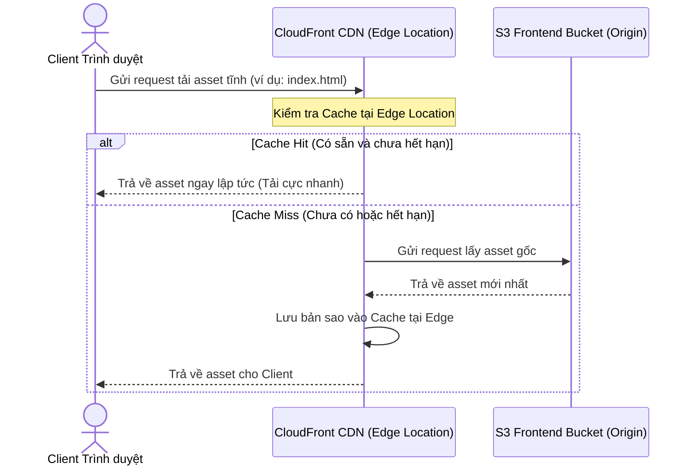
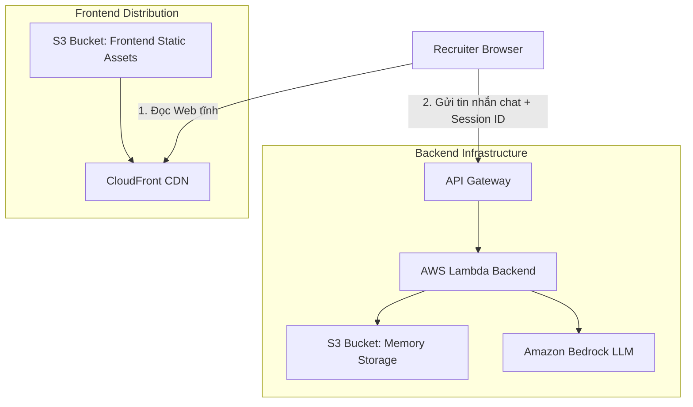

# 32. Day 1 - AWS Foundations for Production AI - From Console to Infrastructure

Course domain: AI Engineer Production Track: Deploy LLMs & Agents at Scale
Course name: AI Engineer Production Track: Deploy LLMs & Agents at Scale

## 1. Source Map - Bản đồ nguồn
- Transcript: đã dùng
- Slide: đã dùng
- Code: không có trực tiếp cho lesson này
- Summary lịch sử: không có
- Ghi chú về độ tin cậy hoặc mâu thuẫn giữa nguồn: Nội dung chủ yếu xoay quanh việc tổng kết Week 1, hướng dẫn dọn dẹp tài nguyên cũ trên AWS Console để kiểm soát chi phí và định hướng lộ trình học tập cho Week 2. Không có mâu thuẫn nào giữa các nguồn.

## 2. Executive Summary - Tóm tắt cốt lõi
- **Trọng tâm Week 2**: Tuần học này tập trung chuyên sâu vào hạ tầng Amazon Web Services (AWS) và tự động hóa triển khai sản phẩm AI, hướng tới xây dựng một hệ thống bền vững, có khả năng scale tốt và chuẩn doanh nghiệp.
- **Quy trình dọn dẹp tài nguyên (Cleanup)**: Để tránh phát sinh chi phí duy trì tài nguyên nhàn rỗi (idle cost), học viên bắt buộc phải đăng nhập dưới quyền root user để xóa bỏ hoàn toàn dịch vụ AWS App Runner và Docker image trong ECR (Elastic Container Registry) đã được triển khai từ Week 1.
- **Giám sát chi phí**: Sử dụng trang AWS Billing & Cost Management để theo dõi chi tiêu thực tế, đảm bảo không có chi phí ẩn phát sinh ngoài ý muốn.
- **Next.js App Router**: Định hướng phát triển frontend của tuần học này sẽ chuyển dịch sang Next.js App Router thay vì Pages Router của tuần trước để tối ưu hóa hiệu năng render phía server.
- **Infrastructure as Code (IaC) - Cơ sở hạ tầng dưới dạng mã**: Giới thiệu khái niệm IaC và công cụ Terraform để định nghĩa hạ tầng bằng code, giúp việc dựng và dọn hạ tầng diễn ra tự động chỉ bằng vài dòng lệnh.
- **Lý do chọn Terraform**: Chọn Terraform thay vì AWS CDK vì tính chất độc lập đám mây (cloud-agnostic), hỗ trợ đa nền tảng (multi-cloud bao gồm cả GCP, Azure) và là tiêu chuẩn tuyển dụng hàng đầu hiện nay.

## 3. Lesson Goals - Mục tiêu bài học
- **Concept goals - mục tiêu kiến thức**:
  - Hiểu rõ sự cần thiết và quy trình dọn dẹp hạ tầng thử nghiệm để tối ưu hóa chi phí (cost optimization).
  - Nắm vững lộ trình học tập: từ thao tác thủ công qua giao diện Console/CLI để hiểu bản chất của tài nguyên, sau đó nâng cấp lên tự động hóa hoàn toàn bằng Infrastructure as Code (IaC).
  - Hiểu lý do tại sao Terraform lại được lựa chọn làm công cụ IaC chính trong khóa học thay vì công cụ chính chủ AWS CDK.
  - Hiểu vai trò của GitHub Actions trong quy trình CI/CD tự động hóa đưa code từ repository lên AWS production.
- **Practical goals - mục tiêu thực hành**:
  - Đăng nhập vào AWS Console bằng tài khoản tối cao (Root user) một cách an toàn.
  - Thực hành kiểm tra hóa đơn và chi tiêu tại trang Billing & Cost Management.
  - Định vị và xóa bỏ thành công các instance App Runner và Docker repository trong ECR của dự án cũ.
- **What learner should be able to explain - người học cần giải thích được**:
  - Tại sao việc duy trì các Docker image dung lượng lớn trên ECR lại phát sinh chi phí hàng tháng mặc dù dịch vụ web đã tắt.
  - Sự khác biệt về mặt định hướng sử dụng giữa Terraform và AWS CDK.
  - Tại sao một kỹ sư AI thực thụ cần thành thạo kỹ năng Platform Engineering (quản lý hạ tầng cloud) thay vì chỉ gọi API mô hình thô.

## 4. Previous Context - Liên hệ với bài trước
- Bài học này liên kết trực tiếp với dự án Consultation App (Ứng dụng tư vấn y tế) đã hoàn thành ở cuối Week 1, yêu cầu dọn dẹp triệt để hạ tầng của dự án này trên AWS (App Runner và ECR) để chuẩn bị môi trường sạch cho dự án AI Digital Twin sắp tới.

## 5. Core Theory - Lý thuyết cốt lõi
- **Term - thuật ngữ**: Root user - Người dùng gốc
  - **Meaning - nghĩa**: Tài khoản tối cao của AWS, được tạo bằng địa chỉ email đăng ký ban đầu, sở hữu toàn quyền quản trị cao nhất trên toàn hệ thống mà không thể bị hạn chế.
  - **Why it matters - vì sao quan trọng**: Cần thiết khi thực hiện các tác vụ liên quan đến Billing, quản lý tài chính, đóng tài khoản hoặc dọn dẹp các tài nguyên bị kẹt mà tài khoản IAM thông thường không đủ thẩm quyền.
  - **Relationship - liên hệ với khái niệm khác**: Đối lập với IAM User (tài khoản con được phân quyền hạn chế theo nguyên tắc Least Privilege để vận hành hàng ngày).
- **Term - thuật ngữ**: Infrastructure as Code (IaC) - Cơ sở hạ tầng dưới dạng mã
  - **Meaning - nghĩa**: Phương pháp thiết lập và quản lý tài nguyên máy chủ, mạng, cơ sở dữ liệu trên cloud thông qua các file code khai báo (declarative configuration files) thay vì thao tác tay trên giao diện web đồ họa (GUI).
  - **Why it matters - vì sao quan trọng**: Loại bỏ hoàn toàn sai sót do con người khi click chuột thủ công, cho phép tái sử dụng hạ tầng, kiểm soát phiên bản cấu hình bằng Git và triển khai đồng loạt hàng trăm tài nguyên trong vài giây.
  - **Relationship - liên hệ với khái niệm khác**: Được triển khai thông qua các công cụ tiêu biểu như Terraform, AWS CloudFormation, hoặc AWS CDK.
- **Term - thuật ngữ**: Terraform
  - **Meaning - nghĩa**: Công cụ IaC mã nguồn mở do HashiCorp phát triển, sử dụng ngôn ngữ cấu hình HCL (HashiCorp Configuration Language) để khai báo hạ tầng.
  - **Why it matters - vì sao quan trọng**: Có tính chất độc lập nhà cung cấp (cloud-agnostic), cho phép lập trình viên quản lý tài nguyên của cả AWS, Google Cloud (GCP), Microsoft Azure... bằng cùng một cú pháp.
  - **Relationship - liên hệ với khái niệm khác**: Đối thủ cạnh tranh trực tiếp là AWS CDK, nhưng có lợi thế vượt trội về khả năng chạy đa nền tảng (multi-cloud).
- **Term - thuật ngữ**: CI/CD (Continuous Integration & Continuous Deployment) - Tích hợp liên tục & Triển khai liên tục
  - **Meaning - nghĩa**: Quy trình tự động hóa các khâu kiểm thử code mới và tự động triển khai mã nguồn sạch lên môi trường production mà không cần kỹ sư vận hành thủ công.
  - **Why it matters - vì sao quan trọng**: Giúp rút ngắn chu kỳ phát hành sản phẩm, đảm bảo code mới viết chạy ổn định và không làm hỏng ứng dụng đang chạy.
  - **Relationship - liên hệ với khái niệm khác**: Sẽ được triển khai thông qua công cụ GitHub Actions trong tuần này.

## 6. Workflow / Pipeline - Quy trình / luồng hoạt động
Quy trình dọn dẹp hạ tầng Week 1 để bảo toàn chi phí (Cost Management):

1. **Input**: Tài khoản root AWS, các service App Runner đang active và Docker image được push trong repository ECR của Week 1.
2. **Processing steps**:
   - Đăng nhập vào AWS Console bằng email và mật khẩu của Root User.
   - Di chuyển tới trang **Billing & Cost Management** để kiểm soát hóa đơn và cấu trúc tính phí.
   - Tìm kiếm và mở dịch vụ **AWS App Runner**. Chọn Consultation Service tương ứng, click menu **Actions** ở góc phải và chọn **Delete**. Nhập dòng chữ "delete" vào ô xác nhận để hệ thống tiến hành teardown instance.
   - Tìm kiếm dịch vụ **Elastic Container Registry (ECR)**. Chọn repository chứa Docker image của ứng dụng, click **Delete** để xóa bỏ hoàn toàn tệp tin ảnh nặng hàng GB khỏi đĩa lưu trữ đám mây.
3. **Output**: Hủy bỏ thành công các tài nguyên chạy ngầm của Week 1. Tránh phát sinh chi phí không mong muốn.
4. **Control flow / data flow**: Yêu cầu hủy được gửi từ trình duyệt qua giao diện HTTPS tới AWS Control Plane API để kích hoạt tiến trình giải phóng RAM/CPU của máy chủ vật lý và xóa block lưu trữ.
5. **Decision points**: Luôn quyết định xóa bỏ toàn bộ hạ tầng thử nghiệm (App Runner, ECR) ngay sau khi hoàn tất bài học trừ khi bạn đang vận hành một ứng dụng thực sự kiếm được doanh thu thương mại để duy trì.

## 7. Techniques - Kỹ thuật sử dụng
- **Technique - kỹ thuật**: Cloud Resource Cleanup - Dọn dẹp tài nguyên đám mây nhàn rỗi
  - **Purpose - mục đích**: Kiểm soát tối ưu hóa chi phí đám mây, triệt tiêu chi phí lãng phí từ tài nguyên chạy ngầm không sử dụng.
  - **When to use - dùng khi nào**: Ngay khi hoàn tất bài thực hành lab, kết thúc giai đoạn thử nghiệm hoặc khi muốn reset môi trường triển khai.
  - **Trade-off - đánh đổi**: Xóa tài nguyên đồng nghĩa với việc mất toàn bộ môi trường chạy trực tiếp của ứng dụng. Muốn chạy lại phải cấu hình từ đầu (được giải quyết triệt để nhờ việc học Terraform ở cuối tuần để tự động dựng lại).
  - **Common mistake - lỗi dễ gặp**: Nghĩ rằng chỉ cần tắt terminal local hoặc xóa code frontend trên Vercel là xong, quên mất backend server (App Runner instance) và Docker image lưu trữ trên ECR vẫn đang chạy ngầm và bị AWS tính phí theo thời gian thực.

## 8. Code Walkthrough - Phân tích code nếu có
`Code được cung cấp trong session nhưng chưa thấy code liên quan trực tiếp tới lesson này`

## 9. Options / Trade-offs - Bản đồ lựa chọn
So sánh các giải pháp quản lý và cấu hình cơ sở hạ tầng đám mây:
- **Option**: Cấu hình thủ công qua GUI AWS Console
  - **Pros**: Trực quan, dễ tiếp cận cho người mới bắt đầu, giúp hiểu rõ cấu trúc giao diện và các tùy chọn của từng dịch vụ đám mây.
  - **Cons**: Dễ click nhầm gây lỗi hệ thống, không có khả năng tái sử dụng, không thể theo dõi phiên bản thay đổi (no version history), tốn nhiều công sức khi quy mô ứng dụng lớn.
  - **When to choose**: Khi muốn tìm hiểu nhanh tính năng của một dịch vụ mới hoặc làm các bài lab thử nghiệm siêu nhỏ một lần duy nhất.
- **Option**: Sử dụng Terraform (IaC)
  - **Pros**: (Recommended) Độc lập đám mây (cloud-agnostic), hỗ trợ đa nền tảng (AWS, GCP, Azure), cú pháp khai báo HCL rõ ràng, dễ bảo trì, cho phép quản lý vòng đời hạ tầng bằng code và Git.
  - **Cons**: Đòi hỏi học cú pháp ngôn ngữ mới (HCL) và mất thời gian thiết lập file state ban đầu phức tạp hơn.
  - **When to choose**: Các dự án startup hoặc doanh nghiệp lớn cần hạ tầng ổn định, tự động hóa cao và có kế hoạch scale lớn hoặc multi-cloud.
- **Option**: Sử dụng AWS CDK (IaC)
  - **Pros**: Cho phép viết code hạ tầng bằng các ngôn ngữ lập trình phổ biến (Python, TypeScript, Java), tận dụng được thế mạnh hướng đối tượng và các thư viện sẵn có của AWS.
  - **Cons**: Bị khóa chặt vào hệ sinh thái AWS (vendor lock-in), không thể sử dụng để deploy tài nguyên trên Google Cloud hay Azure.
  - **When to choose**: Khi hệ thống cam kết sử dụng 100% dịch vụ AWS và đội ngũ kỹ sư muốn viết code hạ tầng bằng ngôn ngữ lập trình thuần túy thay vì viết file cấu hình khai báo.

## 10. Pitfalls - Lỗi / bẫy thường gặp
- **Failure mode**: Hóa đơn AWS tăng vọt đột ngột (bill shock).
  - **Root cause**: Quên không xóa bỏ tài nguyên sau khi thực hành (đặc biệt là App Runner duy trì RAM/vCPU liên tục và ECR lưu trữ file image nặng).
  - **Symptom**: Nhận được email cảnh báo hóa đơn từ AWS hoặc số dư tài khoản ngân hàng bị trừ lớn bất thường.
  - **Fix / prevention**: Thiết lập CloudWatch Billing Alarm để tự động gửi email cảnh báo khi chi phí vượt quá một hạn mức nhỏ (ví dụ $5). Luôn thực thi checklist dọn dẹp môi trường ngay sau khi học xong.

## 11. Knowledge Extension - Kiến thức mở rộng
- **AWS Cost Explorer**: Công cụ phân tích chi tiết cấu trúc chi phí của AWS, giúp bạn vẽ biểu đồ trực quan xem dịch vụ nào đang tiêu tốn nhiều tiền nhất theo ngày/giờ.
- **Terraform State File**: Tệp tin state (`.tfstate`) là "trái tim" của Terraform, lưu trữ bản đồ ánh xạ giữa code cấu hình của bạn và các tài nguyên thực tế chạy trên AWS. Tuyệt đối không được xóa hoặc chỉnh sửa file này bằng tay để tránh làm rách nát cấu trúc hạ tầng.

## 12. Study Pack - Gói ôn tập
### Must remember
1. AWS App Runner tính phí duy trì liên tục cho instance chạy ngầm, bắt buộc phải Delete khi không dùng.
2. ECR tính phí lưu trữ Docker image (storage cost), cần xóa bỏ repository để giải phóng dung lượng đĩa cloud.
3. Root user là tài khoản tối cao dùng để xử lý các vấn đề Billing và cleanup triệt để tài nguyên nhàn rỗi.
4. Terraform là công cụ Infrastructure as Code (IaC) đa nền tảng phổ biến nhất hiện nay.
5. AWS CDK là bộ công cụ định nghĩa hạ tầng bằng mã nguồn lập trình thông thường nhưng chỉ dành riêng cho AWS.

### Self-check questions
1. Tại sao dọn dẹp ECR lại quan trọng dù chi phí lưu trữ image rất nhỏ?
2. Điểm khác biệt lớn nhất giữa Root User và IAM User trong AWS là gì?
3. Tại sao tác giả khóa học khuyên học viên nên làm quen với click Console thủ công trước khi chuyển sang dùng Terraform?
4. IaC giải quyết những nhược điểm gì của phương pháp cấu hình hạ tầng truyền thống bằng tay?
5. CI/CD bằng GitHub Actions mang lại lợi ích gì cho việc deploy ứng dụng AI?

### Flashcards
- **Q**: IaC là gì?
  **A**: Infrastructure as Code - Phương pháp quản lý và cấu hình hạ tầng máy chủ, mạng thông qua các file code khai báo thay vì cấu hình thủ công.
- **Q**: AWS App Runner là gì?
  **A**: Dịch vụ Container as a Service (CaaS) của AWS giúp triển khai nhanh các web app chạy Docker mà không cần quản lý máy chủ hay Kubernetes.
- **Q**: Tại sao Terraform lại độc lập đám mây (cloud-agnostic)?
  **A**: Vì nó sử dụng cơ chế Providers (nhà cung cấp) riêng biệt cho từng nền tảng (AWS Provider, GCP Provider...), cho phép quản lý tài nguyên của bất kỳ cloud nào bằng một ngôn ngữ HCL duy nhất.

### Interview Q&A nếu phù hợp
- **Q**: Khi được yêu cầu triển khai hạ tầng cho một ứng dụng AI đa đám mây (multi-cloud), bạn chọn Terraform hay AWS CDK? Tại sao?
  **A**: Tôi sẽ chọn Terraform. Vì Terraform hỗ trợ đa đám mây (AWS, GCP, Azure, Oracle Cloud...) thông qua các provider tương ứng, giúp đồng nhất mã nguồn hạ tầng. AWS CDK chỉ hỗ trợ riêng cho AWS, nếu muốn chuyển đổi sang GCP hay Azure sẽ phải viết lại từ đầu bằng công cụ khác như Terraform hoặc Google Cloud Deployment Manager.

## 13. Missing Inputs - Còn thiếu gì
- Không có.

---

# 33. Day 1 - Cloud Deployment Architectures for Production AI Applications

Course domain: AI Engineer Production Track: Deploy LLMs & Agents at Scale
Course name: AI Engineer Production Track: Deploy LLMs & Agents at Scale

## 1. Source Map - Bản đồ nguồn
- Transcript: đã dùng
- Slide: đã dùng
- Code: không có trực tiếp cho lesson này
- Summary lịch sử: không có
- Ghi chú về độ tin cậy hoặc mâu thuẫn giữa nguồn: Bài học lý thuyết hệ thống hóa các kiến trúc triển khai cloud. Các nguồn thống nhất về mặt thuật ngữ và phân loại.

## 2. Executive Summary - Tóm tắt cốt lõi
- **5 kiến trúc cloud phổ biến**: Phân tích và phân loại hạ tầng triển khai thành 5 mô hình chính: IaaS, PaaS, CaaS, Container Orchestration, và Serverless FaaS.
- **Traditional Cloud Server (IaaS)**: Người dùng thuê máy chủ ảo (VM) nguyên bản và tự chịu trách nhiệm cấu hình từ OS, database cho tới runtime. Dịch vụ AWS tương ứng là **EC2**.
- **Platform as a Service (PaaS)**: Tối giản hóa hạ tầng, developer chỉ cần viết code, platform tự lo việc deploy, scaling và domain. Tiêu biểu là Vercel, Heroku và AWS **Elastic Beanstalk**.
- **Container as a Service (CaaS)**: Đóng gói app vào Docker container và deploy trực tiếp mà không cần cấu hình cụ thể hệ thống chạy ngầm. AWS tương ứng là **App Runner**.
- **Container Orchestration**: Giải pháp cao cấp sử dụng Kubernetes hoặc AWS **ECS/EKS** để quản lý, điều phối mạng lưới nhiều container chạy phối hợp ở quy mô lớn.
- **Serverless Architecture (FaaS)**: Mô hình chạy code theo hàm (event-driven), tự động scale theo tải thực tế và hỗ trợ scale-to-zero (không tính phí khi không có request). AWS tương ứng là **Lambda**.

## 3. Lesson Goals - Mục tiêu bài học
- **Concept goals - mục tiêu kiến thức**:
  - Phân biệt rõ ràng định nghĩa, ưu và nhược điểm của 5 mô hình triển khai cloud phổ biến.
  - Hiểu cách thức hoạt động của Serverless và lý do tại sao nó lại tối ưu về mặt chi phí cho các dự án AI quy mô vừa và nhỏ.
  - Nắm được cách ánh xạ (mapping) từng mô hình triển khai với các dịch vụ tương ứng trên AWS.
- **Practical goals - mục tiêu thực hành**:
  - Không có (bài học thuần lý thuyết kiến trúc hệ thống).
- **What learner should be able to explain - người học cần giải thích được**:
  - Sự khác nhau giữa việc quản lý ứng dụng trên máy chủ EC2 (IaaS) và Lambda (Serverless).
  - Khái niệm scale-to-zero và ý nghĩa tài chính của nó đối với startup.
  - Phân biệt giữa CaaS (App Runner) và các hệ thống Container Orchestration phức tạp (ECS/EKS/Kubernetes).

## 4. Previous Context - Liên hệ với bài trước
- Bài học này chuẩn hóa lý thuyết sau khi học viên đã trải nghiệm thực tế cả hai phương pháp triển khai ở Week 1: deploy frontend thông qua Vercel (mô hình PaaS) và deploy backend app chạy Docker qua AWS App Runner (mô hình CaaS).

## 5. Core Theory - Lý thuyết cốt lõi
- **Term - thuật ngữ**: Infrastructure as a Service (IaaS) - Cơ sở hạ tầng dưới dạng dịch vụ
  - **Meaning - nghĩa**: Mô hình cung cấp các tài nguyên máy tính cơ bản (như máy chủ ảo, dung lượng lưu trữ, mạng) thông qua ảo hóa, người dùng tự quản lý hệ điều hành và phần mềm.
  - **Why it matters - vì sao quan trọng**: Cung cấp quyền kiểm soát tối đa đối với cấu hình hệ thống bên dưới nhưng đòi hỏi công sức bảo trì cao.
  - **Relationship - liên hệ với khái niệm khác**: Dịch vụ đại diện là AWS EC2 (Elastic Compute Cloud).
- **Term - thuật ngữ**: Platform as a Service (PaaS) - Nền tảng dưới dạng dịch vụ
  - **Meaning - nghĩa**: Mô hình cung cấp môi trường chạy ứng dụng hoàn chỉnh, giúp lập trình viên chỉ cần tải code lên là chạy, không cần quan tâm đến hệ điều hành, máy chủ hay cập nhật bản vá bảo mật.
  - **Why it matters - vì sao quan trọng**: Tăng tốc độ đưa sản phẩm ra thị trường (time-to-market) nhờ loại bỏ các tác vụ quản trị hệ thống phức tạp.
  - **Relationship - liên hệ với khái niệm khác**: Vercel, Heroku, AWS Elastic Beanstalk.
- **Term - thuật ngữ**: Container as a Service (CaaS) - Container dưới dạng dịch vụ
  - **Meaning - nghĩa**: Mô hình cho phép người dùng tải lên các Docker image đã được đóng gói sẵn và chạy trực tiếp trên cloud dưới sự quản lý của nhà cung cấp.
  - **Why it matters - vì sao quan trọng**: Trung hòa giữa tính linh hoạt của container và tính đơn giản của PaaS.
  - **Relationship - liên hệ với khái niệm khác**: AWS App Runner, AWS ECS chạy Fargate.
- **Term - thuật ngữ**: Container Orchestration - Điều phối Container
  - **Meaning - nghĩa**: Việc tự động hóa các khâu triển khai, mở rộng, định tuyến và quản lý vòng đời của hàng loạt container chạy liên kết trong hệ thống microservices.
  - **Why it matters - vì sao quan trọng**: Cần thiết cho các ứng dụng doanh nghiệp quy mô lớn, có lưu lượng truy cập khổng lồ và kiến trúc phức tạp.
  - **Relationship - liên hệ với khái niệm khác**: Kubernetes (K8s), AWS ECS, AWS EKS.
- **Term - thuật ngữ**: Serverless / FaaS (Function as a Service) - Kiến trúc không máy chủ / Hàm dưới dạng dịch vụ
  - **Meaning - nghĩa**: Kiến trúc lập trình hướng sự kiện (event-driven), trong đó các hàm mã nguồn chỉ được kích hoạt, khởi chạy khi có request gửi tới và tự động tắt đi sau khi hoàn thành nhiệm vụ.
  - **Why it matters - vì sao quan trọng**: Khả năng mở rộng tự động gần như vô hạn và cơ chế tính phí strictly theo thời gian chạy thực tế của CPU, tối ưu chi phí tối đa.
  - **Relationship - liên hệ với khái niệm khác**: Dịch vụ cốt lõi là AWS Lambda.

## 6. Workflow / Pipeline - Quy trình / luồng hoạt động
Sơ đồ so sánh cơ chế định tuyến request (request routing) và vòng đời server (server lifecycle) của 3 mô hình tiêu biểu:

- **Luồng IaaS (EC2)**: Request -> Web Server (luôn chạy trên EC2 VM) -> Application (luôn chạy) -> Database (tính phí server liên tục 24/7).
- **Luồng Serverless (Lambda)**: Request (sự kiện) -> API Gateway -> Kích hoạt Lambda Instance (AWS tự dựng container chạy hàm trong mili-giây) -> Xử lý logic -> Trả response -> Lambda Instance tự tắt (scale-to-zero khi hết request).

## 7. Techniques - Kỹ thuật sử dụng
- **Technique - kỹ thuật**: Scale-to-Zero - Co giãn về không
  - **Purpose - mục đích**: Triệt tiêu hoàn toàn chi phí hạ tầng khi ứng dụng không có người truy cập.
  - **When to use - dùng khi nào**: Cực kỳ phù hợp cho môi trường phát triển (development), thử nghiệm (testing) hoặc các ứng dụng có lưu lượng truy cập không liên tục.
  - **Trade-off - đánh đổi**: Tránh lãng phí tiền bạc nhưng phải chấp nhận hiện tượng "cold start" (độ trễ phản hồi trong lần đầu tiên gọi hàm).
  - **Common mistake - lỗi dễ gặp**: Đặt serverless chạy các tác vụ nền kéo dài hoặc render trang web liên tục, làm phát sinh chi phí cao hơn cả thuê server EC2 cố định.

## 8. Code Walkthrough - Phân tích code nếu có
`Code được cung cấp trong session nhưng chưa thấy code liên quan trực tiếp tới lesson này`

## 9. Options / Trade-offs - Bản đồ lựa chọn
Bản đồ lựa chọn mô hình hạ tầng:
- **Option**: Thuê máy chủ EC2 (IaaS)
  - **Pros**: Kiểm soát toàn bộ hệ thống, hiệu năng ổn định, chạy được các app nặng liên tục 24/7.
  - **Cons**: Phải tự bảo trì bảo mật OS, tự cấu hình scaling phức tạp.
  - **When to choose**: Hệ thống database lớn, ứng dụng legacy hoặc tác vụ nặng chạy liên tục.
- **Option**: Deploy container qua AWS App Runner (CaaS)
  - **Pros**: Triển khai nhanh từ Docker image, scale tự động, không lo cấu hình server.
  - **Cons**: Bị giới hạn tùy chỉnh hạ tầng phần cứng ngầm.
  - **When to choose**: Các backend web app chạy Docker tiêu chuẩn, cần ổn định và deploy nhanh.
- **Option**: Sử dụng AWS Lambda (Serverless)
  - **Pros**: (Recommended) Tiết kiệm chi phí tối đa, chỉ tính tiền khi chạy hàm, tự động scale hoàn hảo.
  - **Cons**: Giới hạn thời gian chạy tối đa 15 phút, gặp hiện tượng cold start.
  - **When to choose**: Các API endpoints cho ứng dụng AI, chatbot, xử lý tác vụ background event-driven.

## 10. Pitfalls - Lỗi / bẫy thường gặp
- **Failure mode**: Cold Start latency - Độ trễ khởi động lạnh
  - **Root cause**: AWS giải phóng container chứa hàm Lambda khi lâu không có request. Khi có request mới đến, AWS phải mất thời gian khởi chạy container và nạp runtime từ đầu.
  - **Symptom**: Người dùng đầu tiên sau một khoảng thời gian dài bị trễ phản hồi (loading lâu vài giây).
  - **Fix / prevention**: Giảm dung lượng package deploy, chọn ngôn ngữ khởi động nhanh (Python, Node.js), sử dụng Provisioned Concurrency (trả thêm phí để giữ ấm hàm) hoặc setup cron job định kỳ tự kích hoạt hàm (warm up).

## 11. Knowledge Extension - Kiến thức mở rộng
- **Vendor Lock-in - Khóa chặt nhà cung cấp**: Khi viết code phụ thuộc quá nhiều vào các dịch vụ FaaS đặc thù như AWS Lambda, việc di chuyển ứng dụng sang các cloud khác như Google Cloud (Cloud Functions) hay Azure (Azure Functions) sẽ gặp khó khăn và tốn kém chi phí viết lại adapter.

## 12. Study Pack - Gói ôn tập
### Must remember
1. EC2 đại diện cho IaaS (Infrastructure as a Service) - tự cấu hình từ OS trở lên.
2. Vercel và Elastic Beanstalk đại diện cho PaaS (Platform as a Service) - chỉ cần upload code.
3. App Runner đại diện cho CaaS (Container as a Service) - chạy Docker container nhanh chóng.
4. Lambda đại diện cho Serverless/FaaS - tính tiền strictly theo mili-giây CPU thực chạy, hỗ trợ scale-to-zero.
5. ECS và EKS dùng cho Container Orchestration ở các hệ thống cực lớn cần phối hợp hàng trăm container.

### Self-check questions
1. Giải thích sự khác nhau về trách nhiệm quản trị hệ thống giữa EC2 (IaaS) và App Runner (CaaS)?
2. Tại sao Lambda lại được gọi là mô hình triển khai "Serverless" trong khi bản chất vẫn có server vật lý chạy code?
3. Cold start xảy ra khi nào trong kiến trúc Serverless?
4. Khi nào một solo-developer nên chọn Vercel thay vì tự dựng hạ tầng trên AWS?
5. Điểm giống và khác nhau giữa ECS và EKS is gì?

### Flashcards
- **Q**: Khái niệm FaaS là gì?
  **A**: Function as a Service - Mô hình chạy code dưới dạng các hàm độc lập được kích hoạt bởi sự kiện mà không cần quản lý máy chủ.
- **Q**: EC2 hoạt động ở tầng nào của mô hình dịch vụ đám mây?
  **A**: Tầng IaaS (Infrastructure as a Service).
- **Q**: Cơ chế tính phí của AWS Lambda dựa trên những yếu tố nào?
  **A**: Số lượng request gửi tới hàm và thời gian thực thi của CPU (mili-giây) nhân với lượng bộ nhớ RAM được cấu hình cho hàm.

### Interview Q&A nếu phù hợp
- **Q**: Hãy phân biệt sự khác nhau về cơ chế tính phí giữa AWS EC2 và AWS Lambda.
  **A**: AWS EC2 tính phí liên tục theo giờ hoặc giây dựa trên cấu hình phần cứng đã chọn (bất kể máy chủ có xử lý request hay nằm chạy không tải). AWS Lambda chỉ tính phí khi có request được kích hoạt, tính theo số lần request và thời gian thực thi của hàm (đơn vị mili-giây) nhân với lượng bộ nhớ RAM được cấu hình. Khi không có request, Lambda không phát sinh chi phí (scale to zero).

## 13. Missing Inputs - Còn thiếu gì
- Không có.

---

# 34. Day 1 - AWS Cloud Components for Production AI - S3, Lambda, and Bedrock

Course domain: AI Engineer Production Track: Deploy LLMs & Agents at Scale
Course name: AI Engineer Production Track: Deploy LLMs & Agents at Scale

## 1. Source Map - Bản đồ nguồn
- Transcript: đã dùng
- Slide: đã dùng
- Code: không có trực tiếp cho lesson này
- Summary lịch sử: không có
- Ghi chú về độ tin cậy hoặc mâu thuẫn giữa nguồn: Bài học lý thuyết chi tiết về các AWS component chính. Không có sự mâu thuẫn hay không nhất quán giữa các tài liệu.

## 2. Executive Summary - Tóm tắt cốt lõi
- **Amazon S3**: Dịch vụ lưu trữ đối tượng (object storage) đơn giản, tổ chức dưới dạng các "bucket" đóng vai trò như ổ đĩa chia sẻ trên cloud.
- **AWS Lambda**: Dịch vụ chạy code serverless theo hàm, chỉ tính phí dựa trên số chu kỳ CPU clock và RAM thực tế tiêu thụ.
- **Amazon CloudFront**: Mạng phân phối nội dung (CDN) giúp phân phối các tệp tin tĩnh (assets) tới các Edge Locations gần người dùng nhất trên toàn thế giới, tối ưu độ trễ tải trang.
- **Amazon API Gateway**: Cổng kết nối API an toàn đứng trước Lambda, quản lý định tuyến HTTP, CORS, rate-limiting và nâng cao tính bảo mật.
- **Amazon Bedrock**: Dịch vụ API trung gian cho phép kết nối trực tiếp đến các Frontier Models (LLMs) hàng đầu (như Anthropic Claude, Meta Llama) mà không cần quản lý hạ tầng GPU phức tạp.
- **Quy tắc đặt tên thương hiệu**: Phân biệt cách đặt tên "Amazon" (dành cho dịch vụ sơ khởi hoặc hướng tới khách hàng đại chúng) và "AWS" (dành cho các dịch vụ kỹ thuật thuần tuý cho lập trình viên).

## 3. Lesson Goals - Mục tiêu bài học
- **Concept goals - mục tiêu kiến thức**:
  - Nắm vững kiến trúc và nhiệm vụ của 5 thành phần AWS cốt lõi (S3, Lambda, CloudFront, API Gateway, Bedrock).
  - Hiểu nguyên lý hoạt động của CDN (Content Delivery Network) và cách thức CloudFront cải thiện hiệu suất ứng dụng.
  - Hiểu tầm quan trọng của việc đặt API Gateway đứng trước AWS Lambda trong môi trường doanh nghiệp (enterprise setup).
- **Practical goals - mục tiêu thực hành**:
  - Không có (bài học thuần lý thuyết về cấu trúc dịch vụ).
- **What learner should be able to explain - người học cần giải thích được**:
  - Cách phân biệt và lý do sử dụng thương hiệu Amazon vs AWS của hãng.
  - Tại sao không nên gọi trực tiếp Lambda từ client mà nên cấu hình thông qua API Gateway.
  - S3 lưu trữ dữ liệu theo cơ chế nào và khái niệm "bucket" là gì.

## 4. Previous Context - Liên hệ với bài trước
- Bài học này đi sâu vào chi tiết kỹ thuật của từng thành phần AWS đã được đề cập tổng quan ở bài 33 (Cloud Deployment Architectures), chuẩn bị các viên gạch nền móng để dựng sơ đồ thiết kế hệ thống ở bài 35.

## 5. Core Theory - Lý thuyết cốt lõi
- **Term - thuật ngữ**: Amazon S3 (Simple Storage Service) - Dịch vụ lưu trữ đơn giản
  - **Meaning - nghĩa**: Dịch vụ lưu trữ đối tượng (object storage) trên cloud, lưu trữ dữ liệu dưới dạng key-value bên trong các phân vùng được đặt tên là "bucket".
  - **Why it matters - vì sao quan trọng**: Cho phép lưu trữ dữ liệu tĩnh (tệp tin, ảnh, JSON) quy mô không giới hạn, độ bền cao, giá thành rẻ.
  - **Relationship - liên hệ với khái niệm khác**: Trong dự án, S3 được dùng làm nơi chứa static frontend (HTML/JS/CSS) và chứa tệp tin JSON ghi nhớ hội thoại (memory storage) cho chatbot backend.
- **Term - thuật ngữ**: Content Delivery Network (CDN) - Mạng phân phối nội dung
  - **Meaning - nghĩa**: Hệ thống các máy chủ đệm (caching servers) phân bố ở nhiều khu vực địa lý trên toàn cầu nhằm cung cấp nội dung nhanh hơn cho người dùng.
  - **Why it matters - vì sao quan trọng**: Giảm tải cho máy chủ gốc và tăng tốc độ hiển thị giao diện trang web đối với khách truy cập ở xa.
  - **Relationship - liên hệ với khái niệm khác**: Dịch vụ CDN của AWS được gọi là Amazon CloudFront.
- **Term - thuật ngữ**: Amazon CloudFront
  - **Meaning - nghĩa**: Dịch vụ CDN bảo mật cao của AWS giúp phân phối toàn cầu các tệp tin tĩnh (HTML, CSS, JS, media) từ S3 nguồn tới người dùng cuối với độ trễ tối thiểu.
  - **Why it matters - vì sao quan trọng**: Giúp frontend Next.js của ứng dụng AI tải tức thì bất kể người dùng ở đâu trên thế giới.
  - **Relationship - liên hệ với khái niệm khác**: Kết nối trực tiếp với S3 bucket (Origin) để đồng bộ và cache dữ liệu tại Edge Locations.
- **Term - thuật ngữ**: Amazon API Gateway
  - **Meaning - nghĩa**: Dịch vụ quản lý API hoàn chỉnh, đóng vai trò như một proxy bảo mật trung gian tiếp nhận các request từ clients và định tuyến tới backend services.
  - **Why it matters - vì sao quan trọng**: Cung cấp khả năng rate-limiting (chống spam API), xử lý CORS, chứng thực và giám sát tập trung lưu lượng truy cập.
  - **Relationship - liên hệ với khái niệm khác**: Đứng trước AWS Lambda để nhận các HTTP request từ frontend browser và chuyển thành các event kích hoạt hàm Lambda.
- **Term - thuật ngữ**: Amazon Bedrock
  - **Meaning - nghĩa**: Dịch vụ trung gian quản lý API để tương tác với các Foundation Models (LMs) lớn của các bên thứ ba và chính Amazon thông qua một giao diện lập trình thống nhất.
  - **Why it matters - vì sao quan trọng**: Loại bỏ gánh nặng vận hành phần cứng GPU, cho phép lập trình viên tích hợp các mô hình LLM mạnh mẽ nhất thế giới một cách nhanh chóng và an toàn bảo mật.
  - **Relationship - liên hệ với khái niệm khác**: Là công cụ AI suy luận chính được gọi từ hàm Lambda backend.

## 6. Workflow / Pipeline - Quy trình / luồng hoạt động
Sơ đồ phân phối nội dung tĩnh thông qua Edge Caching của CloudFront:

1. **Input**: Tệp tin frontend tĩnh (static assets) lưu trong S3 Bucket nguồn (Origin S3 Bucket).
2. **Processing steps**:
   - Client gửi yêu cầu tải tệp tin (ví dụ: `index.html`) qua trình duyệt.
   - Request được định tuyến tới CloudFront Edge Location gần nhất về mặt địa lý.
   - CloudFront Edge Location kiểm tra cache:
     - *Trường hợp 1 (Cache Hit)*: Tệp tin có sẵn trong cache và chưa hết hạn (TTL). CloudFront trả ngay lập tức cho client.
     - *Trường hợp 2 (Cache Miss)*: Tệp tin chưa có hoặc đã hết hạn. CloudFront gửi yêu cầu ngược về S3 Origin để lấy tệp tin mới nhất -> Lưu bản sao vào cache tại Edge -> Trả tệp tin về cho client.
3. **Output**: Client tải được giao diện trang web với tốc độ cao nhất, S3 Origin giảm thiểu được số lượng request xử lý trực tiếp.
4. **Control flow / data flow**: Client Browser <-> CloudFront Edge Location <-> S3 Origin Bucket.
5. **Decision points**: Cấu hình Time-to-Live (TTL) cho cache. TTL lớn giúp tối ưu tải cho origin nhưng làm chậm tốc độ cập nhật phiên bản mới, cần cân nhắc thiết lập cơ chế Invalidation khi deploy.

## 7. Techniques - Kỹ thuật sử dụng
- **Technique - kỹ thuật**: Edge Caching - Lưu trữ đệm tại biên
  - **Purpose - mục đích**: Tối ưu hóa thời gian phản hồi mạng (latency) bằng cách lưu trữ tạm thời nội dung tĩnh gần người dùng cuối nhất có thể.
  - **When to use - dùng khi nào**: Dành cho tất cả các static assets của ứng dụng như file code frontend compiled, hình ảnh, font chữ.
  - **Trade-off - đánh đổi**: Cải thiện hiệu năng vượt trội nhưng phải chấp nhận rủi ro người dùng tải dữ liệu cũ nếu cấu hình thời gian hết hạn cache (TTL) quá dài mà không có cơ chế invalidation.
  - **Common mistake - lỗi dễ gặp**: Triển khai phiên bản web mới lên S3 nhưng không yêu cầu CloudFront làm mới cache (Invalidation), dẫn đến trình duyệt người dùng vẫn hiển thị trang web cũ bị lỗi không khớp API.

## 8. Code Walkthrough - Phân tích code nếu có
`Code được cung cấp trong session nhưng chưa thấy code liên quan trực tiếp tới lesson này`

## 9. Options / Trade-offs - Bản đồ lựa chọn
So sánh phương pháp truy cập backend Lambda trực tiếp và qua API Gateway:
- **Option**: Sử dụng AWS Lambda Function URL (gọi trực tiếp Lambda)
  - **Pros**: Cực kỳ đơn giản, thiết lập nhanh trong vài giây, không tốn thêm chi phí trung gian của dịch vụ khác.
  - **Cons**: Thiếu các tính năng bảo mật nâng cao như rate-limiting, IP blocking, không có công cụ quản lý API Key tập trung, khó tích hợp custom domains lớn.
  - **When to choose**: Các buổi thực hành nhanh, API thử nghiệm nhỏ hoặc webhook nội bộ không yêu cầu khắt khe về bảo mật.
- **Option**: Đặt API Gateway đứng trước AWS Lambda
  - **Pros**: (Recommended) Đầy đủ tính năng chuẩn doanh nghiệp (bảo mật, rate-limiting, CORS handling), dễ dàng định tuyến nhiều subdomain/endpoint tới các Lambda khác nhau.
  - **Cons**: Cấu hình phức tạp hơn nhiều bước, phát sinh thêm chi phí nhỏ theo lưu lượng request qua Gateway.
  - **When to choose**: Các dự án thực tế chạy production thực tế phục vụ khách hàng, ứng dụng full-stack cần cấu hình CORS chặt chẽ.

## 10. Pitfalls - Lỗi / bẫy thường gặp
- **Failure mode**: CORS (Cross-Origin Resource Sharing) block error - Lỗi chặn chia sẻ tài nguyên nguồn gốc chéo.
  - **Root cause**: Trình duyệt web của người dùng thực thi chính sách bảo mật ngăn không cho mã JavaScript gửi request HTTP tới một domain khác với domain của trang web hiện tại, trừ khi server nhận request trả về header đồng ý (`Access-Control-Allow-Origin`).
  - **Symptom**: Ứng dụng frontend không hiển thị kết quả chat từ API, kiểm tra Console trình duyệt thấy báo lỗi CORS.
  - **Fix / prevention**: Cấu hình CORS một cách rõ ràng trên API Gateway hoặc kích hoạt CORS Middleware trong mã nguồn backend (FastAPI) để chấp nhận domain frontend (ví dụ: domain CloudFront hoặc localhost:3000).

## 11. Knowledge Extension - Kiến thức mở rộng
- **Amazon Bedrock Agentic Capability**: Bedrock không chỉ cung cấp các API LLM thô mà còn tích hợp sẵn nền tảng orchestration cho Agent. Nó giúp tự động phân tích câu lệnh của người dùng, tự động chia nhỏ công việc và kích hoạt các API bên ngoài thông qua các hàm AWS Lambda liên kết (Action Groups).

## 12. Study Pack - Gói ôn tập
### Must remember
1. S3 lưu trữ đối tượng tĩnh trong các Bucket, tương tự như ổ đĩa dùng chung trên cloud.
2. CloudFront là CDN giúp tăng tốc tải trang web toàn cầu bằng Edge Caching tại Edge Locations gần người dùng.
3. API Gateway đóng vai trò làm proxy kiểm soát tải, xử lý CORS và bảo mật trước khi trigger Lambda.
4. Bedrock là cổng API kết nối đa mô hình LLM (Claude, Llama...) do Amazon quản lý.
5. Thương hiệu "Amazon" dùng cho dịch vụ đại chúng/sơ khởi, thương hiệu "AWS" dùng cho dịch vụ chuyên sâu cho kỹ sư mang tên "AWS" (Lambda).

### Self-check questions
1. Tại sao nói CloudFront Edge Location giúp giảm tải băng thông cho S3 Origin?
2. Sự khác nhau giữa cơ chế lưu trữ của Amazon S3 (Object Storage) và ổ đĩa máy chủ thông thường (Block Storage) là gì?
3. Cold start ảnh hưởng thế nào đến các hàm Lambda ít khi được kích hoạt?
4. Tại sao các doanh nghiệp lại coi API Gateway là một thành phần bắt buộc khi triển khai Microservices?
5. Amazon Bedrock kết nối các mô hình thông qua phương thức nào? Có cần tự quản lý GPU không?

### Flashcards
- **Q**: Khái niệm CDN là gì?
  **A**: Content Delivery Network - Mạng lưới máy chủ phân phối nội dung tĩnh nằm ở nhiều vị trí địa lý khác nhau để phục vụ người dùng nhanh nhất.
- **Q**: Tại sao cấu hình CORS lại quan trọng đối với API Gateway?
  **A**: Vì nếu không cấu hình CORS cho phép, trình duyệt web chạy frontend ở domain khác sẽ chặn mọi response từ API Gateway gửi về.
- **Q**: Lợi ích lớn nhất của Amazon Bedrock so với việc tự chạy model trên máy chủ EC2 là gì?
  **A**: Serverless hoàn toàn, thanh toán theo lượng token sử dụng, không cần quan tâm setup driver, CUDA hay quản lý máy chủ GPU đắt đỏ.

### Interview Q&A nếu phù hợp
- **Q**: Khi deploy ứng dụng React trên S3 và API Backend trên Lambda, bạn cấu hình định tuyến như thế nào qua CloudFront và API Gateway để tránh lỗi CORS một cách triệt để nhất?
  **A**: Để tránh lỗi CORS triệt để mà không cần mở CORS wildcard nguy hiểm, ta có thể cấu hình **CloudFront làm điểm tiếp nhận duy nhất (Single Domain)**. Ta tạo một CloudFront Distribution:
  - Cấu hình Default Behavior (`/*`) định tuyến về S3 Origin để phục vụ trang tĩnh frontend React.
  - Cấu hình một Behavior bổ sung (ví dụ `/api/*`) định tuyến về API Gateway Origin.
  Như vậy, cả frontend và backend đều chạy chung dưới một domain duy nhất của CloudFront, loại bỏ hoàn toàn việc gửi request chéo domain (cross-origin), từ đó loại bỏ triệt để lỗi CORS ở trình duyệt mà không cần can thiệp sâu vào cấu hình header.

## 13. Missing Inputs - Còn thiếu gì
- Không có.

---

# 35. Day 1 - Building Your Digital Twin - AWS Lambda + Bedrock Architecture Setup

Course domain: AI Engineer Production Track: Deploy LLMs & Agents at Scale
Course name: AI Engineer Production Track: Deploy LLMs & Agents at Scale

## 1. Source Map - Bản đồ nguồn
- Transcript: đã dùng
- Slide: đã dùng
- Code: không có trực tiếp cho lesson này
- Summary lịch sử: không có
- Ghi chú về độ tin cậy hoặc mâu thuẫn giữa nguồn: Bài học giới thiệu kiến trúc tổng thể và giải thích lý thuyết về bộ nhớ chatbot. Các nguồn tài liệu thống nhất về mô tả luồng dữ liệu.

## 2. Executive Summary - Tóm tắt cốt lõi
- **AI Digital Twin Mk2**: Chatbot đại diện cho hồ sơ năng lực, kinh nghiệm của học viên để tương tác trực tuyến với nhà tuyển dụng, quản lý thay thế cho CV truyền thống.
- **Sơ đồ hạ tầng Production**:
  - *Backend*: AWS Lambda xử lý logic chính, kết nối với Amazon Bedrock để gọi LLM và tương tác với một S3 Bucket làm nơi lưu trữ bộ nhớ (Memory S3 Bucket). API Gateway đóng vai trò làm cổng API công khai.
  - *Frontend*: Next.js App Router được build thành web tĩnh (static export), lưu trữ tại Frontend S3 Bucket và phân phối qua CDN CloudFront.
- **Bản chất Stateless của LLM**: Các mô hình LLM mặc định không có ký ức giữa các lần gọi API. Để duy trì cuộc trò chuyện liên tục, lập trình viên phải truyền kèm toàn bộ lịch sử hội thoại trước đó vào context trong mỗi lượt chat mới.
- **Chiến lược triển khai**: Ngày 1 tập trung xây dựng phiên bản chạy local hoàn chỉnh (FastAPI + NextJS App Router + local JSON memory files) để kiểm chứng logic trước khi migrate lên hạ tầng AWS ở Ngày 2.

## 3. Lesson Goals - Mục tiêu bài học
- **Concept goals - mục tiêu kiến thức**:
  - Hiểu rõ sơ đồ kiến trúc và luồng dữ liệu End-to-End của ứng dụng AI Digital Twin Mk2 trên AWS.
  - Nắm vững khái niệm stateless của LLM và nguyên lý thiết lập Conversational Memory.
  - Hiểu rõ lộ trình phát triển: kiểm thử ổn định logic bộ nhớ ở môi trường local trước khi đưa lên môi trường cloud phức tạp.
- **Practical goals - mục tiêu thực hành**:
  - Không có (bài học thiết lập mô hình kiến trúc hạ tầng và chuẩn bị tâm lý cho việc deploy).
- **What learner should be able to explain - người học cần giải thích được**:
  - Tại sao hệ thống cần phân tách làm 2 S3 bucket với nhiệm vụ riêng biệt.
  - Cơ chế hoạt động của Conversational Memory ở mức kiến trúc.
  - Vai trò của từng thành phần (Lambda, S3, API Gateway, CloudFront, Bedrock) trong sơ đồ tổng thể.

## 4. Previous Context - Liên hệ với bài trước
- Bài học này tích hợp các mảnh ghép dịch vụ đơn lẻ của AWS đã được phân tích ở bài 34 (S3, Lambda, CloudFront, API Gateway, Bedrock) thành một hệ thống full-stack AI hoàn chỉnh và thực tế.

## 5. Core Theory - Lý thuyết cốt lõi
- **Term - thuật ngữ**: Stateless LLM - Mô hình ngôn ngữ lớn không lưu trạng thái
  - **Meaning - nghĩa**: Trạng thái hoạt động của mô hình AI mà trong đó mỗi request gửi lên được xử lý độc lập hoàn toàn, không lưu trữ thông tin hay ngữ cảnh của các request trước đó.
  - **Why it matters - vì sao quan trọng**: Đòi hỏi nhà phát triển phải tự xây dựng cơ chế lưu trữ và nạp lịch sử chat thủ công nếu muốn ứng dụng chatbot có khả năng đối thoại tự nhiên.
  - **Relationship - liên hệ với khái niệm khác**: Đối lập hoàn toàn với Stateful Application (ứng dụng lưu trữ trạng thái phiên làm việc).
- **Term - thuật ngữ**: Conversational Memory - Bộ nhớ hội thoại
  - **Meaning - nghĩa**: Kỹ thuật lưu trữ và nạp lại lịch sử các câu hỏi của người dùng và câu trả lời của AI để đưa vào context window của LLM trong lần gọi tiếp theo.
  - **Why it matters - vì sao quan trọng**: Giúp chatbot hiểu được ngữ cảnh hội thoại, các đại từ nhân xưng tham chiếu và trả lời nhất quán.
  - **Relationship - liên hệ với khái niệm khác**: Dữ liệu bộ nhớ được lưu dưới dạng file JSON gắn với một `session_id` trong S3 bucket.

## 6. Workflow / Pipeline - Quy trình / luồng hoạt động
Sơ đồ kiến trúc triển khai tổng thể của Production AI Digital Twin Mk2 trên AWS:

Quy trình hoạt động End-to-End của Production AI Digital Twin Mk2:
1. **Input**: Người dùng nhập tin nhắn chat trên giao diện trình duyệt web.
2. **Processing steps**:
   - Trình duyệt gửi request HTTP POST chứa tin nhắn và `session_id` (nếu có) tới API Gateway.
   - API Gateway tiếp nhận, kiểm tra CORS và chuyển tiếp yêu cầu tới backend Lambda.
   - Lambda nhận request, tìm kiếm `session_id`. Nếu có, Lambda truy vấn vào **Memory S3 Bucket** để tải file JSON lịch sử trò chuyện.
   - Lambda tạo mảng tin nhắn bao gồm: `[System prompt chứa personality] + [Lịch sử hội thoại cũ tải từ S3] + [Tin nhắn mới của user]`.
   - Lambda gọi API gửi mảng tin nhắn này tới **Amazon Bedrock** để thực hiện suy luận.
   - Bedrock xử lý và trả kết quả phản hồi của LLM về cho Lambda.
   - Lambda lưu tin nhắn mới của user và phản hồi của LLM vào lịch sử hội thoại, rồi lưu đè file JSON cập nhật trở lại **Memory S3 Bucket**.
   - Lambda đóng gói dữ liệu phản hồi trả về qua API Gateway.
   - API Gateway chuyển tiếp response về cho frontend browser hiển thị.
3. **Output**: Giao diện hiển thị tin nhắn phản hồi của AI và cuộc hội thoại được lưu giữ an toàn.
4. **Control flow / data flow**: Browser -> API Gateway -> Lambda -> S3 & Bedrock -> Lambda -> API Gateway -> Browser.
5. **Decision points**: Nếu request gửi lên không kèm `session_id`, Lambda sẽ tự động tạo một session mới bằng cách sinh chuỗi ngẫu nhiên UUID và tạo mới file JSON lưu trong S3.

## 7. Techniques - Kỹ thuật sử dụng
- **Technique - kỹ thuật**: Context History Injecting - Nhúng lịch sử hội thoại vào ngữ cảnh
  - **Purpose - mục đích**: Duy trì trạng thái hội thoại (stateful) cho mô hình stateless LLM.
  - **When to use - dùng khi nào**: Bắt buộc sử dụng cho mọi chatbot có tính năng đối thoại qua lại nhiều lượt (multi-turn conversation).
  - **Trade-off - đánh đổi**: Giúp AI thông minh và nhớ ngữ cảnh nhưng làm tăng đáng kể kích thước đầu vào (input tokens) qua mỗi lượt chat, dẫn đến chi phí sử dụng API tăng dần theo độ dài cuộc trò chuyện.
  - **Common mistake - lỗi dễ gặp**: Gửi toàn bộ lịch sử trò chuyện quá dài làm tràn cửa sổ ngữ cảnh (Context Window) của LLM hoặc phát sinh chi phí quá lớn ngoài tầm kiểm soát.

## 8. Code Walkthrough - Phân tích code nếu có
`Code được cung cấp trong session nhưng chưa thấy code liên quan trực tiếp tới lesson này`

## 9. Options / Trade-offs - Bản đồ lựa chọn
So sánh các phương pháp quản lý Conversational Memory ở Backend:
- **Option**: Sử dụng File-based (S3 Bucket / JSON files)
  - **Pros**: Thiết lập cực kỳ đơn giản, nhanh chóng, không tốn công cấu hình database, chi phí lưu trữ tệp tin tĩnh cực kỳ rẻ.
  - **Cons**: Tốc độ đọc/ghi file từ S3 chậm hơn so với database chuyên dụng (độ trễ cao hơn), khó truy vấn hoặc phân tích dữ liệu chat nâng cao.
  - **When to choose**: (Recommended) Cho các ứng dụng chatbot quy mô nhỏ và vừa, cần dựng nhanh hạ tầng tối giản chi phí.
- **Option**: Sử dụng NoSQL Database (AWS DynamoDB)
  - **Pros**: Tốc độ đọc ghi cực nhanh (single-digit millisecond), khả năng mở rộng tự động và tính sẵn sàng cao, hỗ trợ khóa session tốt.
  - **Cons**: Đòi hỏi cấu hình phân quyền IAM, thiết lập bảng biểu và chi phí cố định duy trì cao hơn.
  - **When to choose**: Ứng dụng chatbot production thực tế có lượng người dùng truy cập lớn và đồng thời cao.
- **Option**: Sử dụng In-memory Database (Amazon ElastiCache for Redis)
  - **Pros**: Độ trễ cực thấp (micro-seconds), tối ưu tối đa cho việc duy trì session.
  - **Cons**: Chi phí vận hành rất đắt đỏ, dữ liệu dễ mất nếu không cấu hình cơ chế persistence cẩn thận.
  - **When to choose**: Hệ thống chatbot quy mô lớn cần phản hồi thời gian thực và lượng session hoạt động đồng thời khổng lồ.

## 10. Pitfalls - Lỗi / bẫy thường gặp
- **Failure mode**: Context Window Overflow - Tràn cửa sổ ngữ cảnh.
  - **Root cause**: Lịch sử hội thoại được lưu và gửi đi quá dài, vượt quá giới hạn token đầu vào (input token limit) của mô hình LLM.
  - **Symptom**: Hàm Lambda trả về lỗi HTTP 400 Bad Request từ API Bedrock, chatbot ngừng phản hồi đột ngột.
  - **Fix / prevention**: Áp dụng cơ chế cắt ngắn lịch sử (ví dụ: chỉ lấy 10-20 tin nhắn gần nhất) hoặc viết thêm logic để tự động tóm tắt các cuộc hội thoại cũ khi độ dài vượt quá ngưỡng an toàn.

## 11. Knowledge Extension - Kiến thức mở rộng
- **Lightweight System Prompt Rules**: Khi xây dựng personality cho Digital Twin, hệ thống prompt cần được kiểm tra để tránh các lỗi bị bẻ khóa (prompt injection). Nên dùng cấu trúc phân vùng rõ ràng (ví dụ sử dụng thẻ XML `<personality>...</personality>`) để LLM phân biệt rõ ràng đâu là hướng dẫn hệ thống và đâu là tin nhắn của người dùng.

## 12. Study Pack - Gói ôn tập
### Must remember
1. AI Digital Twin Mk2 là chatbot mô phỏng CV cá nhân để recruiters tương tác trực tuyến.
2. Cấu trúc hạ tầng gồm 2 nhánh: Frontend (S3 + CloudFront) và Backend (API Gateway + Lambda + S3 Memory + Bedrock).
3. LLM mặc định là stateless, cần truyền lại lịch sử chat ở mỗi lượt để duy trì ký ức (conversational memory).
4. Hệ thống sử dụng 2 S3 bucket độc lập: một để chứa assets frontend tĩnh, một để chứa file JSON lưu memory.
5. Ngày 1 thiết kế để chạy thử nghiệm local (FastAPI + Next.js App Router + local JSON files) trước khi mang lên cloud ở các ngày sau.

### Self-check questions
1. Tại sao việc tách biệt S3 Frontend và S3 Memory lại là một thiết kế bảo mật tốt?
2. Hãy mô tả chi tiết cơ chế hoạt động của Conversational Memory trong Lambda?
3. Hiện tượng "Cold Start" của Lambda ảnh hưởng thế nào đến trải nghiệm nhắn tin của người dùng trong lần đầu truy cập chatbot?
4. Làm thế nào để giải quyết lỗi tràn cửa sổ ngữ cảnh (Context Window Overflow) khi cuộc chat kéo dài?
5. Tại sao Next.js App Router lại có thể chạy trực tiếp trên S3 mà không cần máy chủ Node.js?

### Flashcards
- **Q**: Tại sao LLM lại cần được cung cấp lại lịch sử chat ở mỗi request?
  **A**: Vì LLM hoạt động theo cơ chế stateless, nó không lưu trữ bất kỳ trạng thái hay thông tin hội thoại nào của các lượt chat trước.
- **Q**: Origin trong cấu hình CloudFront CDN là gì?
  **A**: Là nguồn lưu trữ gốc chứa tài nguyên tĩnh, trong trường hợp này chính là Frontend S3 Bucket.
- **Q**: Vai trò của API Gateway trong kiến trúc Digital Twin is gì?
  **A**: Đóng vai trò làm cổng kết nối API bảo mật, định tuyến các HTTP request từ browser client vào hàm Lambda xử lý bên trong.

### Interview Q&A nếu phù hợp
- **Q**: Trong thiết kế hệ thống chatbot AI, nếu quy mô người dùng tăng lên gấp 100 lần, phần nào trong kiến trúc AWS này sẽ là điểm nghẽn (bottleneck) đầu tiên và bạn tối ưu nó như thế nào?
  **A**: Điểm nghẽn đầu tiên sẽ nằm ở **Memory S3 Bucket**. Vì S3 là dịch vụ object storage, việc đọc và ghi ghi đè liên tục các file JSON nhỏ cho mỗi lượt chat của hàng nghìn người dùng đồng thời sẽ tạo ra độ trễ I/O lớn và làm tăng chi phí request API S3 (PUT/GET requests). Để tối ưu, tôi sẽ chuyển phần Conversational Memory từ S3 Bucket sang **Amazon DynamoDB** (NoSQL Database). DynamoDB hỗ trợ đọc ghi ở mức mili-giây, quản lý session theo khóa một cách tối ưu, hỗ trợ TTL tự động xóa session cũ và có khả năng scale tự động tuyệt vời, giúp hệ thống phản hồi cực nhanh dưới tải trọng lớn.

## 13. Missing Inputs - Còn thiếu gì
- Không có.

---

# 36. Day 1 - Building Your AI Digital Twin - Production Setup with NextJS App Router

Course domain: AI Engineer Production Track: Deploy LLMs & Agents at Scale
Course name: AI Engineer Production Track: Deploy LLMs & Agents at Scale

## 1. Source Map - Bản đồ nguồn
- Transcript: đã dùng
- Slide: đã dùng
- Code: đã dùng (hướng dẫn CLI setup và cấu trúc file trong [day1.md](file:///G:/AIProduction_t6_2026/production/week2/day1.md))
- Summary lịch sử: không có
- Ghi chú về độ tin cậy hoặc mâu thuẫn giữa nguồn: Bài học thực hành đầu tiên về cấu trúc project. Nội dung transcript khớp hoàn toàn với mã nguồn hướng dẫn setup.

## 2. Executive Summary - Tóm tắt cốt lõi
- **Khởi tạo Twin Project**: Bắt đầu xây dựng ứng dụng fullstack `twin` gồm 3 thư mục chính: `backend/` (FastAPI), `frontend/` (Next.js) và `memory/` (chứa dữ liệu local chat).
- **Next.js App Router**: Nâng cấp từ Pages Router sang App Router hiện đại. Routes được định nghĩa bằng cấu trúc thư mục chứa file `page.tsx` bên trong folder `app/` (ví dụ: `app/page.tsx` map với route `/`).
- **Khởi tạo Frontend**: Sử dụng lệnh CLI khởi tạo Next.js có cấu hình sẵn TypeScript và Tailwind CSS: `npx create-next-app@latest frontend --typescript --tailwind --app --no-src-dir`.
- **uv Package Manager**: Sử dụng trình quản lý package Python hiện đại `uv` viết bằng Rust giúp tăng tốc cài đặt dependencies. Lệnh nâng cấp: `uv self-update`.
- **Cấu hình Backend**: Tạo file `backend/requirements.txt` định nghĩa các thư viện cần thiết, và file `backend/.env` lưu trữ API key của OpenAI cùng CORS origins được phép.
- **Bảo mật**: Tạo `.gitignore` ở thư mục gốc chứa `.env` để ngăn chặn lộ lọt API Key lên GitHub.

## 3. Lesson Goals - Mục tiêu bài học
- **Concept goals - mục tiêu kiến thức**:
  - Phân biệt rõ sự khác nhau về cơ chế routing và cấu trúc thư mục giữa Next.js Pages Router và App Router.
  - Hiểu lợi ích của việc sử dụng `uv` thay thế cho pip và virtualenv truyền thống.
  - Nắm được cách tổ chức thư mục của một dự án full-stack AI tiêu chuẩn.
- **Practical goals - mục tiêu thực hành**:
  - Tạo cấu trúc thư mục `twin/backend` và `twin/memory`.
  - Triển khai lệnh CLI để tạo Next.js frontend với cấu hình App Router phẳng.
  - Cấu hình và cập nhật `uv` trên môi trường local.
  - Tạo các file config backend: `requirements.txt`, `.env` và thiết lập `.gitignore` bảo mật.
- **What learner should be able to explain - người học cần giải thích được**:
  - Tại sao Next.js App Router lại được coi là xu hướng thiết kế web React hiện đại.
  - Cách thức folder-based routing hoạt động trong Next.js.
  - Tại sao phải đưa file `.env` vào `.gitignore` trước khi commit code lên Git.

## 4. Previous Context - Liên hệ với bài trước
- Bài học này hiện thực hóa mô hình lý thuyết của chatbot Digital Twin Mk2 được giới thiệu ở bài 35 bằng cách thiết lập cấu trúc mã nguồn thực tế tại máy cá nhân.

## 5. Core Theory - Lý thuyết cốt lõi
- **Term - thuật ngữ**: Next.js App Router - Định tuyến ứng dụng Next.js
  - **Meaning - nghĩa**: Hệ thống định tuyến mới dựa trên cấu trúc các thư mục nằm trong folder `app/`, sử dụng cơ chế React Server Components mặc định để tối ưu hóa thời gian tải và render trang web.
  - **Why it matters - vì sao quan trọng**: Giúp phân tách code sạch hơn, tối ưu hóa SEO và hiệu suất xử lý dữ liệu trực tiếp phía server.
  - **Relationship - liên hệ với khái niệm khác**: Thay thế cho Pages Router (sử dụng folder `pages/` với cơ chế file-based routing) dùng ở Week 1.
- **Term - thuật ngữ**: `uv` (Rust-based Python package manager)
  - **Meaning - nghĩa**: Trình quản lý thư viện và môi trường ảo Python cực nhanh được phát triển bằng ngôn ngữ Rust.
  - **Why it matters - vì sao quan trọng**: Rút ngắn thời gian cài đặt dependencies từ hàng phút xuống vài giây nhờ cơ chế cache và cài đặt song song.
  - **Relationship - liên hệ với khái niệm khác**: Giải pháp thay thế hiện đại cho pip, poetry, virtualenv và conda.

## 6. Workflow / Pipeline - Quy trình / luồng hoạt động
Quy trình khởi tạo và cấu trúc hạ tầng dự án Twin:
1. **Input**: Máy tính cá nhân đã cài sẵn Node.js, Python.
2. **Processing steps**:
   - Khởi tạo thư mục gốc `twin/`.
   - Tạo các thư mục con: `backend/` và `memory/`.
   - Mở terminal tại thư mục `twin/` và chạy lệnh:
     `npx create-next-app@latest frontend --typescript --tailwind --app --no-src-dir`
     để tự động sinh mã nguồn frontend Next.js.
   - Tạo folder `frontend/components/` chứa các React component tái sử dụng.
   - Cài đặt và cập nhật `uv` bằng lệnh `uv self-update`.
   - Tạo file `backend/requirements.txt` và `backend/.env` để cấu hình thư viện và môi trường cho FastAPI server.
   - Tạo file `.gitignore` chứa `.env`.
3. **Output**: Hạ tầng thư mục và các file cấu hình cơ bản sẵn sàng để lập trình ứng dụng.
4. **Control flow / data flow**: Thiết lập các workspace cục bộ, phân định rõ ràng cổng frontend (localhost:3000) và backend API (localhost:8000).
5. **Decision points**: Tắt tùy chọn thư mục `src/` (`--no-src-dir`) khi khởi tạo Next.js để giữ cấu trúc dự án phẳng, dễ quản lý tệp tin.

## 7. Techniques - Kỹ thuật sử dụng
- **Technique - kỹ thuật**: App Router Folder-based Routing - Định tuyến dựa trên thư mục
  - **Purpose - mục đích**: Tự động ánh xạ cấu trúc thư mục của dự án thành các route URL công khai mà không cần file cấu hình route tập trung.
  - **When to use - dùng khi nào**: Khi thiết lập toàn bộ các trang giao diện, sub-pages của ứng dụng Next.js.
  - **Trade-off - đánh đổi**: Cấu trúc thư mục tường minh, dễ quản lý nhưng bắt buộc phải tuân thủ nghiêm ngặt quy tắc đặt tên file (phải là `page.tsx` cho trang hiển thị, `layout.tsx` cho khung giao diện chung).
  - **Common mistake - lỗi dễ gặp**: Đặt tên file là `about.tsx` trực tiếp trong `app/` để tạo trang `/about`. Next.js sẽ không nhận diện route này. Đúng quy chuẩn phải tạo thư mục `app/about/` và đặt file `page.tsx` vào trong.

## 8. Code Walkthrough - Phân tích code nếu có
- **File / block**: CLI Setup & Project Structure
- **Purpose - mục đích**: Khởi tạo và thiết lập hạ tầng mã nguồn cho dự án AI Digital Twin.
- **Key logic - logic chính**: Sử dụng lệnh npx để tự động cài đặt Next.js frontend bản mới nhất có tích hợp sẵn TypeScript, Tailwind CSS và App Router mà không cần làm thủ công.
- **Important lines / functions**:
  - `npx create-next-app@latest frontend --typescript --tailwind --app --no-src-dir`
  - Cấu trúc thư mục được thiết lập:
    ```text
    twin/
    ├── backend/
    │   ├── .env
    │   └── requirements.txt
    ├── frontend/
    │   ├── app/
    │   └── components/
    └── memory/
    ```
- **Vietnamese inline notes - ghi chú tiếng Việt để giải thích snippet**:
  - `--typescript`: Kích hoạt TypeScript để kiểm soát chặt chẽ kiểu dữ liệu của biến, hàm, tránh lỗi runtime.
  - `--tailwind`: Tự động import và cấu hình Tailwind CSS để styling giao diện nhanh bằng utility classes.
  - `--app`: Chọn mô hình định tuyến App Router mới thay vì Pages Router cũ.
  - `--no-src-dir`: Tạo thư mục `app/` trực tiếp ở thư mục gốc của frontend, giúp đường dẫn import code ngắn gọn hơn.

## 9. Options / Trade-offs - Bản đồ lựa chọn
So sánh phương pháp quản lý package Python:
- **Option**: Sử dụng `pip` và `virtualenv` truyền thống
  - **Pros**: Sẵn có, không cần cài đặt thêm phần mềm ngoài, được hỗ trợ bởi 100% tài liệu Python trực tuyến.
  - **Cons**: Tốc độ tải và giải nén package chậm, không tự động quản lý lock file phiên bản Python, dễ bị lỗi môi trường chéo.
  - **When to choose**: Các script Python nhỏ chạy một lần hoặc trong các base container Docker tối giản.
- **Option**: Sử dụng `uv` Package Manager
  - **Pros**: (Recommended) Tốc độ cài đặt package cực nhanh (viết bằng Rust) và cơ chế caching thông minh, tự động pin phiên bản Python chính xác, dễ dàng quản lý dependencies.
  - **Cons**: Công cụ mới, các câu lệnh CLI cần học thêm (`uv add`, `uv run`).
  - **When to choose**: Phù hợp với mọi dự án Python hiện đại, đặc biệt là các dự án deploy production cần thời gian build container nhanh để tối ưu CI/CD.

## 10. Pitfalls - Lỗi / bẫy thường gặp
- **Failure mode**: Leak API Keys on Public Git Repository - Lộ API key trên GitHub.
  - **Root cause**: Quên không khởi tạo tệp `.gitignore` hoặc ghi thiếu `.env` trong danh sách bỏ qua của Git, dẫn đến việc commit và push file chứa API Key OpenAI lên repo công khai.
  - **Symptom**: Nhận cảnh báo bảo mật từ GitHub hoặc email khóa key tự động từ OpenAI, phát sinh chi phí billing lạ trong tài khoản.
  - **Fix / prevention**: Luôn tạo file `.gitignore` chứa dòng `.env` tại thư mục gốc ngay ở bước khởi tạo dự án và chạy `git status` để kiểm tra trước khi commit.

## 11. Knowledge Extension - Kiến thức mở rộng
- **React Server Components vs Client Components**: Trong Next.js App Router, mặc định mọi component là Server Component (chỉ render HTML ở server). Khi cần tương tác người dùng (sử dụng hook `useState`, `useEffect` hay các event listener như `onClick`), ta bắt buộc phải thêm chỉ thị `'use client';` ở ngay dòng đầu tiên của file để chuyển nó thành Client Component.

## 12. Study Pack - Gói ôn tập
### Must remember
1. Lệnh tạo Next.js frontend phẳng: `npx create-next-app@latest frontend --typescript --tailwind --app --no-src-dir`.
2. Cấu trúc thư mục của dự án gồm 3 phần: `backend`, `frontend`, và `memory`.
3. Next.js App Router định tuyến dựa trên cấu trúc thư mục (folder-based routing) kết hợp tệp tin `page.tsx`.
4. `uv` là công cụ quản lý package viết bằng Rust giúp cài đặt thư viện Python siêu nhanh.
5. Luôn thêm `.env` vào file `.gitignore` để tránh bị lộ API Key khi push code lên GitHub.

### Self-check questions
1. Giải thích sự khác nhau lớn nhất về mặt định tuyến (routing) giữa Pages Router và App Router trong Next.js?
2. Tại sao Next.js App Router lại sử dụng React Server Components làm mặc định?
3. Trình quản lý package `uv` thay thế cho những công cụ Python nào?
4. Làm cách nào để chuyển một Server Component trong Next.js thành Client Component?
5. Tại sao trong file `.env` của backend lại cần cấu hình biến `CORS_ORIGINS`?

### Flashcards
- **Q**: Chỉ thị `'use client';` có ý nghĩa gì?
  **A**: Báo cho Next.js biết component này sẽ được render và chạy tương tác ở trình duyệt client, cho phép sử dụng state và effects của React.
- **Q**: Lệnh CLI nào giúp tạo một folder route `/contact` trong Next.js App Router?
  **A**: Tạo thư mục `app/contact/` và tạo file `page.tsx` bên trong thư mục đó.
- **Q**: Lệnh `uv self-update` có tác dụng gì?
  **A**: Cập nhật trình quản lý package `uv` lên phiên bản mới nhất từ trang chủ Astral.

### Interview Q&A nếu phù hợp
- **Q**: Khi cấu hình CORS cho ứng dụng FastAPI backend chạy ở port 8000 nhận request từ Next.js frontend chạy ở port 3000, tại sao ta không nên dùng `allow_origins=["*"]` trên môi trường Production?
  **A**: Sử dụng ký tự đại diện `"*"` (wildcard) cho phép bất kỳ trang web nào trên internet cũng có thể gửi request và đọc dữ liệu từ backend API của bạn. Đây là một lỗ hổng bảo mật nghiêm trọng. Trên môi trường Production, ta phải cấu hình tường minh danh sách các domain tin cậy được phép truy cập (ví dụ: domain cụ thể của frontend như `https://my-twin-app.cloudfront.net`), giúp ngăn chặn các cuộc tấn công Cross-Site Request Forgery (CSRF) và bảo vệ dữ liệu API của người dùng.

## 13. Missing Inputs - Còn thiếu gì
- Không có.

---

# 37. Day 1 - Building Your First Full-Stack AI App with FastAPI and React

Course domain: AI Engineer Production Track: Deploy LLMs & Agents at Scale
Course name: AI Engineer Production Track: Deploy LLMs & Agents at Scale

## 1. Source Map - Bản đồ nguồn
- Transcript: đã dùng
- Slide: đã dùng
- Code: đã dùng (các file code trong [day1.md](file:///G:/AIProduction_t6_2026/production/week2/day1.md) bao gồm backend server.py v1 stateless, frontend twin.tsx, page.tsx, globals.css, postcss.config.mjs, và requirements.txt)
- Summary lịch sử: không có
- Ghi chú về độ tin cậy hoặc mâu thuẫn giữa nguồn: Tài liệu hướng dẫn code thực hành. Không có mâu thuẫn về cấu trúc API hay luồng code giữa transcript và file day1.md.

## 2. Executive Summary - Tóm tắt cốt lõi
- **Tích hợp Full-Stack**: Viết code và khởi chạy đồng thời local Next.js frontend (port 3000) và FastAPI backend (port 8000) kết nối thông qua REST API.
- **Thiết lập Persona**: Tạo file `backend/me.txt` để lưu trữ mô tả tính cách, tiểu sử của Digital Twin. File này được backend đọc lên để làm System Prompt cho LLM.
- **FastAPI Server (Stateless)**: Viết tệp backend `server.py` cơ bản. Cấu hình middleware CORS, endpoint `/health`, và endpoint `/chat` tiếp nhận request gửi lên OpenAI API (`gpt-4o-mini`).
- **Giao diện Chat UI**: Viết component React client `frontend/components/twin.tsx` sử dụng Lucide React để hiển thị icon và Fetch API để gửi HTTP POST request đến backend.
- **Cấu hình Tailwind CSS v4**: Cấu hình `postcss.config.mjs` với `@tailwindcss/postcss` và viết lại `globals.css` để cập nhật Tailwind v4 mới nhất và khai báo hiệu ứng bounce cho loading.
- **Tái hiện lỗi mất trí nhớ (Stateless Limitation)**: Trải nghiệm thực tế việc chatbot không thể nhớ thông tin người dùng vừa giới thiệu ở tin nhắn trước (chứng minh bản chất stateless của LLM và sự cần thiết của bộ nhớ).

## 3. Lesson Goals - Mục tiêu bài học
- **Concept goals - mục tiêu kiến thức**:
  - Hiểu cách thức hoạt động đồng bộ của ứng dụng web full-stack thông qua CORS middleware.
  - Nắm vững bản chất "stateless" của LLM và nguyên nhân chatbot bị mất ngữ cảnh hội thoại.
  - Hiểu cách cấu hình Tailwind CSS v4 kết hợp PostCSS trong môi trường Next.js.
- **Practical goals - mục tiêu thực hành**:
  - Tạo file persona `me.txt` và viết mã nguồn server FastAPI `server.py` bản stateless.
  - Viết component React Client `twin.tsx`, trang chủ `page.tsx` và cấu hình css Tailwind v4.
  - Khởi chạy song song 2 terminal để chạy backend bằng uvicorn (`uv run uvicorn server:app --reload`) và frontend bằng npm (`npm run dev`).
  - Giao tiếp với chatbot để kiểm tra và xác nhận lỗi mất trí nhớ.
- **What learner should be able to explain - người học cần giải thích được**:
  - Tại sao cần cài đặt gói `lucide-react` cho frontend.
  - Ý nghĩa của các tham số cấu hình trong middleware CORS của FastAPI.
  - Tại sao LLM lại không nhớ được tên người dùng trong câu hỏi thứ hai mặc dù session ID vẫn được sinh ra.

## 4. Previous Context - Liên hệ với bài trước
- Bài học này trực tiếp triển khai code vào các thư mục trống đã được tạo ra ở bài 36 (Building Your AI Digital Twin - Production Setup with NextJS App Router).

## 5. Core Theory - Lý thuyết cốt lõi
- **Term - thuật ngữ**: CORS (Cross-Origin Resource Sharing) - Chia sẻ tài nguyên nguồn gốc chéo
  - **Meaning - nghĩa**: Cơ chế bảo mật tích hợp sẵn trong các trình duyệt web ngăn chặn mã JavaScript gửi request HTTP tới một domain (origin) khác với domain trang web hiện tại, trừ khi máy chủ nhận request trả về header Access-Control-Allow-Origin đồng ý.
  - **Why it matters - vì sao quan trọng**: Frontend chạy ở `http://localhost:3000` và backend chạy ở `http://localhost:8000` được coi là 2 origin khác nhau, nếu không cấu hình CORS thì trình duyệt sẽ chặn đứng cuộc gọi API.
  - **Relationship - liên hệ với khái niệm khác**: Được quản lý bởi `CORSMiddleware` trong FastAPI.
- **Term - thuật ngữ**: React Client Component - Component phía Client của React
  - **Meaning - nghĩa**: Component được render và chạy tương tác trực tiếp trên trình duyệt của người dùng cuối, hỗ trợ lưu trữ trạng thái cục bộ (React state) và các hiệu ứng phụ (side effects).
  - **Why it matters - vì sao quan trọng**: Giao diện chat cần cập nhật tin nhắn liên tục thời gian thực và cuộn trang tự động, do đó bắt buộc phải khai báo là Client Component.
  - **Relationship - liên hệ với khái niệm khác**: Được định nghĩa bằng dòng chỉ thị `'use client';` viết ở đầu tệp tin.

## 6. Workflow / Pipeline - Quy trình / luồng hoạt động
Quy trình thực thi và tương tác của hệ thống local AI Twin (Phiên bản Stateless):
1. **Input**: Tệp tin cấu hình môi trường `.env` có key OpenAI, tệp persona `me.txt`, và mã nguồn server, client.
2. **Processing steps**:
   - Backend khởi chạy uvicorn đọc `me.txt` và lưu vào biến toàn cục `PERSONALITY`.
   - Frontend khởi chạy dev server, render giao diện chat.
   - User nhập câu hỏi: *"Hi! My name is Alex"* và nhấn gửi.
   - Frontend gửi POST request tới `http://localhost:8000/chat` dạng JSON: `{"message": "Hi! My name is Alex", "session_id": null}`.
   - Backend nhận request, tạo session ID mới ngẫu nhiên (UUID), gọi API OpenAI:
     - Messages gửi đi: `[{"role": "system", "content": PERSONALITY}, {"role": "user", "content": "Hi! My name is Alex"}]`.
   - OpenAI xử lý và trả kết quả chào mừng về backend. Backend trả về frontend kèm session ID vừa tạo.
   - User hỏi tiếp: *"What is my name?"*.
   - Frontend gửi request: `{"message": "What is my name?", "session_id": "uuid-vừa-tạo"}`.
   - Backend tiếp nhận request, gọi API OpenAI:
     - Messages gửi đi: `[{"role": "system", "content": PERSONALITY}, {"role": "user", "content": "What is my name?"}]`.
   - OpenAI không nhận được bất kỳ lịch sử nào về tên "Alex" ở lượt chat trước nên phản hồi không biết thông tin.
3. **Output**: Giao diện hiển thị chatbot trả lời không nhớ tên người dùng, xác nhận lỗi stateless.
4. **Control flow / data flow**: Browser Client -> HTTP POST -> FastAPI Server -> OpenAI API -> FastAPI Server -> Browser Client.
5. **Decision points**: Cần cài đặt thư viện icons `lucide-react` trước khi import component `Twin` để tránh lỗi biên dịch frontend bị đổ vỡ (red squiggly lines).

## 7. Techniques - Kỹ thuật sử dụng
- **Technique - kỹ thuật**: CORS Origin Configuration - Cấu hình nguồn gốc CORS
  - **Purpose - mục đích**: Cấp quyền truy cập an toàn cho domain frontend được truy xuất dữ liệu từ API backend.
  - **When to use - dùng khi nào**: Luôn cấu hình khi backend và frontend được deploy trên hai tên miền (hoặc cổng) khác nhau.
  - **Trade-off - đánh đổi**: Tăng tính bảo mật cho ứng dụng nhưng phải bảo trì danh sách domain cho phép khi thay đổi môi trường triển khai.
  - **Common mistake - lỗi dễ gặp**: Cấu hình origins thiếu giao thức (ví dụ chỉ ghi `localhost:3000` thay vì ghi đủ `http://localhost:3000`), làm trình duyệt không chấp nhận CORS.

## 8. Code Walkthrough - Phân tích code nếu có
- **File / block**: `backend/server.py` (Stateless version)
  - **Purpose - mục đích**: Cung cấp API endpoint phục vụ hội thoại chatbot AI không lưu trạng thái.
  - **Key logic - logic chính**: Thiết lập FastAPI server, nạp personality từ file, tiếp nhận HTTP POST request, chuyển tiếp tin nhắn hiện tại tới OpenAI API và trả về text phản hồi thô.
  - **Important lines / functions**:
    ```python
    # Load personality details
    def load_personality():
        with open("me.txt", "r", encoding="utf-8") as f:
            return f.read().strip()
    
    PERSONALITY = load_personality()

    @app.post("/chat", response_model=ChatResponse)
    async def chat(request: ChatRequest):
        try:
            session_id = request.session_id or str(uuid.uuid4())
            # NOTE: No memory - each request is independent!
            messages = [
                {"role": "system", "content": PERSONALITY},
                {"role": "user", "content": request.message},
            ]
            response = client.chat.completions.create(
                model="gpt-4o-mini", 
                messages=messages
            )
            return ChatResponse(
                response=response.choices[0].message.content, 
                session_id=session_id
            )
        except Exception as e:
            raise HTTPException(status_code=500, detail=str(e))
    ```
  - **Vietnamese inline notes - ghi chú tiếng Việt để giải thích snippet**:
    - `load_personality()`: Mở file `me.txt` ở dạng read-only với encoding UTF-8 để hỗ trợ hoàn hảo tiếng Việt có dấu.
    - `messages = [...]`: Mảng tin nhắn gửi tới OpenAI chỉ chứa system prompt và tin nhắn hiện tại của user, hoàn toàn bỏ qua mọi cuộc hội thoại cũ.
    - `gpt-4o-mini`: Sử dụng mô hình LLM giá rẻ, tốc độ phản hồi nhanh của OpenAI phù hợp cho chat thông thường.

- **File / block**: `frontend/components/twin.tsx` (Chat Interface logic)
  - **Purpose - mục đích**: Tạo giao diện chat tương tác với người dùng ở phía trình duyệt.
  - **Key logic - logic chính**: Sử dụng React state để quản lý mảng tin nhắn chat, gửi API POST bằng Fetch và cập nhật UI ngay lập tức khi nhận được response.
  - **Important lines / functions**:
    ```typescript
    const sendMessage = async () => {
        if (!input.trim() || isLoading) return;

        const userMessage: Message = {
            id: Date.now().toString(),
            role: 'user',
            content: input,
            timestamp: new Date(),
        };

        setMessages(prev => [...prev, userMessage]);
        setInput('');
        setIsLoading(true);

        try {
            const response = await fetch('http://localhost:8000/chat', {
                method: 'POST',
                headers: { 'Content-Type': 'application/json' },
                body: JSON.stringify({
                    message: input,
                    session_id: sessionId || undefined,
                }),
            });
            const data = await response.json();
            if (!sessionId) { setSessionId(data.session_id); }
            const assistantMessage: Message = {
                id: (Date.now() + 1).toString(),
                role: 'assistant',
                content: data.response,
                timestamp: new Date(),
            };
            setMessages(prev => [...prev, assistantMessage]);
        } catch (error) { ... }
    };
    ```
  - **Vietnamese inline notes - ghi chú tiếng Việt để giải thích snippet**:
    - `setMessages(prev => [...prev, userMessage])`: Cập nhật lập tức tin nhắn của user lên màn hình để tạo cảm giác phản hồi nhanh nhạy.
    - `fetch('http://localhost:8000/chat', ...)`: Gửi HTTP Request sang backend FastAPI chạy cục bộ ở cổng 8000.
    - `setSessionId(data.session_id)`: Lưu trữ lại session ID trả về từ backend cho các request tiếp theo của phiên chat hiện tại.

- **File / block**: `frontend/app/globals.css` (Tailwind v4 & Custom Animation)
  - **Purpose - mục đích**: Cấu hình CSS Tailwind CSS v4 toàn cục và tạo animation loading cho bong bóng chat.
  - **Important lines / functions**:
    ```css
    @import 'tailwindcss';

    @keyframes bounce {
      0%, 80%, 100% { transform: translateY(0); }
      40% { transform: translateY(-10px); }
    }

    .animate-bounce {
      animation: bounce 1.4s infinite;
    }
    ```
  - **Vietnamese inline notes - ghi chú tiếng Việt để giải thích snippet**:
    - `@import 'tailwindcss';`: Cú pháp import mới của Tailwind v4, thay thế hoàn toàn cho các directive `@tailwind base; @tailwind components;...` ở bản v3 cũ.
    - `@keyframes bounce`: Định nghĩa chuyển động nhảy lên nhảy xuống của dấu chấm lửng khi AI đang suy nghĩ phản hồi.

## 9. Options / Trade-offs - Bản đồ lựa chọn
So sánh thư viện Icons trong React:
- **Option**: Sử dụng Lucide React (Lucide icons)
  - **Pros**: (Recommended) Nhẹ, hỗ trợ tree-shaking (chỉ build icon được dùng), các icon thiết kế hiện đại, tương thích hoàn hảo với Tailwind CSS.
  - **Cons**: Giới hạn số lượng icon chuyên dụng phức tạp.
  - **When to choose**: Các dự án web app hiện đại cần icons phong cách tối giản, nhất quán.
- **Option**: Sử dụng React Icons (tổng hợp FontAwesome, Material Design...)
  - **Pros**: Thư viện khổng lồ chứa hàng vạn icon từ hàng chục bộ icon khác nhau trên internet.
  - **Cons**: Kích thước package tải về có thể rất lớn nếu không cấu hình tree-shaking chuẩn xác.
  - **When to choose**: Khi dự án cần sử dụng nhiều bộ icon đặc thù khác nhau cùng lúc.

## 10. Pitfalls - Lỗi / bẫy thường gặp
- **Failure mode**: Network Error / Connection Refused on chat submit - Lỗi không thể gửi tin nhắn.
  - **Root cause**: Quên không bật backend server FastAPI (uvicorn) hoặc uvicorn bị crash do thiếu API Key, hoặc gõ sai URL endpoint của backend.
  - **Symptom**: Nhấn nút gửi tin nhắn, UI hiện loading rồi hiển thị thông báo lỗi mạng đỏ ở console trình duyệt.
  - **Fix / prevention**: Luôn kiểm tra terminal backend xem uvicorn có đang chạy bình thường ở cổng port 8000 hay không, kiểm tra file `.env` đã được load thành công.

## 11. Knowledge Extension - Kiến thức mở rộng
- **PostCSS Config in Tailwind v4**: Tailwind CSS v4 sử dụng compiler mới tốc độ cao và thay đổi cách tích hợp. Next.js yêu cầu cài đặt package `@tailwindcss/postcss` và khai báo plugin này trong file `postcss.config.mjs` để xử lý CSS chính xác lúc build.

## 12. Study Pack - Gói ôn tập
### Must remember
1. `me.txt` chứa mô tả persona làm system prompt định hình hành vi chatbot.
2. Cú gọi API từ client Next.js tới backend dùng Fetch API gọi trực tiếp `http://localhost:8000/chat`.
3. Middleware CORS trên FastAPI bắt buộc phải cho phép origin `http://localhost:3000` của frontend.
4. Tailwind v4 cấu hình đơn giản bằng directive `@import 'tailwindcss';` trong file CSS chính.
5. Ở phiên bản stateless, chatbot sẽ không nhớ được bất kỳ thông tin nào của tin nhắn cũ.

### Self-check questions
1. Tại sao trình duyệt lại chặn request nếu backend không cấu hình CORS middleware?
2. Ý nghĩa của tham số `allow_credentials=True` trong cấu hình CORS là gì?
3. Cách thức Next.js 15.5 liên kết và compile CSS của Tailwind CSS v4 thông qua PostCSS?
4. Giải thích cách thức hoạt động của animation keyframe `@keyframes bounce` cấu hình trong globals.css?
5. Làm cách nào để chứng minh chatbot hiện tại đang hoạt động stateless?

### Flashcards
- **Q**: FastAPI Middleware là gì?
  **A**: Là một hàm trung gian chặn các HTTP request đi vào server và các HTTP response đi ra để xử lý các tác vụ chung như CORS, xác thực, ghi log.
- **Q**: Lệnh `uv add -r requirements.txt` dùng để làm gì?
  **A**: Cài đặt toàn bộ các thư viện được liệt kê trong file requirements.txt vào môi trường ảo Python một cách nhanh chóng.
- **Q**: CORS Preflight Request là gì?
  **A**: Là request sử dụng phương thức `OPTIONS` do trình duyệt tự động gửi trước request thực tế để kiểm tra xem server có chấp nhận origin của client hay không.

### Interview Q&A nếu phù hợp
- **Q**: Khi cấu hình ứng dụng fullstack, làm sao để bạn cấu hình middleware CORS trong FastAPI chỉ cho phép domain frontend truy cập mà vẫn hoạt động được ở cả môi trường dev (localhost) và production (CloudFront URL)?
  **A**: Tôi sẽ đọc danh sách CORS origins được phép từ biến môi trường thông qua file `.env`. Trong code FastAPI, tôi sử dụng `os.getenv("CORS_ORIGINS")` để lấy chuỗi cấu hình (ví dụ: `http://localhost:3000,https://my-twin.cloudfront.net`), tách chuỗi này bằng dấu phẩy thành một danh sách (list), và gán danh sách đó cho tham số `allow_origins` của `CORSMiddleware`. Điều này giúp hạ tầng linh hoạt, chỉ cần thay đổi file `.env` theo từng môi trường triển khai mà không cần sửa đổi mã nguồn Python.

## 13. Missing Inputs - Còn thiếu gì
- Không có.

---

# 38. Day 1 - Building Conversational Memory for Production AI Chat Applications

Course domain: AI Engineer Production Track: Deploy LLMs & Agents at Scale
Course name: AI Engineer Production Track: Deploy LLMs & Agents at Scale

## 1. Source Map - Bản đồ nguồn
- Transcript: đã dùng
- Slide: đã dùng
- Code: đã dùng (mã nguồn backend server.py v2 stateful có memory trong [day1.md](file:///G:/AIProduction_t6_2026/production/week2/day1.md))
- Summary lịch sử: không có
- Ghi chú về độ tin cậy hoặc mâu thuẫn giữa nguồn: Bài học thực hành hoàn thiện logic bộ nhớ local. Nội dung code và giải thích trong transcript khớp hoàn toàn với file day1.md.

## 2. Executive Summary - Tóm tắt cốt lõi
- **Nâng cấp Stateful Backend**: Thay thế server.py cũ bằng phiên bản nâng cao, hỗ trợ lưu giữ và tải lại trạng thái cuộc trò chuyện (conversational memory) thông qua các file JSON cục bộ.
- **Cơ chế Lưu trữ File-based**: Định nghĩa thư mục `Path("../memory")` để lưu trữ dữ liệu. Sử dụng thư viện `json` của Python để ghi/đọc dữ liệu.
- **Hàm Load/Save Conversation**:
  - `load_conversation(session_id)`: Đọc và parse dữ liệu từ tệp `{session_id}.json` (nếu tồn tại) trả về danh sách tin nhắn.
  - `save_conversation(session_id, messages)`: Ghi đè mảng tin nhắn mới cập nhật xuống file JSON tương ứng dưới định dạng dễ đọc (`indent=2`) và hỗ trợ unicode tiếng Việt (`ensure_ascii=False`).
- **Quy trình API Endpoint `/chat`**:
  1. Nhận tin nhắn và kiểm tra `session_id` từ request. Nếu trống, tự sinh mới bằng UUID.
  2. Nạp bối cảnh hội thoại: Khởi tạo mảng tin nhắn gửi đi với System Personality prompt, duyệt qua lịch sử cũ từ tệp JSON, rồi append tin nhắn mới của user.
  3. Gọi OpenAI API suy luận phản hồi.
  4. Cập nhật lịch sử: Append tin nhắn user và phản hồi của AI vào mảng lịch sử, gọi `save_conversation` để ghi đè lại file.
  5. Trả response về cho client kèm `session_id`.
- **Endpoint `/sessions`**: Endpoint mới giúp liệt kê toàn bộ phiên hội thoại đang có trên disk, phục vụ việc thống kê trạng thái chat.
- **Kiểm thử bộ nhớ**: Thực hành khởi chạy lại backend và kiểm chứng chatbot đã nhớ thông tin giới thiệu của user (ví dụ: nhớ tên "Alex" và sở thích học Python) ở các lượt chat sau.

## 3. Lesson Goals - Mục tiêu bài học
- **Concept goals - mục tiêu kiến thức**:
  - Hiểu cách thức xây dựng tính năng nhớ ngữ cảnh (stateful chat) trên giao thức HTTP stateless bằng phương pháp lưu trữ dữ liệu phiên.
  - Nắm vững cú pháp đọc/ghi file và xử lý tuần tự hóa (serialization) JSON trong Python.
  - Hiểu cách quản lý session của từng cuộc trò chuyện độc lập thông qua chuỗi UUID duy nhất.
- **Practical goals - mục tiêu thực hành**:
  - Viết lại tệp tin `server.py` tích hợp các hàm load/save conversation và endpoint thống kê session.
  - Restart backend server và thực hiện trò chuyện để xác nhận bộ nhớ hoạt động chính xác.
  - Truy cập thư mục `memory/` kiểm tra sự xuất hiện của file JSON session chat.
- **What learner should be able to explain - người học cần giải thích được**:
  - Tại sao LLM cần nhận lại toàn bộ lịch sử trò chuyện ở mỗi lượt request mới.
  - Cơ chế ghi đè tệp tin JSON khi lưu lịch sử.
  - Cách thức endpoint `/sessions` thu thập thông tin metadata của các file chat trên đĩa cứng.

## 4. Previous Context - Liên hệ với bài trước
- Bài học này giải quyết triệt để lỗi mất trí nhớ (stateless limitation) được phát hiện ở bài 37, hoàn thiện phiên bản local hoàn chỉnh trước khi chuyển giao hạ tầng lên AWS Lambda và S3 ở Day 2.

## 5. Core Theory - Lý thuyết cốt lõi
- **Term - thuật ngữ**: File-based Session Storage - Lưu trữ phiên dựa trên tệp tin
  - **Meaning - nghĩa**: Kỹ thuật lưu trữ trạng thái hoạt động của từng phiên làm việc (session) của người dùng thành các tệp tin tĩnh riêng biệt trên ổ đĩa máy chủ thay vì lưu trữ trong cơ sở dữ liệu (database).
  - **Why it matters - vì sao quan trọng**: Là giải pháp lưu trữ tối giản, gọn nhẹ, dễ triển khai cho môi trường thử nghiệm mà không tốn công cấu hình database phức tạp.
  - **Relationship - liên hệ với khái niệm khác**: Trong dự án, mỗi session chat được ghi nhận thành một file JSON lưu trong folder `memory/`.
- **Term - thuật ngữ**: Session ID - Định danh phiên làm việc
  - **Meaning - nghĩa**: Một chuỗi ký tự duy nhất (thường sử dụng định dạng UUID) được gán cho một cuộc hội thoại cụ thể để phân biệt nó với các cuộc hội thoại khác của hệ thống.
  - **Why it matters - vì sao quan trọng**: Giúp backend phân định rõ ràng và nạp đúng tệp tin lịch sử của người dùng tương ứng, tránh việc rò rỉ hoặc lẫn lộn thông tin giữa các phiên chat khác nhau.
  - **Relationship - liên hệ với khái niệm khác**: Được sinh ra ở backend, lưu ở React state của client, và truyền qua lại trong HTTP payload.

## 6. Workflow / Pipeline - Quy trình / luồng hoạt động
Quy trình xử lý request hội thoại trong backend FastAPI có tích hợp Conversational Memory:
1. **Input**: HTTP request gửi tới endpoint `/chat` chứa tin nhắn mới và `session_id`.
2. **Processing steps**:
   - Nhận dữ liệu request từ client.
   - Kiểm tra `session_id`. Nếu rỗng (cuộc hội thoại mới bắt đầu), backend tự động sinh một UUID ngẫu nhiên làm ID phiên.
   - Gọi hàm `load_conversation(session_id)` tìm kiếm tệp `{session_id}.json` trên ổ đĩa:
     - Nếu tệp tồn tại: Đọc và parse dữ liệu JSON thành mảng lịch sử `conversation`.
     - Nếu tệp không tồn tại: Trả về mảng rỗng `[]`.
   - Xây dựng payload gửi đi: Khởi tạo danh sách tin nhắn `messages` với system prompt định hình personality (`PERSONALITY`).
   - Lặp qua mảng `conversation` và đẩy toàn bộ các tin nhắn cũ vào `messages`.
   - Đẩy tin nhắn hiện tại của user vào cuối `messages`.
   - Gửi yêu cầu tới API OpenAI (`gpt-4o-mini`) kèm mảng `messages` đầy đủ bối cảnh.
   - Nhận chuỗi văn bản phản hồi từ LLM.
   - Cập nhật lịch sử cục bộ: Append tin nhắn hiện tại của user và phản hồi của AI vào mảng `conversation`.
   - Gọi hàm `save_conversation(session_id, conversation)` để ghi đè mảng cập nhật xuống tệp `{session_id}.json` trên ổ đĩa.
   - Trả HTTP response về cho frontend client chứa text trả lời và `session_id` tương ứng.
3. **Output**: Client nhận được câu trả lời của AI và tệp JSON bộ nhớ được cập nhật an toàn trên máy chủ.
4. **Control flow / data flow**: Browser Client -> HTTP POST -> FastAPI Server -> load_conversation() -> OpenAI completion API -> save_conversation() -> HTTP Response -> Browser Client.
5. **Decision points**: Cấu hình `override=True` trong `load_dotenv` để đảm bảo file `.env` được backend nạp lại chuẩn xác mỗi khi uvicorn reload code.

## 7. Techniques - Kỹ thuật sử dụng
- **Technique - kỹ thuật**: Session-based JSON Serialization - Tuần tự hóa JSON theo phiên
  - **Purpose - mục đích**: Lưu trữ mảng cấu hình tin nhắn của Python thành tệp tin text JSON tĩnh trên đĩa cứng để lưu giữ ký ức hội thoại.
  - **When to use - dùng khi nào**: Khi cần thực hiện cơ chế lưu trữ dữ liệu dạng file-based đơn giản mà không muốn cài đặt database.
  - **Trade-off - đánh đổi**: Cực kỳ dễ triển khai và kiểm tra thủ công, nhưng tốc độ đọc ghi file ổ đĩa sẽ chậm đi khi kích thước cuộc trò chuyện dài ra (dung lượng file lớn).
  - **Common mistake - lỗi dễ gặp**: Không cấu hình tham số `ensure_ascii=False` khi dump JSON, làm toàn bộ các ký tự tiếng Việt có dấu bị mã hóa thành ký tự unicode escape (ví dụ `\u00fa`), gây khó khăn khi mở file text kiểm tra dữ liệu.

## 8. Code Walkthrough - Phân tích code nếu có
- **File / block**: `backend/server.py` (Stateful version có memory)
  - **Purpose - mục đích**: Cung cấp API endpoint phục vụ hội thoại chatbot có lưu trữ bộ nhớ và endpoint thống kê phiên chat.
  - **Key logic - logic chính**: Sử dụng thư viện `pathlib` và `json` để tự động hóa việc đọc ghi file hội thoại cục bộ theo UUID, kết hợp nạp lịch sử trò chuyện vào context window của LLM.
  - **Important lines / functions**:
    ```python
    # Memory directory
    MEMORY_DIR = Path("../memory")
    MEMORY_DIR.mkdir(exist_ok=True)

    # Memory functions
    def load_conversation(session_id: str) -> List[Dict]:
        """Load conversation history from file"""
        file_path = MEMORY_DIR / f"{session_id}.json"
        if file_path.exists():
            with open(file_path, "r", encoding="utf-8") as f:
                return json.load(f)
        return []

    def save_conversation(session_id: str, messages: List[Dict]):
        """Save conversation history to file"""
        file_path = MEMORY_DIR / f"{session_id}.json"
        with open(file_path, "w", encoding="utf-8") as f:
            json.dump(messages, f, indent=2, ensure_ascii=False)

    @app.post("/chat", response_model=ChatResponse)
    async def chat(request: ChatRequest):
        try:
            session_id = request.session_id or str(uuid.uuid4())
            conversation = load_conversation(session_id)
            
            messages = [{"role": "system", "content": PERSONALITY}]
            for msg in conversation:
                messages.append(msg)
            messages.append({"role": "user", "content": request.message})
            
            response = client.chat.completions.create(
                model="gpt-4o-mini",
                messages=messages
            )
            assistant_response = response.choices[0].message.content
            
            conversation.append({"role": "user", "content": request.message})
            conversation.append({"role": "assistant", "content": assistant_response})
            save_conversation(session_id, conversation)
            
            return ChatResponse(
                response=assistant_response, 
                session_id=session_id
            )
        except Exception as e:
            raise HTTPException(status_code=500, detail=str(e))
            
    @app.get("/sessions")
    async def list_sessions():
        """List all conversation sessions"""
        sessions = []
        for file_path in MEMORY_DIR.glob("*.json"):
            session_id = file_path.stem
            with open(file_path, "r", encoding="utf-8") as f:
                conversation = json.load(f)
                sessions.append({
                    "session_id": session_id,
                    "message_count": len(conversation),
                    "last_message": conversation[-1]["content"] if conversation else None
                })
        return {"sessions": sessions}
    ```
  - **Vietnamese inline notes - ghi chú tiếng Việt để giải thích snippet**:
    - `MEMORY_DIR = Path("../memory")`: Đường dẫn tuyệt đối trỏ tới thư mục `memory` nằm ngang hàng với `backend`. Thư viện `pathlib` tự động chuẩn hóa dấu gạch phân tách đường dẫn phù hợp với hệ điều hành Windows và Linux.
    - `MEMORY_DIR.mkdir(exist_ok=True)`: Tự động khởi tạo thư mục `memory` trên đĩa nếu chưa có, tham số `exist_ok=True` ngăn lỗi phát sinh nếu thư mục đã tồn tại.
    - `json.dump(..., indent=2)`: Định dạng file JSON được xuống dòng và thụt lề 2 khoảng trắng giúp người phát triển dễ dàng mở file đọc kiểm tra.
    - `for file_path in MEMORY_DIR.glob("*.json")`: Quét và tìm toàn bộ các file có đuôi `.json` trong thư mục memory để lấy danh sách session.

## 9. Options / Trade-offs - Bản đồ lựa chọn
So sánh phương án cấu trúc file lưu trữ bộ nhớ cục bộ:
- **Option**: Tạo file riêng biệt cho mỗi Session ID (`session_id.json`)
  - **Pros**: (Recommended) Tối ưu hóa hiệu năng đọc/ghi vì kích thước file nhỏ, cô lập lỗi cực tốt (file session này hỏng không ảnh hưởng tới session khác), dễ dàng xóa bỏ một session cũ chỉ bằng cách xóa file tương ứng.
  - **Cons**: Tạo ra số lượng file lớn trên ổ đĩa nếu ứng dụng có hàng nghìn lượt chat, khó thực hiện thống kê tổng hợp chéo.
  - **When to choose**: Các ứng dụng chatbot độc lập, chatbot hỗ trợ khách hàng thông dụng.
- **Option**: Lưu trữ tất cả session chung vào một file JSON tổng hợp hoặc SQLite
  - **Pros**: Chỉ cần quản lý và sao lưu một file cơ sở dữ liệu duy nhất, dễ dàng viết các câu lệnh truy vấn thống kê chéo dữ liệu.
  - **Cons**: Gặp hiện tượng khóa tệp tin (file locking) khi có nhiều user nhắn tin đồng thời, lỗi hỏng file sẽ phá hỏng toàn bộ dữ liệu trò chuyện của mọi người dùng.
  - **When to choose**: Các ứng dụng nội bộ nhỏ, chạy đơn người dùng (single-user application).

## 10. Pitfalls - Lỗi / bẫy thường gặp
- **Failure mode**: File locking / concurrency issue - Lỗi xung đột ghi file đồng thời.
  - **Root cause**: Hai request của cùng một session gửi lên backend gần như đồng thời, backend thực thi đọc file cũ cùng lúc và ghi đè đè lên nhau, làm mất mát dữ liệu hoặc làm hỏng cấu trúc tệp JSON.
  - **Symptom**: File JSON bị lỗi định dạng (malformed JSON syntax), backend không thể parse dữ liệu ở các lượt chat sau.
  - **Fix / prevention**: Thiết lập cơ chế khóa tệp tin (file lock) hoặc (khuyến nghị) chuyển dịch sang sử dụng cơ sở dữ liệu NoSQL như DynamoDB trên Production để tận dụng cơ chế ghi nhất quán (consistent write).

## 11. Knowledge Extension - Kiến thức mở rộng
- **UUID version 4 randomness**: Hàm `uuid.uuid4()` sinh ID ngẫu nhiên dài 36 ký tự. Độ ngẫu nhiên cực cao đảm bảo rằng xác suất hai phiên chat của hai người dùng khác nhau trùng ID là bằng không, giúp cô lập hoàn toàn dữ liệu bộ nhớ mà không cần hệ thống đăng nhập tài khoản.

## 12. Study Pack - Gói ôn tập
### Must remember
1. Conversational memory hoạt động bằng cách lưu giữ lịch sử chat ra file JSON và nạp lại vào context của LLM ở mỗi request tiếp theo.
2. Hàm `load_conversation` và `save_conversation` tương tác với các tệp tin trong thư mục `Path("../memory")`.
3. Sử dụng `ensure_ascii=False` trong `json.dump` để ghi tiếng Việt unicode nguyên bản xuống file JSON.
4. UUID sinh ra làm `session_id` giúp phân tách bộ nhớ của các người dùng.
5. Endpoint `/sessions` quét thư mục đĩa cứng để trả về siêu dữ liệu (metadata) của toàn bộ các phiên trò chuyện hiện hành.

### Self-check questions
1. Tại sao nạp lịch sử chat (Conversational Memory) lại làm chi phí sử dụng API của LLM tăng dần theo độ dài hội thoại?
2. Sự khác biệt cơ bản giữa `uuid.uuid4()` và các phiên bản UUID khác là gì?
3. Cách giải quyết lỗi `FileNotFoundError` khi backend cố gắng ghi file lưu bộ nhớ?
4. Làm thế nào để xóa bộ nhớ của một phiên chat cụ thể trên máy chủ cục bộ?
5. Endpoint `/sessions` có thể dùng để xây dựng tính năng gì ở frontend?

### Flashcards
- **Q**: Pathlib stem property có tác dụng gì?
  **A**: Trả về tên của file lược bỏ phần mở rộng (ví dụ: `abc-123.json` sẽ trả về `abc-123`), giúp lấy nhanh session ID từ đường dẫn tệp.
- **Q**: Tại sao cần dùng `override=True` trong load_dotenv?
  **A**: Để ép buộc Python tải lại và ghi đè các biến môi trường mới nhất từ file `.env` vào runtime, tránh việc cache các key cũ bị lỗi.
- **Q**: Điều gì xảy ra nếu mảng lịch sử gửi lên OpenAI API không sắp xếp đúng thứ tự thời gian?
  **A**: AI sẽ bị rối loạn bối cảnh hội thoại, hiểu sai trình tự câu hỏi/câu trả lời dẫn đến phản hồi vô nghĩa hoặc sai lệch hoàn toàn.

### Interview Q&A nếu phù hợp
- **Q**: Trong hệ thống chatbot Production, làm sao để hạn chế chi phí tăng tiến của LLM API khi cuộc hội thoại của người dùng kéo dài hàng trăm tin nhắn?
  **A**: Để giải quyết bài toán chi phí (và giới hạn context window của mô hình), tôi sẽ áp dụng các kỹ thuật quản lý bộ nhớ nâng cao:
  1. *Sliding Window Memory (Bộ nhớ cửa sổ trượt)*: Chỉ lấy N tin nhắn gần đây nhất (ví dụ 10 tin nhắn gần nhất) để nạp vào context gửi đi.
  2. *Summarized Memory (Bộ nhớ tóm tắt)*: Khi cuộc hội thoại vượt quá số lượng tin nhắn quy định, tôi sẽ gọi LLM chạy ngầm để tóm tắt (summarize) toàn bộ nội dung hội thoại cũ thành một đoạn văn ngắn gọn, sau đó lưu đoạn tóm tắt này làm system context mới và xóa bỏ các tin nhắn chi tiết cũ để giải phóng token.
  3. *Hybrid Memory*: Kết hợp cả hai phương pháp trên: Gửi kèm đoạn tóm tắt của các cuộc trò chuyện cũ ở xa + chi tiết N tin nhắn trò chuyện gần nhất.

## 13. Missing Inputs - Còn thiếu gì
- Không có.
