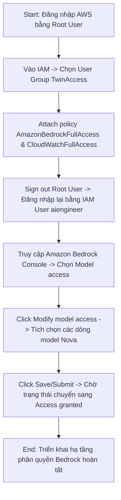
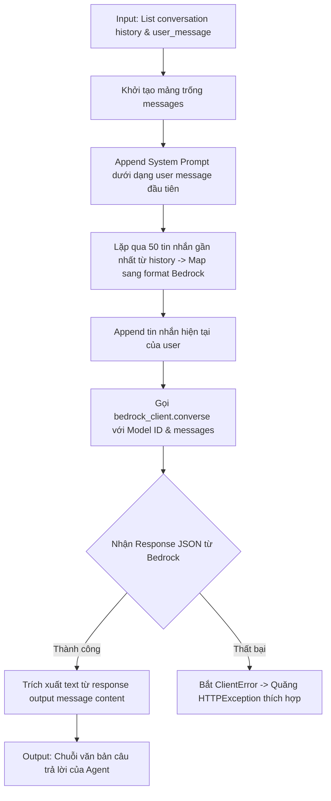
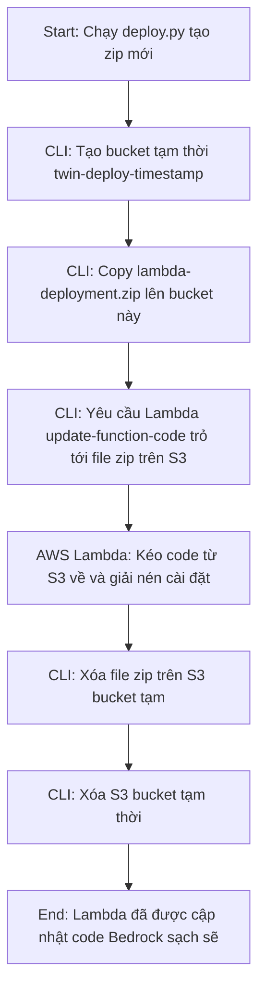
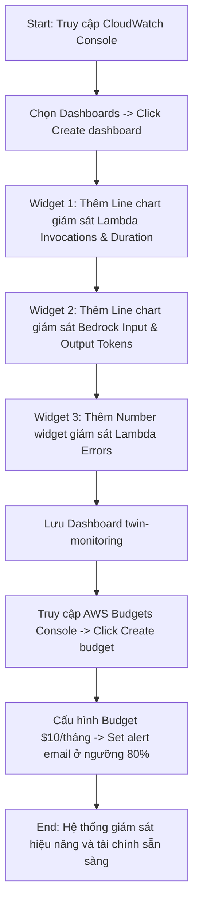

# Day 3 Summary - Transition to AWS Bedrock

Course domain: AI Engineer Production Track: Deploy LLMs & Agents at Scale  
Course name: AI Engineer Production Track: Deploy LLMs & Agents at Scale

---

# 46. Day 3 - Setting Up Amazon Bedrock for Production LLM Deployment on AWS

Course domain: AI Engineer Production Track: Deploy LLMs & Agents at Scale  
Course name: AI Engineer Production Track: Deploy LLMs & Agents at Scale

## 1. Source Map - Bản đồ nguồn
- Transcript: đã dùng
- Slide: đã dùng
- Code: [day3.md](file:///G:/AIProduction_t6_2026/production/week2/day3.md)
- Summary lịch sử: [day2_summary.md](file:///G:/AIProduction_t6_2026/production/tai_lieu/week2/day2_summary.md)
- Ghi chú về độ tin cậy hoặc mâu thuẫn giữa nguồn: Không có mâu thuẫn. Nội dung bài giảng về các dòng model Nova và việc cấu hình IAM khớp hoàn toàn giữa transcript và mã nguồn hướng dẫn.

## 2. Executive Summary - Tóm tắt cốt lõi
- **Chuyển dịch sang AWS Bedrock**: Thay thế hoàn toàn OpenAI API bằng Amazon Bedrock (dịch vụ AI managed của AWS) cho Digital Twin để toàn bộ hạ tầng chạy tập trung trong AWS mạng nội bộ.
- **Giới thiệu Amazon Nova**: Họ mô hình nền tảng (Foundation Models) mới nhất của Amazon với ba kích thước: Nova Micro (tối ưu chi phí), Nova Lite (cân bằng hiệu năng/chi phí), và Nova Pro (xử lý logic phức tạp).
- **Phân quyền Bedrock và CloudWatch**: Sử dụng tài khoản Root AWS để cập nhật phân quyền cho User Group `TwinAccess`, cấp thêm 2 policy quan trọng là `AmazonBedrockFullAccess` và `CloudWatchFullAccess`.
- **Yêu cầu Quyền truy cập Mô hình (Model Access)**: Quy trình đăng ký và yêu cầu quyền sử dụng các model Nova trên Bedrock Console để sẵn sàng gọi API từ mã nguồn.
- **Tính độc lập khu vực của Bedrock**: Giải thích cách Bedrock hoạt động, cho phép gọi model ở một vùng khác (ví dụ: `us-east-1` hoặc qua Cross-Region Inference Profiles) bất kể các dịch vụ khác của ta (như Lambda) đang đặt ở khu vực địa lý nào.

## 3. Lesson Goals - Mục tiêu bài học
- **Concept goals - mục tiêu kiến thức**:
  - Hiểu kiến trúc tổng quan của Amazon Bedrock và các ưu điểm của nó đối với ứng dụng doanh nghiệp (bảo mật, độ trễ, quản lý hạ tầng serverless).
  - Nắm rõ đặc điểm, kích thước và phân khúc của họ mô hình Amazon Nova.
  - Hiểu cách AWS IAM quản lý quyền truy cập dịch vụ AI (Amazon Bedrock) và giám sát (CloudWatch).
- **Practical goals - mục tiêu thực hành**:
  - Sử dụng tài khoản Root để cấp chính sách `AmazonBedrockFullAccess` và `CloudWatchFullAccess` vào nhóm `TwinAccess`.
  - Thực hành thao tác truy cập AWS Bedrock Console, vào mục **Model access** để kích hoạt sử dụng 3 model: Nova Micro, Nova Lite và Nova Pro.
- **What learner should be able to explain - người học cần giải thích được**:
  - Tại sao việc thay thế OpenAI bằng Bedrock lại giúp tăng tính bảo mật và giảm độ trễ (latency) cho ứng dụng Digital Twin.
  - Sự khác biệt về mặt kiến trúc tích hợp mô hình giữa AWS (đối tác chiến lược Anthropic) và Microsoft Azure (đối tác chiến lược OpenAI).

## 4. Previous Context - Liên hệ với bài trước
- Bài học này trực tiếp thay thế module AI OpenAI API được xây dựng ở Day 1 và Day 2 bằng AWS Bedrock. Mọi hạ tầng khác bao gồm Lambda, API Gateway, S3 Frontend, S3 Memory và CloudFront được giữ nguyên cấu trúc và tái sử dụng hoàn toàn.

## 5. Core Theory - Lý thuyết cốt lõi
- **Term - thuật ngữ**: Amazon Bedrock
  - **Meaning - nghĩa**: Dịch vụ đám mây được quản lý hoàn toàn (fully managed service) của AWS, cung cấp một API duy nhất để truy cập và sử dụng các mô hình nền tảng (Foundation Models) từ nhiều nhà phát triển AI hàng đầu thế giới (Amazon, Anthropic, Meta, AI21 Labs, Cohere, v.v.).
  - **Why it matters - vì sao quan trọng**: Loại bỏ gánh nặng tự quản lý tài nguyên máy chủ GPU, tích hợp sâu vào hệ sinh thái bảo mật IAM và VPC của AWS, hỗ trợ tính tiền tập trung (unified billing).
  - **Relationship - liên hệ với khái niệm khác**: Là đối thủ cạnh tranh trực tiếp với Azure OpenAI Service, sử dụng SDK `boto3` trong Python để gọi API.
- **Term - thuật ngữ**: Foundation Model (FM) - Mô hình nền tảng
  - **Meaning - nghĩa**: Các mô hình học máy AI quy mô lớn được huấn luyện trước trên lượng dữ liệu khổng lồ, có khả năng thực hiện đa dạng các tác vụ từ sinh văn bản, dịch thuật, lập trình đến phân tích hình ảnh và lý luận logic.
  - **Why it matters - vì sao quan trọng**: Làm nền tảng để xây dựng các ứng dụng AI Agent mà không cần tự huấn luyện lại từ đầu.
  - **Relationship - liên hệ với khái niệm khác**: Nova, Claude, Llama là các ví dụ tiêu biểu về Foundation Model.
- **Term - thuật ngữ**: Amazon Nova
  - **Meaning - nghĩa**: Dòng mô hình trí tuệ nhân tạo thế hệ mới được phát triển chính chủ bởi Amazon, thiết kế tối ưu cho tốc độ phản hồi nhanh, hiệu năng cao và chi phí cực rẻ.
  - **Why it matters - vì sao quan trọng**: Cung cấp lựa chọn thay thế kinh tế nhất cho các dự án chạy thực tế trên hạ tầng AWS.
  - **Relationship - liên hệ với khái niệm khác**: Gồm các phiên bản Nova Micro, Nova Lite và Nova Pro.

## 6. Workflow / Pipeline - Quy trình / luồng hoạt động
Quy trình thiết lập quyền truy cập dịch vụ và mô hình Bedrock:

1. **Input**: Tài khoản Root AWS và tài khoản IAM User `aiengineer`.
2. **Processing steps**:
   - Đăng nhập Root User để chỉnh sửa IAM Group `TwinAccess`, cấp thêm quyền gọi Bedrock và CloudWatch.
   - Đăng nhập lại bằng IAM User `aiengineer`, truy cập vào Bedrock Console.
   - Đi đến mục **Model access**, chọn **Modify model access** để kích hoạt các hộp kiểm cho Nova Micro, Nova Lite, Nova Pro.
   - Nhấn Submit và đợi trạng thái hiển thị "Access granted" (thông thường là tức thì đối với các model do Amazon phát triển).
3. **Output**: Tài khoản IAM và các API keys tạm thời được cấp quyền gọi mô hình Nova thông qua dịch vụ Bedrock.
4. **Control flow / data flow**: Yêu cầu xin quyền đi từ trình duyệt của quản trị viên qua IAM/Bedrock Control Plane của AWS để thay đổi trạng thái metadata phân quyền của account.
5. **Decision points**: Đối với các model bên thứ ba như Anthropic Claude, AWS có thể yêu cầu điền tờ khai sử dụng (use-case questionnaire) trước khi cấp quyền truy cập, trong khi các model của Amazon (Nova) luôn được duyệt tự động ngay lập tức.

## 7. Techniques - Kỹ thuật sử dụng
- **Technique - kỹ thuật**: Model Access Management - Quản lý quyền truy cập mô hình
  - **Purpose - mục đích**: Kiểm soát và giới hạn các dòng model AI được phép sử dụng trong một tài khoản AWS để quản lý chi phí và tuân thủ chính sách bảo mật thông tin của doanh nghiệp.
  - **When to use - dùng khi nào**: Khi thiết lập môi trường AWS mới cho dự án AI hoặc khi muốn mở khóa các model mới được AWS phát hành.
  - **Trade-off - đánh đổi**: Việc bật toàn bộ các mô hình có thể dẫn đến việc lập trình viên gọi nhầm các mô hình đắt tiền, làm tăng chi phí hóa đơn ngoài kiểm soát.
  - **Common mistake - lỗi dễ gặp**: Cố gắng gọi API Bedrock từ mã nguồn mà quên kích hoạt trạng thái "Access granted" trên Console, dẫn đến lỗi `AccessDeniedException` của SDK.

## 8. Code Walkthrough - Phân tích code nếu có
`Code được cung cấp trong session nhưng chưa thấy code liên quan trực tiếp tới lesson này`

## 9. Options / Trade-offs - Bản đồ lựa chọn
So sánh các nguồn cung cấp LLM API cho ứng dụng:
- **Option**: Sử dụng OpenAI API trực tiếp từ bên ngoài
  - **Pros**: Hiệu năng mô hình GPT-4o dẫn đầu thị trường, tài liệu phong phú, dễ tích hợp.
  - **Cons**: Request phải đi ra ngoài môi trường internet công cộng (rủi ro bảo mật dữ liệu), độ trễ cao hơn, quản lý hóa đơn rời rạc ngoài AWS, yêu cầu lưu trữ và bảo vệ API key.
  - **When to choose**: Khi cần khả năng lý luận tối đa và ứng dụng chưa yêu cầu thắt chặt bảo mật hạ tầng mạng.
- **Option**: Sử dụng Amazon Bedrock (Giải pháp hiện tại)
  - **Pros**: (Recommended) Request chạy trong mạng nội bộ AWS (latency thấp, bảo mật tuyệt đối), xác thực không cần key nhờ IAM Roles, tích hợp sẵn giám sát CloudWatch, thanh toán chung một hóa đơn AWS.
  - **Cons**: Bị giới hạn trong danh sách các mô hình mà AWS hỗ trợ, giao thức gọi API phức tạp hơn OpenAI đôi chút.
  - **When to choose**: Bắt buộc cho các dự án chuẩn doanh nghiệp (Enterprise-grade) chạy trên hạ tầng AWS.

## 10. Pitfalls - Lỗi / bẫy thường gặp
- **Failure mode**: Lỗi `AccessDeniedException` khi chạy ứng dụng gọi Bedrock.
  - **Root cause**: Quên không Modify Model Access trên Bedrock Console, hoặc quên chưa attach policy `AmazonBedrockFullAccess` vào User Group của IAM User.
  - **Symptom**: Console log báo lỗi từ chối truy cập API.
  - **Fix / prevention**: Thực hiện kiểm tra chéo cả 2 bước: Đảm bảo IAM Role có quyền và Bedrock Model Access đã hiển thị chữ "Access granted" màu xanh cho model tương ứng.

## 11. Knowledge Extension - Kiến thức mở rộng
- **Anthropic Claude on Bedrock**: Do mối quan hệ hợp tác trị giá nhiều tỷ đô la giữa AWS và Anthropic, Bedrock là nơi duy nhất trên các đám mây công cộng (ngoài Google Cloud Vertex AI) cung cấp mô hình Claude 3.5 Sonnet với độ trễ tối ưu và độ ổn định ngang ngửa API chính chủ của Anthropic.

## 12. Study Pack - Gói ôn tập
### Must remember
- Amazon Bedrock là cổng API managed duy nhất kết nối tới nhiều dòng LLMs khác nhau trên AWS.
- Họ mô hình Nova gồm: Nova Micro, Nova Lite, và Nova Pro.
- Phân quyền sử dụng Bedrock yêu cầu cập nhật cả IAM policies và Model access trên console.
- CloudWatch là công cụ cần thiết để thu thập số liệu giám sát và logs hệ thống cho ứng dụng.
- Dịch vụ AI đối trọng chính của Bedrock là SageMaker (sẽ học ở tuần sau).

### Self-check questions
1. Tại sao Amazon Bedrock lại được coi là giải pháp serverless cho mô hình AI?
2. Có thể gọi mô hình GPT-4o của OpenAI thông qua AWS Bedrock được không? Tại sao?
3. IAM User `aiengineer` cần được gán những policy mới nào trong bài học này?
4. Quy trình modify model access trên Bedrock Console hoạt động như thế nào?
5. Mối quan hệ đối tác chiến lược về AI của AWS là với công ty nào?

### Flashcards
- Q: Đâu là dòng model AI chính chủ của Amazon được giới thiệu trong Day 3?
  A: Amazon Nova.
- Q: Tab nào trên Bedrock Console dùng để kích hoạt các mô hình muốn sử dụng?
  A: Tab "Model access".

## 13. Missing Inputs - Còn thiếu gì
- Region: Cần lưu ý một số mô hình chỉ khả dụng ở một số region nhất định (như `us-east-1` hoặc `us-west-2`). Cần kiểm tra kỹ bảng phân phối mô hình của AWS.

---

# 47. Day 3 - Migrating from OpenAI to AWS Bedrock for Cost-Effective LLM Deployment

Course domain: AI Engineer Production Track: Deploy LLMs & Agents at Scale  
Course name: AI Engineer Production Track: Deploy LLMs & Agents at Scale

## 1. Source Map - Bản đồ nguồn
- Transcript: đã dùng
- Slide: đã dùng
- Code: [day3.md](file:///G:/AIProduction_t6_2026/production/week2/day3.md)
- Ghi chú về độ tin cậy hoặc mâu thuẫn giữa nguồn: Không có mâu thuẫn. Mã nguồn thực tế của `server.py` phản ánh chính xác cấu trúc chuyển đổi API sang Boto3 Converse API được giảng giải trong bài học.

## 2. Executive Summary - Tóm tắt cốt lõi
- **Tối ưu hóa chi phí với Nova**: Bảng giá dịch vụ của Nova cực kỳ rẻ (tính trên 1.000 tokens). Việc sử dụng Nova Lite hoặc Nova Micro giúp giảm hóa đơn chạy AI xuống mức tối thiểu, rất phù hợp cho ứng dụng chat thời gian thực.
- **Loại bỏ Thư viện OpenAI**: Loại bỏ thư viện `openai` khỏi `requirements.txt` để tinh giản package deploy của Lambda.
- **Boto3 Converse API**: Sử dụng API hợp nhất `bedrock_client.converse(...)` của boto3 SDK. API này chuẩn hóa cấu trúc messages giống định dạng OpenAI, giúp đơn giản hóa việc chuyển đổi code.
- **Xử lý System Prompt trong Bedrock**: Trong mã nguồn demo, System Prompt được ghép vào tin nhắn đầu tiên của user với định dạng `"System: [nội dung prompt]"` để đảm bảo tính tương thích và đơn giản.
- **Cấu hình Model ID thế hệ mới (2026)**: Lưu ý quan trọng về việc sử dụng Cross-Region Inference Profiles (ví dụ: `global.amazon.nova-2-lite-v1:0` hoặc `us.amazon.nova-lite-v1:0`) để tự động tối ưu hóa quota và phân bổ vùng xử lý của AWS, tránh nghẽn tải.

## 3. Lesson Goals - Mục tiêu bài học
- **Concept goals - mục tiêu kiến thức**:
  - Nắm vững cấu trúc định giá (pricing model) của Amazon Bedrock và cách quy đổi token.
  - Hiểu cách thức hoạt động của Boto3 Converse API và các ưu điểm của nó so với API InvokeModel truyền thống.
  - Hiểu khái niệm Cross-Region Inference Profiles (Hồ sơ suy luận xuyên vùng) và cơ chế tự động quản lý quota của AWS.
- **Practical goals - mục tiêu thực hành**:
  - Gỡ bỏ `openai` khỏi `requirements.txt`.
  - Viết lại hàm `call_bedrock` trong `server.py` để chuẩn hóa định dạng request/response cho Bedrock.
  - Thiết lập biến môi trường `BEDROCK_MODEL_ID` trong cấu hình cục bộ và Lambda.
- **What learner should be able to explain - người học cần giải thích được**:
  - Tại sao Boto3 Converse API lại ra đời và nó giúp ích gì cho lập trình viên khi muốn thử nghiệm các model từ nhiều nhà cung cấp khác nhau (như Meta Llama vs Anthropic Claude).
  - Cross-region inference profile giải quyết vấn đề gì khi ứng dụng gặp tình trạng quá tải request (rate limit/quota exhaustion).

## 4. Previous Context - Liên hệ với bài trước
- Bài học này trực tiếp refactor logic trong file `server.py` được tạo ở Day 2. Client OpenAI bị gỡ bỏ, thay bằng client Bedrock Runtime của `boto3`.

## 5. Core Theory - Lý thuyết cốt lõi
- **Term - thuật ngữ**: Converse API
  - **Meaning - nghĩa**: Một API đồng nhất và đơn giản hóa được AWS cung cấp trong SDK để tương tác với tất cả các dòng mô hình hội thoại trên Bedrock.
  - **Why it matters - vì sao quan trọng**: Trước khi có Converse API, mỗi nhà cung cấp mô hình (Meta, Anthropic, AI21) yêu cầu một cấu trúc JSON body hoàn toàn khác nhau khi gọi hàm `invoke_model`. Converse API chuẩn hóa tất cả về một cấu trúc duy nhất giống OpenAI format.
  - **Relationship - liên hệ với khái niệm khác**: Gọi qua hàm `bedrock_client.converse()`.
- **Term - thuật ngữ**: Cross-Region Inference Profile - Hồ sơ suy luận xuyên vùng
  - **Meaning - nghĩa**: Tính năng định tuyến của Bedrock cho phép gửi request suy luận tới một định danh model toàn cầu (bắt đầu bằng prefix `global.` hoặc `us.`, `eu.`), AWS sẽ tự động phân phối request đó tới vùng có tài nguyên GPU rảnh rỗi gần nhất.
  - **Why it matters - vì sao quan trọng**: Giúp tối ưu hóa tốc độ xử lý, vượt qua các giới hạn quota chật hẹp của một region đơn lẻ mà không cần tự viết code cân bằng tải.
  - **Relationship - liên hệ với khái niệm khác**: Ví dụ: `global.amazon.nova-2-lite-v1:0` hoặc `us.amazon.nova-lite-v1:0`.

## 6. Workflow / Pipeline - Quy trình / luồng hoạt động
Luồng chuyển đổi dữ liệu của hàm `call_bedrock`:

1. **Input**: Lịch sử hội thoại (dạng list các dict) và tin nhắn mới của người dùng.
2. **Processing steps**:
   - Hàm `call_bedrock` khởi tạo list `messages`.
   - Chèn System Prompt vào phần tử đầu tiên của `messages` (định nghĩa vai trò Digital Twin).
   - Duyệt qua tối đa 50 tin nhắn cũ từ bộ nhớ, chuyển đổi định dạng key `role` và `content` sang cấu trúc mảng của Bedrock (`"content": [{"text": msg["content"]}]`).
   - Append user message hiện tại.
   - Thực hiện gọi API `bedrock_client.converse()`.
   - Trích xuất văn bản trả về từ đường dẫn `response["output"]["message"]["content"][0]["text"]`.
3. **Output**: Phản hồi dạng string của Twin.
4. **Control flow / data flow**: Data flow đi qua khối xử lý exception để bắt các lỗi Validation hoặc AccessDenied từ phía AWS.
5. **Decision points**: Cần lọc lấy tối đa 50 tin nhắn cuối cùng (tương đương 25 lượt trao đổi) để tránh vượt quá giới hạn độ dài ngữ cảnh của mô hình và kiểm soát chi phí tokens đầu vào.

## 7. Techniques - Kỹ thuật sử dụng
- **Technique - kỹ thuật**: Converse API Parameter Standardization - Chuẩn hóa tham số Converse API
  - **Purpose - mục đích**: Sử dụng cấu trúc cấu hình chung `inferenceConfig` (chứa `maxTokens`, `temperature`, `topP`) để điều khiển hành vi sinh văn bản của mô hình một cách đồng nhất.
  - **When to use - dùng khi nào**: Luôn sử dụng khi gọi các mô hình sinh văn bản (Text Generation) qua Bedrock Converse API.
  - **Trade-off - đánh đổi**: Một số tham số đặc thù của riêng một dòng model (ví dụ các tham số đặc biệt của Meta Llama) có thể bị ẩn đi hoặc không cấu hình được qua API chung này (cần dùng `additionalModelRequestFields` nếu muốn cấu hình nâng cao).
  - **Common mistake - lỗi dễ gặp**: Đặt nhiệt độ `temperature` vượt quá giới hạn cho phép (thông thường chỉ từ `0.0` đến `1.0`), gây lỗi `ValidationException` từ AWS.

## 8. Code Walkthrough - Phân tích code nếu có

### File: `backend/server.py` (Khởi tạo Bedrock Client)
- **Purpose - mục đích**: Cấu hình và khởi tạo client kết nối tới dịch vụ Bedrock Runtime.
- **Key logic - logic chính**: Sử dụng `boto3.client` với tên dịch vụ `bedrock-runtime`. Đọc vùng hoạt động mặc định và ID của model từ biến môi trường.

```python
# file:///G:/AIProduction_t6_2026/production/week2/day3.md (dòng 177-184)
# Initialize Bedrock client
bedrock_client = boto3.client(
    service_name="bedrock-runtime", 
    region_name=os.getenv("DEFAULT_AWS_REGION", "us-east-1")
)

# Bedrock model selection
BEDROCK_MODEL_ID = os.getenv("BEDROCK_MODEL_ID", "global.amazon.nova-2-lite-v1:0")
```
*Ghi chú tiếng Việt*: Cần phân biệt rõ `bedrock` (dùng để quản trị mô hình) và `bedrock-runtime` (dùng để chạy suy luận mô hình - sinh chữ). Ở đây ta bắt buộc phải sử dụng client `bedrock-runtime`.

---

### File: `backend/server.py` (Hàm `call_bedrock`)
- **Purpose - mục đích**: Chuyển đổi định dạng hội thoại và thực hiện gọi mô hình Bedrock để lấy phản hồi văn bản.
- **Key logic - logic chính**: Định dạng lại cấu trúc tin nhắn theo đúng chuẩn mảng `content` của Bedrock và gọi hàm `converse`. Bắt các mã lỗi `ValidationException` hoặc `AccessDeniedException`.

```python
# file:///G:/AIProduction_t6_2026/production/week2/day3.md (dòng 254-307)
def call_bedrock(conversation: List[Dict], user_message: str) -> str:
    """Call AWS Bedrock with conversation history"""
    messages = []
    
    # Add system prompt as first user message
    messages.append({
        "role": "user", 
        "content": [{"text": f"System: {prompt()}"}]
    })
    
    # Add conversation history (limit to last 25 exchanges / 50 messages)
    for msg in conversation[-50:]:
        messages.append({
            "role": msg["role"],
            "content": [{"text": msg["content"]}]
        })
    
    # Add current user message
    messages.append({
        "role": "user",
        "content": [{"text": user_message}]
    })
    
    try:
        # Call Bedrock using the converse API
        response = bedrock_client.converse(
            modelId=BEDROCK_MODEL_ID,
            messages=messages,
            inferenceConfig={
                "maxTokens": 2000,
                "temperature": 0.7,
                "topP": 0.9
            }
        )
        # Extract the response text
        return response["output"]["message"]["content"][0]["text"]
        
    except ClientError as e:
        error_code = e.response['Error']['Code']
        if error_code == 'ValidationException':
            print(f"Bedrock validation error: {e}")
            raise HTTPException(status_code=400, detail="Invalid message format for Bedrock")
        elif error_code == 'AccessDeniedException':
            print(f"Bedrock access denied: {e}")
            raise HTTPException(status_code=403, detail="Access denied to Bedrock model")
        else:
            print(f"Bedrock error: {e}")
            raise HTTPException(status_code=500, detail=f"Bedrock error: {str(e)}")
```
*Ghi chú tiếng Việt*: Cấu trúc `content` của tin nhắn Bedrock là một danh sách chứa các block (ở đây là block text: `{"text": ...}`). Đây là thiết kế cho phép Bedrock hỗ trợ các nội dung đa phương tiện (multimodal) như hình ảnh hoặc tài liệu trong tương lai.

## 9. Options / Trade-offs - Bản đồ lựa chọn
So sánh cách cấu hình System Prompt trong Bedrock:
- **Option**: Ghép System Prompt vào User Message đầu tiên (Giải pháp hiện tại)
  - **Pros**: Rực rỡ và đơn giản, không yêu cầu thay đổi cấu trúc gọi API, hoạt động ổn định trên mọi phiên bản mô hình cũ.
  - **Cons**: Không phân tách rõ ràng vai trò của System Instruction đối với mô hình, có thể làm mô hình dễ bị prompt injection hơn.
  - **When to choose**: Khi muốn code tương thích ngược tối đa và viết nhanh.
- **Option**: Sử dụng tham số `system` chính thức của Converse API
  - **Pros**: (Recommended) Đúng chuẩn thiết kế của AWS Bedrock, mô hình nhận biết chỉ thị hệ thống một cách tối ưu và có hiệu năng tuân thủ luật lệ cao hơn.
  - **Cons**: Cần thay đổi tham số gọi hàm thành `bedrock_client.converse(..., system=[{"text": prompt()}])`.
  - **When to choose**: Khuyên dùng cho các ứng dụng thực tế để nâng cao tính bảo mật và định hình Agent chuẩn xác.

## 10. Pitfalls - Lỗi / bẫy thường gặp
- **Failure mode**: Lỗi `AccessDeniedException: The security token included in the request is invalid` hoặc báo lỗi Region.
  - **Root cause**: Đặt sai region cho Bedrock client. Không phải region nào cũng có sẵn các model Nova.
  - **Symptom**: Ứng dụng Lambda crash và trả về lỗi 403 Access denied cho client.
  - **Fix / prevention**: Cố định vùng chạy Bedrock client về `us-east-1` (Bắc Virginia) bằng cách gán `region_name="us-east-1"` vì đây là vùng luôn được ưu tiên cập nhật model mới nhất và có quota rộng rãi nhất.

## 11. Knowledge Extension - Kiến thức mở rộng
- **Token counts**: 1 token tương đương khoảng 4 ký tự hoặc 0.75 từ tiếng Anh. Đối với tiếng Việt, do cơ chế tách từ (tokenization) của các mô hình đa ngôn ngữ, 1 từ tiếng Việt có thể tốn từ 1.5 đến 3 tokens. Lập trình viên cần lưu ý điều này khi tính toán chi phí vận hành cho thị trường Việt Nam.

## 12. Study Pack - Gói ôn tập
### Must remember
- Boto3 client kết nối Bedrock runtime có tên dịch vụ là `bedrock-runtime`.
- Cấu trúc tin nhắn của Bedrock Converse API yêu cầu giá trị của `content` phải là một danh sách các đối tượng JSON.
- Cross-region inference profile giúp tự động cân bằng tải và tăng hạn mức sử dụng mô hình trên AWS.
- System prompt có thể được truyền qua tham số `system` chuyên dụng của Converse API để tăng tính bảo mật.
- ValidationException phát sinh khi định dạng mảng tin nhắn gửi lên không đúng thứ tự xen kẽ (ví dụ gửi 2 tin nhắn của `user` liên tiếp mà không có `assistant` ở giữa).

### Self-check questions
1. Tại sao ta lại gỡ bỏ package `openai` ra khỏi backend requirements?
2. Sự khác biệt giữa client `bedrock` và `bedrock-runtime` trong boto3 là gì?
3. Tại sao cấu trúc `content` trong tin nhắn Bedrock lại sử dụng kiểu dữ liệu danh sách (`List`) thay vì chuỗi đơn giản (`str`)?
4. Cross-Region Inference Profile bắt đầu bằng tiền tố nào?
5. Làm thế nào để xử lý lỗi ValidationException khi gửi chuỗi hội thoại tới Bedrock?

### Flashcards
- Q: Đâu là API hợp nhất mới của AWS Bedrock dùng để chạy hội thoại?
  A: Converse API (`bedrock_client.converse()`).
- Q: Vùng AWS (Region) an toàn và khuyên dùng nhất cho Bedrock trong bài học là gì?
  A: Vùng `us-east-1`.

## 13. Missing Inputs - Còn thiếu gì
- Quota: Học viên sử dụng tài khoản AWS mới lập có thể bị giới hạn quota mặc định cho dòng Nova ở mức thấp. Cần kiểm tra tab Service Quotas nếu gặp lỗi nghẽn request.

---

# 48. Day 3 - Deploying Bedrock LLMs to AWS Lambda and Testing Production APIs

Course domain: AI Engineer Production Track: Deploy LLMs & Agents at Scale  
Course name: AI Engineer Production Track: Deploy LLMs & Agents at Scale

## 1. Source Map - Bản đồ nguồn
- Transcript: đã dùng
- Slide: đã dùng
- Code: [day3.md](file:///G:/AIProduction_t6_2026/production/week2/day3.md)
- Ghi chú về độ tin cậy hoặc mâu thuẫn giữa nguồn: Không có mâu thuẫn. Kịch bản upload qua S3 trung gian bằng PowerShell và Bash Shell trong `day3.md` khớp hoàn toàn với bài thực hành.

## 2. Executive Summary - Tóm tắt cốt lõi
- **Quy trình tái triển khai backend**: Do thay đổi file cấu hình dependencies `requirements.txt` (loại bỏ `openai`), học viên bắt buộc phải chạy lại script đóng gói `deploy.py` để tạo file zip mới.
- **Kịch bản upload tự động thông qua S3**: Giới thiệu và thực hành kịch bản tự động hóa việc đưa file zip lên Lambda bằng CLI thông qua một S3 bucket tạm thời (S3 Deployment Bucket). Kịch bản bao gồm 5 bước: tạo bucket, cp file zip lên S3, update-function-code của Lambda, và dọn dẹp xóa bucket.
- **Chứng thực không khóa (Keyless Authentication)**: Giải thích cơ chế bảo mật tối ưu của AWS: Ứng dụng chạy trên Lambda gọi Bedrock mà không cần bất kỳ API key nào (như `OPENAI_API_KEY` trước đây). Mọi giao dịch được xác thực tự động qua IAM Execution Role.
- **Xác minh đầu ra**: Chạy thử test event và kiểm tra API Gateway `/health` để thấy thông tin mô hình Nova Lite được phản hồi trong JSON.

## 3. Lesson Goals - Mục tiêu bài học
- **Concept goals - mục tiêu kiến thức**:
  - Hiểu sâu sắc cơ chế xác thực không sử dụng khóa (Keyless/IAM-based authentication) trong môi trường đám mây và tại sao nó lại an toàn hơn lưu trữ API keys.
  - Nắm vững quy trình cập nhật mã nguồn cho Lambda function thông qua S3 bucket bằng lệnh AWS CLI.
- **Practical goals - mục tiêu thực hành**:
  - Re-build package zip bằng cách chạy `deploy.py`.
  - Thực thi kịch bản CLI (Bash hoặc PowerShell) để tạo bucket deploy, upload zip và kích hoạt cập nhật Lambda code.
  - Thực hiện thành công test live giao diện Digital Twin trên tên miền CloudFront HTTPS.
- **What learner should be able to explain - người học cần giải thích được**:
  - Tại sao ta có thể gọi mô hình AI có tính phí của Amazon mà không cần điền bất kỳ mật khẩu hay token bảo mật nào vào file cấu hình `.env` của Lambda.
  - Quy trình dọn dẹp (cleanup) các tài nguyên tạm thời (như bucket deploy) sau khi cập nhật code hoàn tất để tránh rác hạ tầng.

## 4. Previous Context - Liên hệ với bài trước
- Ở bài 47, chúng ta đã sửa code local. Bài học này đưa code đó lên Lambda thực tế trên AWS và thực hiện khâu test liên kết toàn hệ thống từ Frontend CloudFront -> API Gateway -> Lambda -> Bedrock.

## 5. Core Theory - Lý thuyết cốt lõi
- **Term - thuật ngữ**: Keyless Authentication - Xác thực không dùng khóa
  - **Meaning - nghĩa**: Phương pháp xác thực và phân quyền giữa các dịch vụ đám mây với nhau dựa trên danh tính được định nghĩa sẵn (IAM Roles) thay vì sử dụng các chuỗi ký tự mật khẩu (API Keys, Tokens) lưu trong cấu hình.
  - **Why it matters - vì sao quan trọng**: Loại bỏ hoàn toàn nguy cơ bị lộ lọt thông tin nhạy cảm khi push code lên GitHub, tự động xoay vòng khóa bảo mật (credential rotation) theo thời gian thực để ngăn chặn hacker tấn công.
  - **Relationship - liên hệ với khái niệm khác**: Hoạt động dựa trên IAM Execution Role được gắn vào Lambda function.
- **Term - thuật ngữ**: AWS Lambda CLI Update - Cập nhật Lambda bằng dòng lệnh
  - **Meaning - nghĩa**: Việc sử dụng công cụ AWS CLI để gửi lệnh yêu cầu Lambda service thay đổi mã nguồn chạy của một hàm cụ thể bằng một tệp tin zip lưu trên S3.
  - **Why it matters - vì sao quan trọng**: Giúp tự động hóa hoàn toàn quy trình triển khai (CI/CD), không cần đăng nhập giao diện web click tay.
  - **Relationship - liên hệ với khái niệm khác**: Gọi qua lệnh `aws lambda update-function-code`.

## 6. Workflow / Pipeline - Quy trình / luồng hoạt động
Quy trình cập nhật code Lambda thông qua S3 Deployment Bucket:

1. **Input**: File nén `lambda-deployment.zip` mới, biến môi trường `DEFAULT_AWS_REGION`.
2. **Processing steps**:
   - Khởi tạo tên bucket duy nhất kèm dấu thời gian: `twin-deploy-[timestamp]`.
   - Chạy lệnh `aws s3 mb` để tạo bucket trên S3 ở region mong muốn.
   - Chạy `aws s3 cp` để đẩy file zip từ máy local lên bucket này.
   - Gọi `aws lambda update-function-code` cung cấp tham số `--s3-bucket` và `--s3-key` để Lambda kéo code về.
   - Chạy lệnh `aws s3 rm` xóa file zip và `aws s3 rb` để xóa bucket tạm vừa tạo nhằm dọn dẹp sạch sẽ tài nguyên.
3. **Output**: Lambda function được cập nhật code mới thành công, trạng thái báo "Successful".
4. **Control flow / data flow**: Quy trình chạy tuần tự từng dòng lệnh CLI. Lệnh sau chỉ chạy khi lệnh trước phản hồi thành công (đồng bộ).
5. **Decision points**: Cần đảm bảo region truyền vào trong các lệnh CLI phải đồng nhất với region đặt Lambda function, nếu lệch region có thể gây lỗi không tìm thấy tài nguyên.

## 7. Techniques - Kỹ thuật sử dụng
- **Technique - kỹ thuật**: CLI-based S3 Deployment Pipeline - Đường ống triển khai S3 qua CLI
  - **Purpose - mục đích**: Tự động hóa quá trình đóng gói và upload file nhị phân lớn lên Lambda một cách an toàn và có thể tái sử dụng trong các script CI/CD.
  - **When to use - dùng khi nào**: Khi kích thước file zip vượt quá 10MB hoặc khi muốn tích hợp quy trình deploy vào script automation.
  - **Trade-off - đánh đổi**: Tốn thêm chi phí rất nhỏ cho request S3 (không đáng kể) và yêu cầu máy dev phải cấu hình sẵn quyền ghi S3 cho AWS CLI.
  - **Common mistake - lỗi dễ gặp**: Quên không chạy lệnh xóa bucket tạm (`aws s3 rb`), làm tích tụ hàng chục bucket rác trong tài khoản AWS qua nhiều lần deploy.

## 8. Code Walkthrough - Phân tích code nếu có

### File: Kịch bản CLI deploy trên Windows (PowerShell)
- **Purpose - mục đích**: Tải biến môi trường từ file `.env`, tạo bucket S3, upload zip, ra lệnh cập nhật Lambda và dọn dẹp tài nguyên trên môi trường Windows.
- **Key logic - logic chính**: Sử dụng lệnh `Get-Content` để parse file `.env` nạp vào session PowerShell. Dùng dấu backtick (`` ` ``) để xuống dòng trong câu lệnh dài của PowerShell.

```powershell
# file:///G:/AIProduction_t6_2026/production/week2/day3.md (dòng 469-498)
# Load environment variables từ file .env
Get-Content .env | ForEach-Object {
    if ($_ -match '^([^=]+)=(.*)$') {
        [System.Environment]::SetEnvironmentVariable($matches[1], $matches[2], 'Process')
    }
}

# Di chuyển vào backend
cd backend

# Khởi tạo tên bucket duy nhất kèm timestamp
$timestamp = Get-Date -Format "yyyyMMddHHmmss"
$deployBucket = "twin-deploy-$timestamp"

# Tạo bucket mới trên S3
aws s3 mb s3://$deployBucket --region $env:DEFAULT_AWS_REGION

# Upload file zip lên bucket
aws s3 cp lambda-deployment.zip s3://$deployBucket/ --region $env:DEFAULT_AWS_REGION

# Cập nhật code cho Lambda function từ nguồn file S3
aws lambda update-function-code `
    --function-name twin-api `
    --s3-bucket $deployBucket `
    --s3-key lambda-deployment.zip `
    --region $env:DEFAULT_AWS_REGION

# Dọn dẹp: xóa file zip và xóa bucket tạm thời khỏi S3
aws s3 rm s3://$deployBucket/lambda-deployment.zip
aws s3 rb s3://$deployBucket
```
*Ghi chú tiếng Việt*: Cú pháp nạp biến môi trường từ `.env` bằng PowerShell ở trên là cách làm chuẩn để đọc cấu hình mà không cần cài thêm công cụ bên thứ ba. Dấu backtick (`` ` ``) là ký tự ngắt dòng bắt buộc trong PowerShell, tương đương dấu backslash (`\`) của Linux Shell.

## 9. Options / Trade-offs - Bản đồ lựa chọn
So sánh phương án cấu hình xác thực cho API:
- **Option**: Sử dụng API Key (như OpenAI)
  - **Pros**: Độc lập với nhà cung cấp đám mây, dễ dàng chuyển đổi mã nguồn sang bất kỳ hosting nào chỉ bằng cách đổi chuỗi key trong file env.
  - **Cons**: Nguy cơ lộ key rất cao nếu vô tình push file `.env` lên GitHub, phải quản lý việc xoay vòng key thủ công, có thể bị hacker spam làm cạn kiệt hạn mức tài chính.
  - **When to choose**: Khi ứng dụng chạy đa đám mây (multi-cloud) hoặc chạy môi trường local phát triển.
- **Option**: Xác thực bằng IAM Role của AWS (Giải pháp hiện tại)
  - **Pros**: (Recommended) Bảo mật tối đa, không cần lưu trữ bất kỳ mật khẩu nào trong code, AWS tự động quản lý việc xoay vòng token xác thực, phân quyền chi tiết tới từng hàm API.
  - **Cons**: Ràng buộc chặt chẽ vào hạ tầng AWS, khó migrate sang nhà cung cấp cloud khác (như GCP hay Azure) nếu không sửa lại cơ chế auth.
  - **When to choose**: Bắt buộc cho mọi ứng dụng chạy trên hạ tầng production của AWS.

## 10. Pitfalls - Lỗi / bẫy thường gặp
- **Failure mode**: Lỗi `An error occurred (BucketAlreadyExists) when calling the CreateBucket operation`.
  - **Root cause**: Trùng tên bucket khi chạy lệnh `aws s3 mb`. Dù đã dùng timestamp nhưng có thể định dạng timestamp quá ngắn hoặc chạy script trùng giây với một lượt chạy cũ.
  - **Symptom**: Script deploy bị crash ngay ở bước tạo bucket và không thể tiếp tục.
  - **Fix / prevention**: Đảm bảo định dạng timestamp đầy đủ đến tận giây (`yyyyMMddHHmmss`) hoặc nối thêm một chuỗi số ngẫu nhiên vào tên bucket để triệt tiêu tỷ lệ trùng tên.

## 11. Knowledge Extension - Kiến thức mở rộng
- **AWS Instance Metadata Service (IMDS)**: Khi boto3 gọi Bedrock mà không có key, nó sẽ truy vấn tới địa chỉ IP link-local đặc biệt `http://169.254.169.254/latest/meta-data/iam/security-credentials/` để lấy token bảo mật tạm thời. AWS Lambda tự động cấu hình và bảo vệ địa chỉ IP này cho mỗi container thực thi.

## 12. Study Pack - Gói ôn tập
### Must remember
- Lệnh CLI để cập nhật code Lambda từ S3 là: `aws lambda update-function-code`.
- Dấu backtick (`` ` ``) được dùng để ngắt dòng câu lệnh trong PowerShell trên Windows.
- IAM-based authentication loại bỏ hoàn toàn nhu cầu cấu hình API keys cho các dịch vụ nội bộ của AWS.
- Cần xóa file zip và xóa bucket tạm thời ngay sau khi deploy để tối ưu chi phí lưu trữ S3.
- Kết quả test event `/health` thành công sẽ hiển thị chính xác tên model Bedrock đang cấu hình.

### Self-check questions
1. Tại sao việc upload code qua S3 trung gian lại được khuyên dùng hơn upload trực tiếp qua CLI bằng cờ `--zip-file`?
2. Ký tự ngắt dòng lệnh trong Bash Shell (Linux) và PowerShell (Windows) khác nhau thế nào?
3. Làm thế nào để kiểm chứng chắc chắn Lambda đang thực sự chạy code Bedrock thay vì code OpenAI cũ?
4. Đâu là các bước dọn dẹp tài nguyên S3 tạm thời sau khi hoàn tất kịch bản deploy?
5. Tại sao Digital Twin chạy bằng Bedrock lại không cần biến môi trường `OPENAI_API_KEY` nữa?

### Flashcards
- Q: Lệnh CLI nào dùng để xóa một S3 bucket rỗng?
  A: Lệnh `aws s3 rb s3://[tên-bucket]`.
- Q: Lệnh CLI nào dùng để tạo mới một S3 bucket?
  A: Lệnh `aws s3 mb s3://[tên-bucket]`.

## 13. Missing Inputs - Còn thiếu gì
- AWS CLI: Máy local của học viên phải được cài đặt AWS CLI và chạy cấu hình `aws configure` với quyền quản trị S3 và Lambda trước khi chạy kịch bản.

---

# 49. Day 3 - Monitoring Production AI with CloudWatch and Bedrock Metrics

Course domain: AI Engineer Production Track: Deploy LLMs & Agents at Scale  
Course name: AI Engineer Production Track: Deploy LLMs & Agents at Scale

## 1. Source Map - Bản đồ nguồn
- Transcript: đã dùng
- Slide: đã dùng
- Code: [day3.md](file:///G:/AIProduction_t6_2026/production/week2/day3.md)
- Ghi chú về độ tin cậy hoặc mâu thuẫn giữa nguồn: Không có mâu thuẫn. Các bước thiết lập Dashboard và các số liệu Lambda/Bedrock khớp hoàn toàn với thực tế quản lý giám sát của AWS CloudWatch.

## 2. Executive Summary - Tóm tắt cốt lõi
- **Vai trò của Giám sát (Monitoring)**: Để vận hành hệ thống AI thực tế, kỹ sư bắt buộc phải có bằng chứng số liệu chứng minh hệ thống đang gọi đúng mô hình (Nova) và theo dõi sức khỏe của hạ tầng.
- **Các chỉ số Lambda cốt lõi**: Giám sát 4 chỉ số vàng của Lambda: Invocations (số lượt gọi), Duration (thời gian chạy), Errors (số lỗi phát sinh) và Throttles (số request bị nghẽn do quá tải tài nguyên).
- **Các chỉ số Bedrock cốt lõi**: Giám sát 4 chỉ số hiệu năng AI: InvocationLatency (độ trễ phản hồi), Invocations, InputTokenCount (token đầu vào gửi đi) và OutputTokenCount (token đầu ra sinh ra).
- **Thiết lập CloudWatch Dashboard**: Hướng dẫn tạo bảng giám sát tập trung `twin-monitoring` kết hợp nhiều widget dạng Line chart và Number widget để hiển thị trực quan các chỉ số Lambda và Bedrock.
- **Tiện ích giám sát nhanh của Lambda**: Chỉ ra cách xem nhanh các biểu đồ CloudWatch tích hợp sẵn ngay trên tab **Monitor** của trang quản trị Lambda function, giúp tiết kiệm thời gian cấu hình dashboard thủ công.
- **Cost & Budget Management**: Khuyến nghị thiết lập Billing Budget (`twin-budget`) mức giới hạn $10/tháng và cấu hình gửi cảnh báo email tự động khi chi tiêu đạt mức 80% để kiểm soát tài chính.

## 3. Lesson Goals - Mục tiêu bài học
- **Concept goals - mục tiêu kiến thức**:
  - Hiểu tầm quan trọng của việc giám sát hệ thống (Observability) trong vận hành AI Agent ở quy mô lớn.
  - Hiểu ý nghĩa kỹ thuật của các chỉ số giám sát: Latency, Invocations, Tokens, Throttles, Errors.
  - Nắm được cách thiết lập các ngưỡng cảnh báo tài chính (Billing Alerts) để tránh rủi ro hóa đơn khổng lồ từ cloud.
- **Practical goals - mục tiêu thực hành**:
  - Truy cập CloudWatch Metrics để tìm và hiển thị các số liệu của Lambda `twin-api` và Bedrock Nova Lite.
  - Tạo mới một CloudWatch Dashboard mang tên `twin-monitoring`.
  - Cấu hình 3 widgets giám sát: Invocations & Duration (Line), và Errors (Number).
  - Khởi tạo một Cost Budget trị giá $10 trong AWS Budgets Console kèm cấu hình cảnh báo email.
- **What learner should be able to explain - người học cần giải thích được**:
  - Tại sao việc theo dõi InputTokenCount và OutputTokenCount lại vô cùng quan trọng đối với việc dự báo chi phí vận hành AI Agent.
  - Sự khác biệt về mặt thông tin giám sát giữa việc xem CloudWatch Metrics (số liệu thống kê dạng số) và CloudWatch Logs (vết text log chi tiết).

## 4. Previous Context - Liên hệ với bài trước
- Bài học này là khâu hoàn thiện mảnh ghép cuối cùng của quá trình triển khai Digital Twin lên AWS. Sau khi hệ thống đã chạy thông suốt ở bài 48, bài này cung cấp công cụ giám sát để đảm bảo ứng dụng hoạt động ổn định lâu dài trên production.

## 5. Core Theory - Lý thuyết cốt lõi
- **Term - thuật ngữ**: CloudWatch Metrics
  - **Meaning - nghĩa**: Các điểm dữ liệu số (numeric data points) được các dịch vụ AWS tự động đẩy về hệ thống giám sát CloudWatch theo chu kỳ thời gian (thường là mỗi 1 hoặc 5 phút) để thể hiện hiệu năng của tài nguyên.
  - **Why it matters - vì sao quan trọng**: Cung cấp cái nhìn tổng quan, định lượng về sức khỏe hệ thống, là cơ sở để thiết lập các cảnh báo tự động (CloudWatch Alarms).
  - **Relationship - liên hệ với khái niệm khác**: Khác với CloudWatch Logs (lưu vết chữ), Metrics lưu dữ liệu số có cấu trúc.
- **Term - thuật ngữ**: Invocation Latency - Độ trễ cuộc gọi mô hình
  - **Meaning - nghĩa**: Khoảng thời gian tính bằng mili-giây kể từ khi gửi request chứa prompt tới Bedrock cho đến khi nhận được đầy đủ token cuối cùng trả về từ mô hình.
  - **Why it matters - vì sao quan trọng**: Ảnh hưởng trực tiếp tới trải nghiệm người dùng (UX). Nếu latency quá cao, người dùng sẽ cảm thấy chatbot bị treo.
  - **Relationship - liên hệ với khái niệm khác**: Đo lường qua metric `InvocationLatency` trong namespace `AWS/Bedrock`.
- **Term - thuật ngữ**: Throttle - Nghẽn cổ chai / Giới hạn điều tiết
  - **Meaning - nghĩa**: Lỗi xảy ra khi số lượng request đồng thời gửi tới một tài nguyên vượt quá hạn mức cho phép của AWS (Concurrency Limit), khiến AWS từ chối xử lý request và trả về lỗi nghẽn tải.
  - **Why it matters - vì sao quan trọng**: Cần phát hiện sớm chỉ số này để yêu cầu AWS tăng hạn mức tài nguyên (quota request) trước khi người dùng bị ảnh hưởng.
  - **Relationship - liên hệ với khái niệm khác**: Theo dõi qua metric `Throttles` của Lambda.

## 6. Workflow / Pipeline - Quy trình / luồng hoạt động
Quy trình thiết lập hệ thống giám sát và cảnh báo chi phí:

1. **Input**: Hàm Lambda `twin-api` đã có một vài request chat chạy thử, tài khoản AWS.
2. **Processing steps**:
   - Mở CloudWatch Console, tạo mới một Dashboard tên `twin-monitoring`.
   - Add Widget 1: Chọn loại Line chart, trỏ vào metric `Invocations` và `Duration` của Lambda function `twin-api`, chọn thống kê là Sum (cho Invocations) và Average (cho Duration) với chu kỳ 5 phút.
   - Add Widget 2: Chọn loại Line chart, trỏ vào metric `Invocations`, `InputTokenCount`, `OutputTokenCount`, và `InvocationLatency` của Bedrock model `amazon.nova-lite-v1:0`.
   - Add Widget 3: Chọn loại Number widget, trỏ vào metric `Errors` của Lambda với chu kỳ 1 giờ để hiển thị số lỗi tức thì (mục tiêu luôn là số 0).
   - Lưu cấu hình dashboard.
   - Di chuyển sang AWS Budgets Console, tạo cost budget trị giá $10, thiết lập gửi mail cảnh báo khi chi phí chạm mốc $8.
3. **Output**: Dashboard hiển thị trực quan sức khỏe hệ thống và budget giám sát tài chính chạy ngầm bảo vệ tài khoản.
4. **Control flow / data flow**: Số liệu hiệu năng được AWS tự động thu thập từ hạ tầng ảo hóa gửi về CloudWatch Engine độc lập, không làm ảnh hưởng đến tài nguyên CPU của hàm Lambda.
5. **Decision points**: Cần chọn đúng statistic là `Sum` hay `Average` cho từng loại metric để biểu đồ phản ánh đúng thực tế (ví dụ: Invocations phải dùng Sum để cộng dồn số lượt gọi, trong khi Duration phải dùng Average để tính thời gian chạy trung bình).

## 7. Techniques - Kỹ thuật sử dụng
- **Technique - kỹ thuật**: CloudWatch Log Insights Querying - Truy vấn sâu nhật ký CloudWatch
  - **Purpose - mục đích**: Sử dụng ngôn ngữ truy vấn dạng SQL của CloudWatch để lọc, phân tích và thống kê dữ liệu logs từ hàng ngàn dòng text thô một cách nhanh chóng.
  - **When to use - dùng khi nào**: Khi muốn thống kê thời gian chạy trung bình của Lambda hoặc tìm kiếm các lỗi cụ thể trong lịch sử logs mà không muốn đọc từng dòng bằng mắt.
  - **Trade-off - đánh đổi**: Tốn thêm chi phí truy vấn dựa trên dung lượng log quét qua ($0.005 per GB scan).
  - **Common mistake - lỗi dễ gặp**: Quên không lọc trường `@type = "REPORT"` khi viết câu lệnh truy vấn thời gian chạy của Lambda, dẫn đến việc kết quả trả về bị lẫn các dòng log stdout thông thường và không thể tính toán số liệu chính xác.

## 8. Code Walkthrough - Phân tích code nếu có

### File: Cấu trúc câu lệnh truy vấn CloudWatch Log Insights
- **Purpose - mục đích**: Thống kê thời gian chạy trung bình, nhỏ nhất và lớn nhất của Lambda function theo từng block thời gian 5 phút.
- **Key logic - logic chính**: Lọc ra các dòng log hệ thống có type là `REPORT` (dòng log AWS tự sinh cuối mỗi lượt chạy chứa thông tin thời gian thực thi). Thực hiện tính toán `avg`, `min`, `max` trên trường `@duration`.

```sql
# file:///G:/AIProduction_t6_2026/production/week2/day3.md (dòng 672-678)
fields @timestamp, @duration
| filter @type = "REPORT"
| stats avg(@duration) as avg_duration,
        min(@duration) as min_duration,
        max(@duration) as max_duration
by bin(5m)
```
*Ghi chú tiếng Việt*: Câu lệnh này giúp ta có cái nhìn cực kỳ chính xác về thời gian chạy của Lambda. Phép gom nhóm `by bin(5m)` giúp vẽ biểu đồ xu hướng thời gian chạy theo các khoảng 5 phút rất đẹp mắt.

## 9. Options / Trade-offs - Bản đồ lựa chọn
So sánh các giải pháp giám sát ứng dụng AI:
- **Option**: Sử dụng tab Monitor tích hợp sẵn trên Lambda Page
  - **Pros**: Không tốn công cấu hình, có sẵn ngay khi tạo hàm, hoàn toàn miễn phí.
  - **Cons**: Không thể xem chung số liệu của Lambda và Bedrock trên cùng một màn hình, không thể tùy biến định dạng biểu đồ theo ý muốn.
  - **When to choose**: Khi muốn check nhanh tình trạng lỗi hoặc thời gian chạy của Lambda trong quá trình phát triển (Dev).
- **Option**: Tạo CloudWatch Dashboard tùy chỉnh (Giải pháp hiện tại)
  - **Pros**: (Recommended) Vô cùng chuyên nghiệp, gom toàn bộ số liệu của cả Lambda, API Gateway và Bedrock lên một màn hình giám sát tập trung, có thể chia sẻ cho các thành viên khác trong đội ngũ vận hành.
  - **Cons**: Tốn chi phí nhỏ để duy trì dashboard (AWS cho phép 3 dashboard miễn phí, sau đó tính phí $3/tháng cho mỗi dashboard bổ sung).
  - **When to choose**: Bắt buộc cho các dự án chạy thực tế (Production) cần giám sát tập trung 24/7.

## 10. Pitfalls - Lỗi / bẫy thường gặp
- **Failure mode**: Biểu đồ của Bedrock metrics không hiển thị bất kỳ dữ liệu nào (nửa đồ thị bị trống).
  - **Root cause**: Chọn sai tên model ID hoặc sai region khi add metric vào widget. Bedrock metrics được tách biệt theo từng Region và từng Model ID cụ thể.
  - **Symptom**: Biểu đồ hiển thị thông báo "No data available".
  - **Fix / prevention**: Kiểm tra kỹ xem Lambda đang gọi model nào ở region nào (ví dụ `us-east-1` gọi `amazon.nova-lite-v1:0`), và chọn đúng các tham số đó khi cấu hình metric trong CloudWatch.

## 11. Knowledge Extension - Kiến thức mở rộng
- **AWS Budgets vs Billing Alarms**: Billing Alarms chỉ cảnh báo khi hóa đơn thực tế đã vượt ngưỡng cấu hình. Trong khi đó, AWS Budgets mạnh mẽ hơn, nó sử dụng thuật toán dự báo (forecasting) để gửi cảnh báo sớm cho bạn ngay khi hệ thống dự đoán rằng hóa đơn của bạn *có khả năng* vượt ngưỡng vào cuối tháng dựa trên tốc độ chi tiêu hiện tại.

## 12. Study Pack - Gói ôn tập
### Must remember
- 4 chỉ số vàng của Lambda: Invocations, Duration, Errors, và Throttles.
- 4 chỉ số vàng của Bedrock: InvocationLatency, Invocations, InputTokenCount, và OutputTokenCount.
- AWS cho phép tạo tối đa 3 CloudWatch Dashboards hoàn toàn miễn phí.
- Dòng log dạng `REPORT` chứa các số liệu hiệu năng thực tế được AWS tự động in ra cuối mỗi phiên chạy Lambda.
- Cảnh báo Budget giúp bảo vệ tài khoản khỏi nguy cơ mất tiền oan do code bị lặp vô hạn hoặc bị tấn công DDoS.

### Self-check questions
1. Tại sao ta phải theo dõi chỉ số `Throttles` của Lambda function?
2. Sự khác biệt giữa metric `InputTokenCount` và `OutputTokenCount` trong giám sát Bedrock là gì?
3. Câu lệnh truy vấn Log Insights sử dụng từ khóa nào để nhóm dữ liệu theo các khoảng thời gian cố định?
4. Đâu là tab trên giao diện quản trị Lambda giúp truy cập nhanh tới các biểu đồ giám sát tích hợp sẵn?
5. Ngưỡng cảnh báo Budget khuyến nghị trong bài lab là bao nhiêu đô la và cảnh báo ở mức bao nhiêu phần trăm?

### Flashcards
- Q: Metric nào đo lường thời gian chạy của Lambda function?
  A: Metric `Duration`.
- Q: Metric nào đo lường độ trễ phản hồi của mô hình trên Bedrock?
  A: Metric `InvocationLatency`.

## 13. Missing Inputs - Còn thiếu gì
- Chi phí Log: Việc in ra quá nhiều logs chi tiết (verbose logs) ở môi trường production có thể làm tăng đáng kể chi phí lưu trữ CloudWatch Logs. Cần cấu hình Retention Policy cho Log Group.
