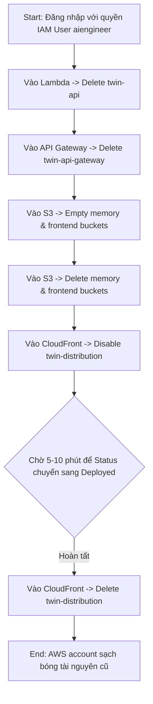
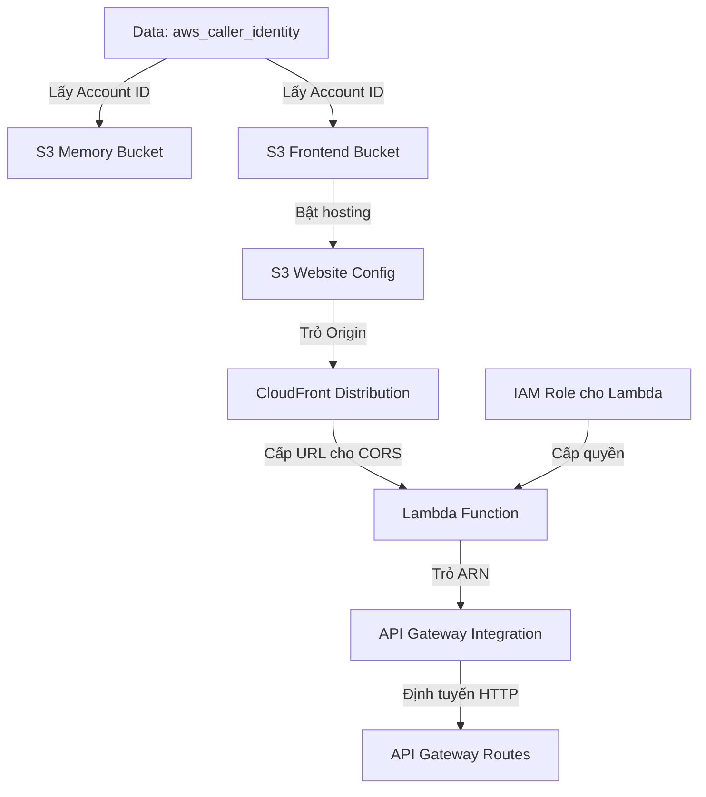
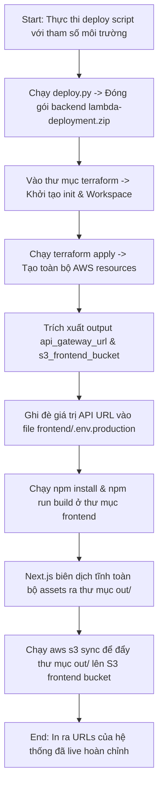
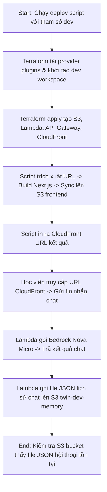
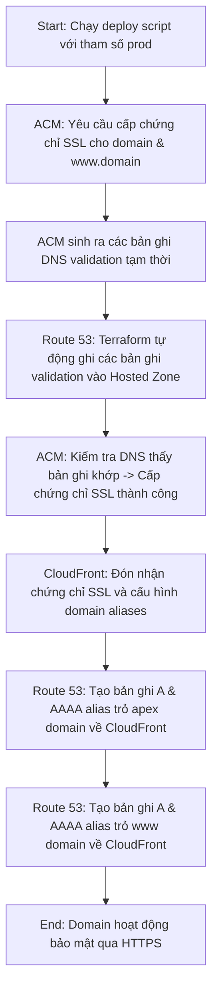
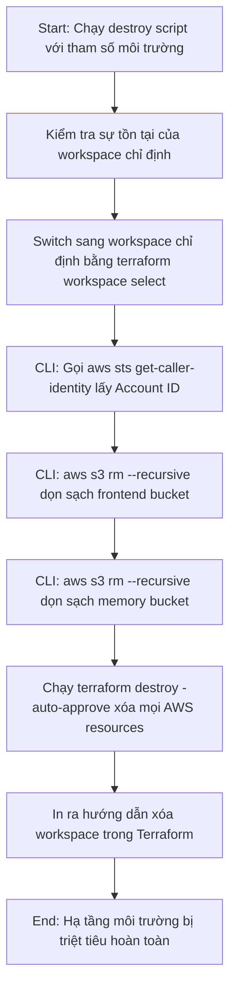

# Day 4 Summary - Infrastructure as Code with Terraform

Course domain: AI Engineer Production Track: Deploy LLMs & Agents at Scale  
Course name: AI Engineer Production Track: Deploy LLMs & Agents at Scale

---

# 50. Day 4 - Infrastructure as Code for AI - Deploying LLM Apps with Terraform

Course domain: AI Engineer Production Track: Deploy LLMs & Agents at Scale  
Course name: AI Engineer Production Track: Deploy LLMs & Agents at Scale

## 1. Source Map - Bản đồ nguồn
- Transcript: đã dùng
- Slide: đã dùng
- Code: [day4.md](file:///G:/AIProduction_t6_2026/production/week2/day4.md)
- Summary lịch sử: [day3_summary.md](file:///G:/AIProduction_t6_2026/production/tai_lieu/week2/day3_summary.md)
- Ghi chú về độ tin cậy hoặc mâu thuẫn giữa nguồn: Không có mâu thuẫn. Phần hướng dẫn dọn dẹp tài nguyên thủ công được mô tả chi tiết, giúp học viên thực hành chính xác trên console.

## 2. Executive Summary - Tóm tắt cốt lõi
- **Chuyển dịch sang Tự động hóa**: Chuyển đổi phương thức quản lý hạ tầng từ thao tác click tay thủ công trên AWS Console sang Infrastructure as Code (IaC - Cơ sở hạ tầng dưới dạng mã) bằng công cụ Terraform.
- **Dọn dẹp triệt để (Clean Slate)**: Hướng dẫn dọn dẹp toàn bộ các tài nguyên đã tạo thủ công ở Day 2 & 3 (Lambda, API Gateway, S3 memory & frontend buckets, CloudFront distribution) để chuẩn bị môi trường sạch cho Terraform quản lý.
- **Trì hoãn xóa CloudFront**: Cảnh báo đặc biệt về thời gian chờ khi xóa CloudFront distribution: Học viên phải chuyển trạng thái sang Disable và đợi từ 5-10 phút để hệ thống cập nhật trạng thái Deployed trước khi có thể thực hiện lệnh xóa vĩnh viễn.
- **Ưu điểm của IaC**: Ba lợi ích cốt lõi của IaC: kiểm soát phiên bản (version controlled), có thể bình duyệt (reviewed) qua pull requests, và tự động hóa/tái sử dụng (automated/repeatable).
- **So sánh Terraform và AWS CDK**: Terraform được chọn làm công cụ giảng dạy chính vì tính chất độc lập nhà cung cấp (cloud-agnostic) và là kỹ năng hàng đầu được săn đón trong các yêu cầu tuyển dụng DevOps/Platform Engineering.

## 3. Lesson Goals - Mục tiêu bài học
- **Concept goals - mục tiêu kiến thức**:
  - Hiểu sâu sắc triết lý của Infrastructure as Code (IaC) và các ưu điểm so với cấu hình tay.
  - Phân biệt được 6 khái niệm cốt lõi của Terraform: Provider, Variable, Resource, State, Output, và Workspace.
  - Hiểu lý do tại sao file State của Terraform lại quan trọng và tại sao không được đưa nó lên hệ thống quản lý phiên bản Git.
- **Practical goals - mục tiêu thực hành**:
  - Thực hành xóa hoàn chỉnh các tài nguyên thủ công trên AWS Console: Lambda, API Gateway, S3, CloudFront.
  - Tải và cài đặt thành công Terraform CLI lên máy phát triển local (qua Homebrew trên Mac/Linux hoặc cài đặt biến môi trường PATH trên Windows).
  - Xác minh cài đặt Terraform thành công bằng lệnh `terraform --version`.
- **What learner should be able to explain - người học cần giải thích được**:
  - Tại sao AWS chặn việc xóa trực tiếp một S3 bucket khi bên trong vẫn còn chứa file dữ liệu.
  - Tại sao CloudFront lại tốn nhiều thời gian (5-10 phút) để kích hoạt hoặc vô hiệu hóa cấu hình phân phối.

## 4. Previous Context - Liên hệ với bài trước
- Bài học này yêu cầu xóa toàn bộ hạ tầng Digital Twin đã tạo thủ công ở Day 2 & Day 3 để xây dựng lại chính xác sơ đồ kiến trúc đó bằng Terraform. Đây là bước chuẩn bị quan trọng để tự động hóa toàn bộ dự án.

## 5. Core Theory - Lý thuyết cốt lõi
- **Term - thuật ngữ**: Infrastructure as Code (IaC) - Cơ sở hạ tầng dưới dạng mã
  - **Meaning - nghĩa**: Phương pháp quản lý và thiết lập tài nguyên đám mây (mạng, máy chủ ảo, cơ sở dữ liệu, phân quyền) thông qua các tệp tin cấu hình dạng văn bản được định nghĩa rõ ràng, thay vì cấu hình thủ công bằng giao diện đồ họa.
  - **Why it matters - vì sao quan trọng**: Đảm bảo tính nhất quán, loại bỏ sai sót do con người, cho phép lưu vết lịch sử thay đổi bằng Git và tích hợp vào quy trình CI/CD.
  - **Relationship - liên hệ với khái niệm khác**: Được thực hiện thông qua các công cụ như Terraform, AWS CloudFormation hoặc AWS CDK.
- **Term - thuật ngữ**: Terraform State - Trạng thái Terraform
  - **Meaning - nghĩa**: File cơ sở dữ liệu (`terraform.tfstate`) lưu trữ bản đồ ánh xạ giữa các khai báo logic trong code Terraform và các tài nguyên vật lý thực tế được tạo ra trên môi trường đám mây.
  - **Why it matters - vì sao quan trọng**: Là "nguồn thông tin tin cậy duy nhất" (source of truth) giúp Terraform biết cần tạo mới, cập nhật hay xóa những tài nguyên nào khi code thay đổi.
  - **Relationship - liên hệ với khái niệm khác**: Mặc định lưu ở local, nhưng trong production thường được lưu trên S3 để chia sẻ nhóm.
- **Term - thuật ngữ**: Cloud-Agnostic - Độc lập nhà cung cấp đám mây
  - **Meaning - nghĩa**: Tính chất của một công cụ hay kiến trúc phần mềm cho phép nó hoạt động tương thích với nhiều nhà cung cấp dịch vụ đám mây khác nhau (AWS, Google Cloud, Microsoft Azure) mà không bị khóa chặt vào một hệ sinh thái cụ thể.
  - **Why it matters - vì sao quan trọng**: Giúp doanh nghiệp dễ dàng chuyển đổi hạ tầng hoặc triển khai chiến lược đa đám mây (multi-cloud).
  - **Relationship - liên hệ với khái niệm khác**: Là ưu điểm vượt trội của Terraform so với công cụ chính chủ AWS CDK.

## 6. Workflow / Pipeline - Quy trình / luồng hoạt động
Quy trình dọn dẹp tài nguyên thủ công trên AWS Console:

1. **Input**: Các tài nguyên thủ công đã tạo ở Day 2 & 3.
2. **Processing steps**:
   - Truy cập Lambda Console, chọn `twin-api` và thực hiện Delete.
   - Truy cập API Gateway, chọn `twin-api-gateway` và Delete (gõ chữ confirmed để xác nhận).
   - Vào S3, bắt buộc thực hiện **Empty** các bucket frontend và memory bằng cách nhập chuỗi "permanently delete", sau đó mới chọn **Delete** bucket.
   - Vào CloudFront, chọn distribution của Twin, nhấn **Disable**. Chờ 5-10 phút để trạng thái cập nhật hoàn tất, sau đó nhấn **Delete**.
3. **Output**: Tài khoản AWS được dọn dẹp sạch sẽ, không còn tài nguyên cũ chạy ẩn làm phát sinh chi phí.
4. **Control flow / data flow**: Yêu cầu xóa được gửi tuần tự qua AWS API Control Plane.
5. **Decision points**: Bước disable CloudFront là bắt buộc, AWS không cho phép nút Delete sáng lên nếu distribution đang ở trạng thái Enabled.

## 7. Techniques - Kỹ thuật sử dụng
- **Technique - kỹ thuật**: Manual Infrastructure Cleanup - Dọn dẹp hạ tầng thủ công
  - **Purpose - mục đích**: Giải phóng hoàn toàn các tài nguyên ảo hóa chạy ngầm để tránh phát sinh chi phí nhàn rỗi (idle costs) và tránh xung đột DNS/tên bucket khi dựng lại bằng Terraform.
  - **When to use - dùng khi nào**: Trước khi áp dụng công cụ tự động hóa IaC cho dự án hoặc khi muốn hủy bỏ môi trường thử nghiệm.
  - **Trade-off - đánh đổi**: Mất công sức click chuột qua nhiều màn hình console khác nhau, dễ bị bỏ sót tài nguyên nếu không kiểm tra kỹ.
  - **Common mistake - lỗi dễ gặp**: Nghĩ rằng đã xóa bucket S3 bằng cách nhấn nút Delete trực tiếp mà quên không thực hiện bước Empty trước, dẫn đến việc AWS báo lỗi và từ chối xóa bucket.

## 8. Code Walkthrough - Phân tích code nếu có
`Buổi học này không có code được cung cấp` (Chỉ cài đặt công cụ Terraform CLI).

## 9. Options / Trade-offs - Bản đồ lựa chọn
So sánh các công cụ IaC:
- **Option**: AWS CloudFormation / AWS CDK
  - **Pros**: Tích hợp sâu nhất với AWS, hỗ trợ các dịch vụ mới phát hành của AWS ngay ngày đầu tiên (Day 1 support), CDK cho phép viết code hạ tầng bằng ngôn ngữ lập trình quen thuộc (Python, TypeScript).
  - **Cons**: Bị khóa chặt vào hệ sinh thái AWS (vendor lock-in), không thể dùng để cấu hình hạ tầng cho GCP hay Azure.
  - **When to choose**: Khi doanh nghiệp cam kết 100% chỉ sử dụng AWS và muốn viết code hạ tầng bằng ngôn ngữ lập trình hướng đối tượng.
- **Option**: Terraform (Giải pháp hiện tại)
  - **Pros**: (Recommended) Độc lập nhà cung cấp (cloud-agnostic), hỗ trợ đa nền tảng, cú pháp khai báo HCL (HashiCorp Configuration Language) trực quan, cộng đồng sử dụng lớn nhất thế giới.
  - **Cons**: Phải học cú pháp ngôn ngữ mới HCL và tự quản lý State file.
  - **When to choose**: Khuyên dùng cho mọi dự án startup hoặc doanh nghiệp lớn hướng tới multi-cloud và tự động hóa tiêu chuẩn.

## 10. Pitfalls - Lỗi / bẫy thường gặp
- **Failure mode**: Nút Delete của CloudFront distribution bị xám (không click được).
  - **Root cause**: Distribution vẫn đang ở trạng thái Enabled hoặc tiến trình Disable đang chạy ngầm chưa đồng bộ xong toàn cầu.
  - **Symptom**: Lập trình viên không thể xóa tài nguyên CloudFront.
  - **Fix / prevention**: Click nút **Disable**, kiên nhẫn chờ từ 5-10 phút, tải lại trang web console cho đến khi cột Status hiển thị trạng thái Enabled biến mất và nút Delete sáng lên.

## 11. Knowledge Extension - Kiến thức mở rộng
- **HashiCorp Licensing**: Vào năm 2023, HashiCorp đã chuyển đổi giấy phép của Terraform từ mã nguồn mở thuần túy (MPL v2) sang giấy phép Business Source License (BSL v1.1). Điều này dẫn đến sự ra đời của OpenTofu - một bản fork mã nguồn mở hoàn toàn được duy trì bởi cộng đồng Linux Foundation để cạnh tranh trực tiếp với Terraform.

## 12. Study Pack - Gói ôn tập
### Must remember
- IaC giúp quản lý hạ tầng đám mây giống như quản lý mã nguồn ứng dụng.
- Phải empty S3 bucket trước khi tiến hành xóa bucket đó khỏi hệ thống.
- CloudFront distribution cần được chuyển sang trạng thái Disabled trước khi xóa.
- State file `terraform.tfstate` lưu trữ ánh xạ thực tế và tuyệt đối không được đưa lên GitHub.
- Terraform được phát triển bởi HashiCorp và sử dụng ngôn ngữ cấu hình HCL.

### Self-check questions
1. Tại sao nói Infrastructure as Code giúp việc triển khai hạ tầng có tính chất "repeatable" (lặp lại được)?
2. 6 khái niệm cốt lõi của Terraform là gì?
3. Tại sao CloudFront distribution lại mất nhiều thời gian để kích hoạt hoặc vô hiệu hóa?
4. Đâu là sự khác biệt chính giữa Terraform và AWS CDK về mặt hỗ trợ nhà cung cấp cloud?
5. Làm cách nào để kiểm tra phiên bản Terraform đã cài đặt trên máy tính của bạn?

### Flashcards
- Q: File nào của Terraform chứa thông tin trạng thái thực tế của tài nguyên đã triển khai?
  A: File `terraform.tfstate`.
- Q: HCL viết tắt của cụm từ gì?
  A: HashiCorp Configuration Language.

## 13. Missing Inputs - Còn thiếu gì
- Tri thức: Slide Day 4 chỉ dừng ở mức giới thiệu khái niệm cơ bản, học viên cần đọc kỹ code hướng dẫn thực tế để hiểu cú pháp HCL.

---

# 51. Day 4 - Infrastructure as Code - Automating AI Deployments with Terraform

Course domain: AI Engineer Production Track: Deploy LLMs & Agents at Scale  
Course name: AI Engineer Production Track: Deploy LLMs & Agents at Scale

## 1. Source Map - Bản đồ nguồn
- Transcript: đã dùng
- Slide: đã dùng
- Code: [day4.md](file:///G:/AIProduction_t6_2026/production/week2/day4.md)
- Ghi chú về độ tin cậy hoặc mâu thuẫn giữa nguồn: Không có mâu thuẫn. Cấu trúc khai báo nhà cung cấp AWS và alias vùng `us-east-1` trong file `versions.tf` khớp chính xác với giải thích của bài giảng.

## 2. Executive Summary - Tóm tắt cốt lõi
- **Thiết lập file cấu hình Git**: Khởi tạo file `.gitignore` để loại bỏ các tệp tin nhạy cảm của Terraform (`*.tfstate`, `.terraform/`) khỏi Git, riêng `terraform.tfvars` và `prod.tfvars` được đưa vào Git một cách an toàn bằng ký tự phủ định `!`.
- **Cơ cấu thư mục Terraform**: Tạo thư mục `/terraform` ở cấp độ root để chứa toàn bộ mã nguồn HCL.
- **Provider versions.tf**: Khai báo sử dụng AWS provider phiên bản `~> 6.0`. Thiết lập cấu hình AWS provider mặc định (lấy từ cấu hình AWS CLI local) và một provider phụ có alias `us_east_1` phục vụ riêng cho việc validate chứng chỉ SSL của ACM (phải thực hiện tại vùng us-east-1).
- **Khai báo Variables**: Định nghĩa các tham số đầu vào trong `variables.tf` với các khối validation ràng buộc kiểu dữ liệu đầu vào chuẩn chỉnh (như chỉ cho phép môi trường dev/test/prod).
- **Viết Main.tf hoàn chỉnh**: Khai báo toàn bộ hạ tầng Digital Twin: S3 Buckets, IAM Roles cho Lambda, Lambda function, API Gateway, stage, routes và CloudFront distribution trong file `main.tf`.

## 3. Lesson Goals - Mục tiêu bài học
- **Concept goals - mục tiêu kiến thức**:
  - Nắm vững cấu trúc cú pháp khai báo của ngôn ngữ HCL trong Terraform.
  - Hiểu vai trò của biến địa phương (`locals`) và cách kết hợp tiền tố `name_prefix` để phân tách tài nguyên giữa các môi trường.
  - Hiểu lý do tại sao ACM Certificate (Chứng chỉ SSL) bắt buộc phải được xác thực ở vùng `us-east-1` (Bắc Virginia) khi sử dụng với CloudFront.
- **Practical goals - mục tiêu thực hành**:
  - Tạo cấu trúc file `.gitignore` chuẩn cho dự án Terraform/Python/Node.
  - Viết file `versions.tf` cấu hình providers.
  - Định nghĩa tệp `variables.tf` chứa các khai báo biến và logic validation.
  - Tạo file `main.tf` chứa toàn bộ tài nguyên hạ tầng AWS-ready.
- **What learner should be able to explain - người học cần giải thích được**:
  - Tại sao Terraform lại tự động gộp nội dung của tất cả các file có đuôi `.tf` trong cùng một thư mục khi thực thi.
  - Cách Terraform quản lý phụ thuộc (dependencies) chéo giữa các tài nguyên (ví dụ: Lambda cần CloudFront URL để cấu hình CORS, CloudFront cần S3 bucket làm origin).

## 4. Previous Context - Liên hệ với bài trước
- Sau khi đã dọn dẹp tài nguyên thủ công ở bài 50, bài học này bắt đầu xây dựng lại toàn bộ cấu trúc hạ tầng đó dưới dạng các file code khai báo HCL của Terraform.

## 5. Core Theory - Lý thuyết cốt lõi
- **Term - thuật ngữ**: HCL (HashiCorp Configuration Language) - Ngôn ngữ cấu hình HashiCorp
  - **Meaning - nghĩa**: Ngôn ngữ lập trình khai báo (declarative programming language) được HashiCorp thiết kế riêng cho Terraform, có cú pháp dễ đọc như JSON nhưng hỗ trợ viết chú thích và cấu trúc logic linh hoạt hơn.
  - **Why it matters - vì sao quan trọng**: Là cú pháp chuẩn duy nhất để định nghĩa tài nguyên trong Terraform.
  - **Relationship - liên hệ với khái niệm khác**: File code viết bằng HCL có phần mở rộng là `.tf`.
- **Term - thuật ngữ**: Alias Provider - Nhà cung cấp định danh phụ
  - **Meaning - nghĩa**: Khai báo cấu hình phụ cho một provider đám mây với khu vực hoạt động hoặc thông tin tài khoản khác với cấu hình mặc định.
  - **Why it matters - vì sao quan trọng**: Cần thiết khi một dự án cần deploy tài nguyên ở nhiều vùng địa lý khác nhau cùng lúc (như deploy database ở Singapore nhưng cert SSL ở Mỹ).
  - **Relationship - liên hệ với khái niệm khác**: Khai báo bằng từ khóa `alias` trong khối `provider` và gọi qua `provider = aws.us_east_1`.
- **Term - thuật ngữ**: Variable Validation - Ràng buộc kiểm tra biến
  - **Meaning - nghĩa**: Khối code logic lồng trong khai báo biến của Terraform, sử dụng biểu thức điều kiện để kiểm tra tính hợp lệ của giá trị đầu vào trước khi tiến hành tạo hạ tầng.
  - **Why it matters - vì sao quan trọng**: Ngăn chặn việc truyền sai tên môi trường hoặc ký tự lạ gây lỗi hệ thống trong quá trình chạy.
  - **Relationship - liên hệ với khái niệm khác**: Sử dụng khối `validation` chứa `condition` và `error_message`.

## 6. Workflow / Pipeline - Quy trình / luồng hoạt động
Quy trình liên kết tài nguyên trong `main.tf`:

1. **Input**: Các file cấu hình `.tf` và file zip Lambda.
2. **Processing steps**:
   - Khai báo data source để lấy thông tin AWS Account ID tự động.
   - Tạo S3 Memory Bucket và S3 Frontend Bucket (gắn hậu tố Account ID để đảm bảo tính duy nhất toàn cầu).
   - Thiết lập S3 Website Configuration và gắn Bucket Policy cho phép đọc công khai.
   - Định nghĩa IAM Role cho Lambda, attach các policy: BasicExecutionRole, BedrockFullAccess, S3FullAccess.
   - Tạo hàm Lambda, nạp zip file, cấu hình biến môi trường lấy CORS từ tên miền của CloudFront.
   - Dựng API Gateway HTTP API, stage default, integrations và cấu hình routes.
   - Thiết lập CloudFront Distribution trỏ origin tới S3 static website endpoint.
3. **Output**: Bộ file cấu hình Terraform sẵn sàng cho tiến trình khởi tạo.
4. **Control flow / data flow**: Terraform tự động phân tích đồ thị phụ thuộc (directed acyclic graph - DAG) để xác định thứ tự tạo tài nguyên tối ưu nhất.
5. **Decision points**: Cần khai báo `depends_on = [aws_cloudfront_distribution.main]` cho Lambda function để đảm bảo Lambda chỉ được tạo sau khi CloudFront đã có domain name thực tế nạp vào biến môi trường CORS.

## 7. Techniques - Kỹ thuật sử dụng
- **Technique - kỹ thuật**: Local Variables Interpolation - Nội suy biến cục bộ
  - **Purpose - mục đích**: Gom nhóm các tính toán chuỗi hoặc logic đặt tên phức tạp vào một khối tập trung (`locals`), giúp code sạch sẽ và tránh lặp lại cấu trúc chuỗi.
  - **When to use - dùng khi nào**: Khi muốn tạo tiền tố tên tài nguyên dạng `[project]-[env]` hoặc định nghĩa thẻ tags chung cho toàn hệ thống.
  - **Trade-off - đánh đổi**: Biến cục bộ chỉ có giá trị trong thư mục hiện tại, không thể truyền đè từ bên ngoài vào như variables.
  - **Common mistake - lỗi dễ gặp**: Gõ nhầm cú pháp truy cập: biến locals phải được gọi qua `local.tên_biến` (không có chữ `s` ở cuối), trong khi khối khai báo là `locals`.

## 8. Code Walkthrough - Phân tích code nếu có

### File: `terraform/versions.tf`
- **Purpose - mục đích**: Khai báo các providers và phiên bản tối thiểu cần dùng cho dự án.
- **Key logic - logic chính**: Sử dụng khối `required_providers` để kéo AWS provider từ HashiCorp registry. Cấu hình thêm provider thứ 2 trỏ về `us-east-1` với alias `us_east_1`.

```hcl
# file:///G:/AIProduction_t6_2026/production/week2/day4.md (dòng 217-236)
terraform {
  required_version = ">= 1.0"

  required_providers {
    aws = {
      source  = "hashicorp/aws"
      version = "~> 6.0"
    }
  }
}

provider "aws" {
  # Sử dụng cấu hình AWS CLI mặc định (vùng us-east-1 hoặc vùng do học viên configure)
}

provider "aws" {
  alias  = "us_east_1"
  region = "us-east-1"
}
```
*Ghi chú tiếng Việt*: Cấu hình `alias = "us_east_1"` là bắt buộc để sau này ta tạo ACM certificate ở đúng vùng Bắc Virginia (us-east-1), điều kiện cần để CloudFront có thể nhận diện chứng chỉ SSL cho tên miền custom.

---

### File: `terraform/variables.tf` (Khối Validation ví dụ)
- **Purpose - mục đích**: Khai báo biến đầu vào kèm theo luật kiểm tra dữ liệu đầu vào nghiêm ngặt.
- **Key logic - logic chính**: Sử dụng hàm `contains` để giới hạn các giá trị hợp lệ của biến `environment` chỉ được phép là dev, test hoặc prod.

```hcl
# file:///G:/AIProduction_t6_2026/production/week2/day4.md (dòng 252-260)
variable "environment" {
  description = "Environment name (dev, test, prod)"
  type        = string
  validation {
    condition     = contains(["dev", "test", "prod"], var.environment)
    error_message = "Environment must be one of: dev, test, prod."
  }
}
```
*Ghi chú tiếng Việt*: Nếu học viên cố tình truyền vào giá trị environment là `staging`, Terraform sẽ dừng tiến trình chạy lập tức và in ra chuỗi thông báo lỗi nằm trong `error_message`.

## 9. Options / Trade-offs - Bản đồ lựa chọn
So sánh cách quản lý file `.tfstate` của Terraform:
- **Option**: Lưu file state ở ổ đĩa cục bộ (Local State) (Giải pháp hiện tại)
  - **Pros**: Rất đơn giản, không yêu cầu thiết lập thêm hạ tầng lưu trữ S3/DynamoDB, chạy nhanh vì đọc trực tiếp đĩa cứng local.
  - **Cons**: Không thể làm việc nhóm (nếu người khác chạy Terraform trên máy của họ sẽ không biết trạng thái hiện tại), rủi ro mất mát dữ liệu nếu hỏng ổ cứng, dễ lộ thông tin nhạy cảm trong file state.
  - **When to choose**: Phù hợp cho các dự án lab học tập cá nhân, nghiên cứu thử nghiệm nhỏ một mình.
- **Option**: Lưu file state từ xa (Remote State) trên S3 + DynamoDB Lock Table
  - **Pros**: (Recommended) Hỗ trợ làm việc nhóm hoàn hảo, DynamoDB giúp khóa trạng thái (state locking) tránh việc 2 người cùng apply một lúc gây hỏng hạ tầng, S3 hỗ trợ versioning để khôi phục state cũ.
  - **Cons**: Phức tạp, phải viết thêm khối cấu hình `backend "s3"` và phải dựng S3 bucket + DynamoDB table trước khi init.
  - **When to choose**: Bắt buộc cho mọi dự án thực tế của doanh nghiệp có từ 2 kỹ sư trở lên.

## 10. Pitfalls - Lỗi / bẫy thường gặp
- **Failure mode**: Lỗi `AccessDenied` khi chạy Terraform init hoặc plan.
  - **Root cause**: AWS CLI local chưa được configure hoặc IAM User `aiengineer` bị thiếu quyền quản trị IAM/S3/Lambda.
  - **Symptom**: Terraform báo lỗi không có quyền truy cập credentials.
  - **Fix / prevention**: Đảm bảo đã chạy lệnh `aws configure` ở terminal local và tài khoản `aiengineer` đã được add vào group `TwinAccess` có đầy đủ 6 policy cần thiết.

## 11. Knowledge Extension - Kiến thức mở rộng
- **Terraform Lock File**: Khi chạy `terraform init`, Terraform tạo ra file `.terraform.lock.hcl`. File này lưu trữ mã băm (hashes) của các provider plugins đã tải về, đảm bảo mọi thành viên trong team hoặc server CI/CD luôn cài đặt chính xác cùng một phiên bản provider nhị phân, nâng cao tính nhất quán.

## 12. Study Pack - Gói ôn tập
### Must remember
- Nhà cung cấp AWS trong Terraform có nguồn khai báo là `hashicorp/aws`.
- Ràng buộc biến đầu vào (Validation) giúp kiểm soát dữ liệu hạ tầng an toàn.
-locals là khối khai báo các biến tính toán cục bộ và được gọi qua `local.tên_biến`.
- Phân quyền IAM Role cho Lambda cần attach tối thiểu: BasicExecutionRole, BedrockFullAccess, và S3FullAccess.
- API Gateway HTTP API hỗ trợ cấu hình CORS tích hợp trực tiếp trong khối khai báo HCL.

### Self-check questions
1. Tại sao file `terraform.tfstate` lại được đưa vào danh sách chặn của `.gitignore`?
2. Ý nghĩa của ký hiệu `~> 6.0` trong phiên bản provider là gì?
3. Tại sao ta phải cấu hình `restrict_public_buckets = true` cho memory S3 bucket nhưng lại để là `false` cho frontend bucket?
4. Đâu là sự khác biệt giữa `variable` và `local` trong Terraform?
5. Quyền `aws_lambda_permission` có tác dụng gì đối với mối quan hệ giữa API Gateway và Lambda?

### Flashcards
- Q: provider alias dùng để làm gì trong cấu hình Terraform?
  A: Dùng để cấu hình deploy tài nguyên ở một vùng (region) khác vùng mặc định.
- Q: Lệnh nào của git dùng để kiểm tra các file đang bị ignore?
  A: `git status` hoặc `git check-ignore`.

## 13. Missing Inputs - Còn thiếu gì
- Hướng dẫn: Khai báo AWS CLI local mặc định phải khớp với credentials của user `aiengineer` để tránh Terraform apply nhầm lên tài khoản Root.

---

# 52. Day 4 - Automating AI Deployments with Terraform and Shell Scripts

Course domain: AI Engineer Production Track: Deploy LLMs & Agents at Scale  
Course name: AI Engineer Production Track: Deploy LLMs & Agents at Scale

## 1. Source Map - Bản đồ nguồn
- Transcript: đã dùng
- Slide: đã dùng
- Code: [day4.md](file:///G:/AIProduction_t6_2026/production/week2/day4.md)
- Ghi chú về độ tin cậy hoặc mâu thuẫn giữa nguồn: Không có mâu thuẫn. Cấu trúc đọc biến môi trường Next.js và kịch bản viết đè file `.env.production` khớp hoàn toàn giữa transcript và mã nguồn.

## 2. Executive Summary - Tóm tắt cốt lõi
- **Default Variables Configuration**: Khởi tạo file `terraform.tfvars` để lưu trữ các giá trị mặc định của biến, chỉ định rõ tên dự án là `twin` và môi trường mặc định là `dev`.
- **Đọc Biến Môi Trường Next.js**: Cải tiến component frontend `twin.tsx` để đọc API URL động từ biến `process.env.NEXT_PUBLIC_API_URL` (Next.js yêu cầu tiền tố `NEXT_PUBLIC_` để biến môi trường khả dụng ở browser client).
- **Vấn đề đồng bộ Static Site**: Giải thích bản chất của Static Website: Do Next.js được build ra mã tĩnh HTML/JS chạy trên trình duyệt của người dùng, URL của API backend bắt buộc phải được biên dịch thẳng vào file JS tĩnh **tại thời điểm build frontend**.
- **Kịch bản tự động hóa (Deployment Scripts)**: Tạo thư mục `/scripts` chứa `deploy.sh` (Mac/Linux) và `deploy.ps1` (PowerShell Windows) để tự động hóa toàn bộ quy trình: build backend zip, chạy Terraform apply, trích xuất Invoke URL của API Gateway, tạo file `.env.production`, chạy npm build frontend, và sync lên S3.

## 3. Lesson Goals - Mục tiêu bài học
- **Concept goals - mục tiêu kiến thức**:
  - Hiểu cách Next.js xử lý biến môi trường phía client thông qua tiền tố `NEXT_PUBLIC_`.
  - Hiểu sâu sắc vấn đề thứ tự thực thi (execution order) của quy trình triển khai fullstack: Tại sao bắt buộc phải chạy Terraform trước để có API URL, rồi mới tiến hành build frontend Next.js.
- **Practical goals - mục tiêu thực hành**:
  - Tạo file `terraform.tfvars` cấu hình các biến mặc định.
  - Sửa đổi fetch URL trong component `twin.tsx` sang định dạng đọc biến môi trường động.
  - Viết script `deploy.sh` và `deploy.ps1` tương ứng với hệ điều hành của máy local.
  - Cấp quyền thực thi cho script bằng lệnh `chmod +x scripts/deploy.sh` (đối với Mac/Linux).
- **What learner should be able to explain - người học cần giải thích được**:
  - Tại sao việc thay đổi fetch URL trực tiếp trong code Next.js sang `NEXT_PUBLIC_API_URL` lại giúp code chạy được cả ở localhost lẫn production mà không cần sửa code thủ công.
  - Tại sao lập trình viên Windows vẫn bắt buộc phải tạo file `deploy.sh` mặc dù không chạy được nó trên PowerShell local.

## 4. Previous Context - Liên hệ với bài trước
- Ở bài 51, chúng ta đã định nghĩa hạ tầng tĩnh bằng Terraform. Bài học này viết các kịch bản để kết nối mã nguồn ứng dụng (frontend/backend) vào hạ tầng đó, tạo thành một quy trình deploy tự động hoàn chỉnh.

## 5. Core Theory - Lý thuyết cốt lõi
- **Term - thuật ngữ**: terraform.tfvars
  - **Meaning - nghĩa**: Tệp tin cấu hình đặc biệt của Terraform dùng để gán giá trị thực tế cho các biến đã khai báo trong `variables.tf`.
  - **Why it matters - vì sao quan trọng**: Phân tách rõ ràng giữa định nghĩa biến (kiểu dữ liệu, mô tả) và giá trị thực tế của biến, giúp dễ dàng thay đổi cấu hình mà không cần sửa code hạ tầng.
  - **Relationship - liên hệ với khái niệm khác**: Được tự động nạp bởi Terraform khi chạy plan hoặc apply.
- **Term - thuật ngữ**: NEXT_PUBLIC_ Prefix - Tiền tố NEXT_PUBLIC_
  - **Meaning - nghĩa**: Quy ước đặt tên biến môi trường của framework Next.js. Chỉ những biến bắt đầu bằng tiền tố này mới được Next.js nhúng vào bản build client-side để JavaScript chạy trên trình duyệt có thể đọc được.
  - **Why it matters - vì sao quan trọng**: Đảm bảo an toàn bảo mật, tránh việc Next.js vô tình nhúng các biến môi trường nhạy cảm của backend (như database password) vào mã nguồn tĩnh gửi cho client.
  - **Relationship - liên hệ với khái niệm khác**: Gọi qua cú pháp `process.env.NEXT_PUBLIC_API_URL`.

## 6. Workflow / Pipeline - Quy trình / luồng hoạt động
Quy trình hoạt động tự động của kịch bản Deploy Script:

1. **Input**: Tham số môi trường (dev/test/prod) truyền vào script.
2. **Processing steps**:
   - Script di chuyển vào `backend/` và thực thi đóng gói zip bằng python.
   - Script di chuyển vào `terraform/`, chạy init, kiểm tra workspace. Nếu chưa có workspace tương ứng (ví dụ: `dev`), chạy lệnh tạo mới `terraform workspace new dev`.
   - Chạy `terraform apply -auto-approve` để tự động xác nhận tạo hạ tầng không cần người dùng gõ yes.
   - Lấy URL API Gateway và tên bucket frontend từ lệnh `terraform output -raw`.
   - Tạo file `.env.production` trong thư mục frontend chứa API URL vừa lấy.
   - Chạy build frontend Next.js ra thư mục tĩnh `out/`.
   - Đồng bộ thư mục `out/` lên S3 frontend bucket bằng lệnh sync của AWS CLI.
3. **Output**: Giao diện in ra toàn bộ URLs của CloudFront, API Gateway và Custom domain đã được cấu hình live.
4. **Control flow / data flow**: Data flow đi tuần tự từ Backend Build -> Terraform Provisioning -> Frontend Build & Sync.
5. **Decision points**: Cần phân nhánh logic trong script: Nếu môi trường là `prod`, script sẽ tự động nạp thêm file cấu hình `-var-file=prod.tfvars` khi apply Terraform.

## 7. Techniques - Kỹ thuật sử dụng
- **Technique - kỹ thuật**: Workspace-Based State Isolation - Cô lập trạng thái qua Workspace
  - **Purpose - mục đích**: Sử dụng cùng một bộ code Terraform để quản lý và deploy nhiều môi trường hạ tầng độc lập hoàn toàn (dev, test, prod) mà không sợ ghi đè hoặc xung đột file state của nhau.
  - **When to use - dùng khi nào**: Khi muốn quản lý vòng đời phát triển phần mềm chuẩn (SDLC) gồm nhiều giai đoạn kiểm thử trước khi đưa lên production.
  - **Trade-off - đánh đổi**: Phải quản lý nhiều workspace đồng thời, dữ liệu state lưu trong thư mục con `terraform.tfstate.d/[workspace-name]` cần được sao lưu cẩn thận.
  - **Common mistake - lỗi dễ gặp**: Quên không switch workspace trước khi apply, dẫn đến việc vô tình ghi đè hạ tầng của môi trường dev lên môi trường test.

## 8. Code Walkthrough - Phân tích code nếu có

### File: `scripts/deploy.sh` (Mac/Linux Shell Script)
- **Purpose - mục đích**: Tự động hóa toàn bộ quy trình build và deploy fullstack ứng dụng Digital Twin lên AWS cho môi trường chỉ định.
- **Key logic - logic chính**: Thiết lập chế độ `set -e` để script dừng chạy ngay lập tức nếu bất kỳ lệnh con nào bị lỗi. Sử dụng cú pháp mảng `TF_APPLY_CMD` để truyền linh hoạt tham số file `.tfvars`.

```bash
# file:///G:/AIProduction_t6_2026/production/week2/day4.md (dòng 743-799)
#!/bin/bash
set -e

# Đọc tham số môi trường, mặc định là dev
ENVIRONMENT=${1:-dev}          # dev | test | prod
PROJECT_NAME=${2:-twin}

echo "🚀 Deploying ${PROJECT_NAME} to ${ENVIRONMENT}..."

# 1. Build Lambda package
cd "$(dirname "$0")/.."        # di chuyển về project root
echo "📦 Building Lambda package..."
(cd backend && uv run deploy.py)

# 2. Khởi tạo Terraform và cấu hình Workspace
cd terraform
terraform init -input=false

if ! terraform workspace list | grep -q "$ENVIRONMENT"; then
  terraform workspace new "$ENVIRONMENT"
else
  terraform workspace select "$ENVIRONMENT"
fi

# Chọn file tfvars phù hợp
if [ "$ENVIRONMENT" = "prod" ]; then
  TF_APPLY_CMD=(terraform apply -var-file=prod.tfvars -var="project_name=$PROJECT_NAME" -var="environment=$ENVIRONMENT" -auto-approve)
else
  TF_APPLY_CMD=(terraform apply -var="project_name=$PROJECT_NAME" -var="environment=$ENVIRONMENT" -auto-approve)
fi

echo "🎯 Applying Terraform..."
"${TF_APPLY_CMD[@]}"

# Đọc kết quả đầu ra từ Terraform outputs
API_URL=$(terraform output -raw api_gateway_url)
FRONTEND_BUCKET=$(terraform output -raw s3_frontend_bucket)
CUSTOM_URL=$(terraform output -raw custom_domain_url 2>/dev/null || true)

# 3. Build và deploy frontend Next.js
cd ../frontend
echo "📝 Setting API URL for production..."
echo "NEXT_PUBLIC_API_URL=$API_URL" > .env.production

npm install
npm run build
aws s3 sync ./out "s3://$FRONTEND_BUCKET/" --delete
cd ..
```
*Ghi chú tiếng Việt*: Dòng lệnh `echo "NEXT_PUBLIC_API_URL=$API_URL" > .env.production` là mấu chốt kỹ thuật quan trọng nhất. Nó ghi đè URL API thực tế được sinh ra bởi API Gateway vào cấu hình môi trường của Next.js trước khi chạy lệnh build, đảm bảo frontend sau khi compile tĩnh sẽ gọi đúng địa chỉ backend đám mây.

## 9. Options / Trade-offs - Bản đồ lựa chọn
So sánh cách quản lý biến cấu hình API URL cho Frontend:
- **Option**: Sử dụng DNS cố định (ví dụ: `api.mydomain.com`) cho API Gateway
  - **Pros**: Frontend có thể hardcode URL `api.mydomain.com` ngay từ đầu, không cần quy trình trích xuất output và ghi đè file `.env.production` lúc build.
  - **Cons**: Bắt buộc phải có custom domain đăng ký trước, tốn chi phí và không áp dụng được cho các môi trường dev/test tạm thời (vốn dùng domain mặc định của AWS).
  - **When to choose**: Phù hợp cho môi trường production chính thức của doanh nghiệp lớn.
- **Option**: Ghi đè biến môi trường động lúc build bằng deploy script (Giải pháp hiện tại)
  - **Pros**: (Recommended) Vô cùng linh hoạt, hoạt động hoàn hảo trên mọi môi trường dev/test/prod với bất kỳ URL ngẫu nhiên nào do AWS sinh ra mà không tốn chi phí tên miền.
  - **Cons**: Làm tăng độ phức tạp của script deploy và tăng thời gian build frontend.
  - **When to choose**: Khuyên dùng cho tất cả các quy trình CI/CD hiện đại để đảm bảo tính linh hoạt tối đa.

## 10. Pitfalls - Lỗi / bẫy thường gặp
- **Failure mode**: Script deploy bị crash ở bước npm run build kèm lỗi `Invalid API URL` hoặc frontend không gọi được API.
  - **Root cause**: Quên không cấu hình tiền tố `NEXT_PUBLIC_` cho biến môi trường trong code React/Next.js, hoặc ghi sai tên file cấu hình môi trường (Next.js yêu cầu đúng tên là `.env.production` khi build production).
  - **Symptom**: Build thành công nhưng khi click chat trên giao diện web, console F12 báo lỗi `fetch failed` tới địa chỉ undefined.
  - **Fix / prevention**: Kiểm tra kỹ file `twin.tsx` đảm bảo sử dụng chính xác cú pháp `${process.env.NEXT_PUBLIC_API_URL ...}` và script deploy ghi đúng vào file `.env.production`.

## 11. Knowledge Extension - Kiến thức mở rộng
- **Chmod Permissions**: Lệnh `chmod +x` (Change Mode + Execute) thêm cờ quyền thực thi vào siêu dữ liệu (metadata) của file trên hệ thống file POSIX (Linux/macOS). Nếu thiếu cờ này, hệ điều hành sẽ từ chối chạy file script và báo lỗi `Permission denied`.

## 12. Study Pack - Gói ôn tập
### Must remember
- `terraform.tfvars` lưu trữ các giá trị cấu hình mặc định cho các biến Terraform.
- Tiền tố `NEXT_PUBLIC_` là bắt buộc để biến môi trường hiển thị ở trình duyệt client của Next.js.
- Quy trình deploy bắt buộc phải chạy Terraform apply trước khi build frontend Next.js.
- Cờ `set -e` trong shell script giúp dừng tiến trình chạy lập tức nếu có lệnh con bị lỗi.
- Lập trình viên Windows cần tạo file `deploy.sh` phục vụ cho CI/CD GitHub Actions chạy trên Linux VM sau này.

### Self-check questions
1. Tại sao ta không thể build frontend Next.js trước khi chạy Terraform apply?
2. Ý nghĩa của cờ `-input=false` khi chạy lệnh terraform init trong script là gì?
3. Cách tạo mới một workspace trong Terraform bằng dòng lệnh là gì?
4. Tại sao Next.js lại chặn các biến môi trường không có tiền tố `NEXT_PUBLIC_` xuất hiện ở client?
5. Lệnh nào dùng để cấp quyền thực thi cho file shell script trên macOS?

### Flashcards
- Q: File cấu hình môi trường Next.js dùng cho bản build production có tên là gì?
  A: File `.env.production`.
- Q: Lệnh Terraform nào dùng để trích xuất giá trị output thô không kèm định dạng?
  A: `terraform output -raw [tên_output]`.

## 13. Missing Inputs - Còn thiếu gì
- CLI Tools: Cần đảm bảo Node.js, npm và Python đã được cài đặt sẵn và cấu hình trong PATH của máy local để script deploy có thể thực thi các lệnh tương ứng.

---

# 53. Day 4 - Automating Full-Stack AI Deployment with Terraform and AWS

Course domain: AI Engineer Production Track: Deploy LLMs & Agents at Scale  
Course name: AI Engineer Production Track: Deploy LLMs & Agents at Scale

## 1. Source Map - Bản đồ nguồn
- Transcript: đã dùng
- Slide: đã dùng
- Code: [day4.md](file:///G:/AIProduction_t6_2026/production/week2/day4.md)
- Ghi chú về độ tin cậy hoặc mâu thuẫn giữa nguồn: Không có mâu thuẫn. Cú pháp khai báo outputs trong `outputs.tf` và các bước kiểm tra S3 memory hoàn toàn chính xác.

## 2. Executive Summary - Tóm tắt cốt lõi
- **Khởi tạo Outputs**: Tạo file `terraform/outputs.tf` để khai báo các thông tin đầu ra quan trọng (API URL, CloudFront URL, Frontend S3 Bucket, Memory S3 Bucket, Lambda Function Name).
- **Khởi tạo Terraform (Init)**: Thực hiện lệnh `terraform init` để tải và thiết lập các plugin provider AWS cần thiết.
- **Thực thi deploy môi trường Dev**: Chạy script deploy cho môi trường phát triển: `./scripts/deploy.sh dev` (hoặc bản PowerShell tương ứng trên Windows).
- **Xác minh môi trường Dev**:
  - Truy cập URL CloudFront được in ra ở cuối script.
  - Chat thử nghiệm với Digital Twin chạy bằng mô hình mặc định Nova Micro.
  - Kiểm tra AWS Console để thấy các tài nguyên mang tiền tố `twin-dev-` đã được khởi tạo tự động hoàn toàn.
  - Xác nhận file JSON lịch sử chat được ghi đè chính xác trên S3 bucket `twin-dev-memory-[account-id]`.

## 3. Lesson Goals - Mục tiêu bài học
- **Concept goals - mục tiêu kiến thức**:
  - Hiểu cách thức hoạt động của cơ chế Output trong Terraform và cách các script bên ngoài tận dụng thông tin này.
  - Hiểu quy trình khởi tạo (initialization) của Terraform và cách nó tải các provider plugins về thư mục ẩn `.terraform/`.
  - Nắm vững cấu trúc đặt tên tài nguyên động dựa trên biến môi trường (ví dụ: `twin-dev-api` vs `twin-prod-api`).
- **Practical goals - mục tiêu thực hành**:
  - Viết file `terraform/outputs.tf` khai báo các outputs.
  - Chạy thành công lệnh `terraform init` trong thư mục `terraform`.
  - Triển khai thành công toàn bộ hạ tầng và code của môi trường phát triển (`dev`) bằng một dòng lệnh script duy nhất.
  - Đăng nhập AWS Console để kiểm tra chéo các tài nguyên được Terraform tạo ra tự động.
- **What learner should be able to explain - người học cần giải thích được**:
  - Tại sao ta lại gộp các giá trị output vào một file riêng `outputs.tf` thay vì viết chung trong `main.tf`.
  - Cách kiểm tra nội dung file JSON lịch sử hội thoại lưu trên S3 để xác minh bộ nhớ của Agent hoạt động ổn định.

## 4. Previous Context - Liên hệ với bài trước
- Ở bài 52, chúng ta đã viết xong các script deploy. Bài học này trực tiếp thực thi kịch bản đó để dựng môi trường phát triển `dev` hoàn chỉnh đầu tiên bằng Terraform IaC.

## 5. Core Theory - Lý thuyết cốt lõi
- **Term - thuật ngữ**: terraform init
  - **Meaning - nghĩa**: Lệnh khởi tạo của Terraform, thực hiện việc phân tích code để xác định các providers cần dùng, tải các provider plugins tương ứng từ internet về lưu trữ cục bộ, và thiết lập backend lưu trữ state file.
  - **Why it matters - vì sao quan trọng**: Là lệnh bắt buộc phải chạy đầu tiên trước khi có thể thực hiện bất kỳ tác vụ plan hay apply nào khác.
  - **Relationship - liên hệ với khái niệm khác**: Tạo ra thư mục ẩn `.terraform/` và file khóa phiên bản `.terraform.lock.hcl`.
- **Term - thuật ngữ**: Terraform Output
  - **Meaning - nghĩa**: Các biến đầu ra được lập trình viên định nghĩa trong cấu hình Terraform để xuất ra các thông tin hữu ích (như IP address, URL, ID tài nguyên) sau khi apply hạ tầng thành công.
  - **Why it matters - vì sao quan trọng**: Cho phép hiển thị thông tin cần thiết cho người dùng cuối và cung cấp dữ liệu đầu vào cho các script tự động hóa khác.
  - **Relationship - liên hệ với khái niệm khác**: Khai báo bằng từ khóa `output` trong file `.tf`.

## 6. Workflow / Pipeline - Quy trình / luồng hoạt động
Quy trình thực thi và kiểm tra môi trường Dev:

1. **Input**: File cấu hình `outputs.tf` và script deploy.
2. **Processing steps**:
   - Chạy `terraform init` để cấu hình môi trường.
   - Chạy script deploy với tham số `dev`.
   - Chờ CloudFront tạo distribution (quá trình poll trạng thái diễn ra).
   - Truy cập URL CloudFront nhận được, thực hiện chat thử.
   - Đăng nhập AWS Console, kiểm tra S3 bucket `twin-dev-memory-[account-id]`.
3. **Output**: Môi trường Dev hoạt động hoàn chỉnh, lịch sử chat được lưu trữ trên S3.
4. **Control flow / data flow**: Lịch sử chat được lưu trữ trực tiếp từ Lambda lên S3 bucket do Terraform quản lý.
5. **Decision points**: Cần kiểm tra kỹ xem S3 bucket name của môi trường dev có tiền tố `twin-dev-memory-` và kết thúc bằng AWS Account ID chuẩn xác hay không.

## 7. Techniques - Kỹ thuật sử dụng
- **Technique - kỹ thuật**: Terraform Output Querying - Truy vấn đầu ra Terraform
  - **Purpose - mục đích**: Truy xuất nhanh và trực tiếp giá trị của các biến output bằng dòng lệnh mà không cần mở file state hay đăng nhập console để tìm kiếm.
  - **When to use - dùng khi nào**: Khi muốn lấy thông tin endpoint hoặc tên bucket để phục vụ cho các câu lệnh CLI tiếp theo trong script.
  - **Trade-off - đánh đổi**: Lệnh truy vấn yêu cầu thư mục thực thi phải chứa file state hợp lệ của workspace hiện tại.
  - **Common mistake - lỗi dễ gặp**: Gọi lệnh truy vấn output khi chưa chạy `terraform apply` thành công lần nào, khiến Terraform báo lỗi không tìm thấy outputs.

## 8. Code Walkthrough - Phân tích code nếu có

### File: `terraform/outputs.tf`
- **Purpose - mục đích**: Định nghĩa các giá trị thông tin hạ tầng đầu ra cần hiển thị hoặc cung cấp cho script deploy.
- **Key logic - logic chính**: Khai báo các khối `output` lấy giá trị trực tiếp từ các thuộc tính của tài nguyên (như `aws_apigatewayv2_api.main.api_endpoint`).

```hcl
# file:///G:/AIProduction_t6_2026/production/week2/day4.md (dòng 657-689)
output "api_gateway_url" {
  description = "URL of the API Gateway"
  value       = aws_apigatewayv2_api.main.api_endpoint
}

output "cloudfront_url" {
  description = "URL of the CloudFront distribution"
  value       = "https://${aws_cloudfront_distribution.main.domain_name}"
}

output "s3_frontend_bucket" {
  description = "Name of the S3 bucket for frontend"
  value       = aws_s3_bucket.frontend.id
}

output "s3_memory_bucket" {
  description = "Name of the S3 bucket for memory storage"
  value       = aws_s3_bucket.memory.id
}

output "lambda_function_name" {
  description = "Name of the Lambda function"
  value       = aws_lambda_function.api.function_name
}
```
*Ghi chú tiếng Việt*: Biến `value` trỏ trực tiếp tới định danh logic của tài nguyên trong `main.tf`. Giá trị trả về của `cloudfront_url` được nối thêm chuỗi `https://` ở đầu để tiện cho học viên click mở trực tiếp từ terminal.

## 9. Options / Trade-offs - Bản đồ lựa chọn
So sánh cách chạy Terraform apply:
- **Option**: Chạy `terraform apply` thủ công (gõ yes xác nhận)
  - **Pros**: Rất an toàn, học viên có thể xem trước danh sách tài nguyên sắp được tạo (execution plan) và có quyền hủy bỏ nếu phát hiện sai sót.
  - **Cons**: Không thể chạy tự động trong các script hoặc pipeline CI/CD tự động hóa vì tiến trình sẽ bị treo đợi input từ bàn phím.
  - **When to choose**: Khi thay đổi hạ tầng lớn trên môi trường Production và muốn rà soát kỹ lưỡng.
- **Option**: Chạy `terraform apply -auto-approve` (Giải pháp hiện tại)
  - **Pros**: (Recommended) Tự động hóa hoàn toàn, chạy trơn tru trong các script deploy và pipeline CI/CD mà không cần tương tác con người.
  - **Cons**: Rủi ro cao nếu code cấu hình có lỗi nghiêm trọng (như vô tình xóa database), Terraform sẽ tự động thực thi hủy và tạo lại mà không cảnh báo.
  - **When to choose**: Phù hợp cho môi trường Dev/Test và các script deploy tự động hóa đã được kiểm thử ổn định.

## 10. Pitfalls - Lỗi / bẫy thường gặp
- **Failure mode**: Lỗi `API Gateway URL is empty` hoặc Next.js không thể build do thiếu URL.
  - **Root cause**: Quên không tạo file `outputs.tf` hoặc gõ sai tên output trong file, khiến lệnh `terraform output -raw api_gateway_url` trả về chuỗi rỗng.
  - **Symptom**: Script deploy chạy đến khâu build frontend thì crash hoặc cảnh báo thiếu biến môi trường.
  - **Fix / prevention**: Đảm bảo file `outputs.tf` đã được tạo trong thư mục `terraform/` và nội dung khai báo đúng chính tả.

## 11. Knowledge Extension - Kiến thức mở rộng
- **Terraform Providers Registry**: Khi chạy `init`, Terraform kết nối tới registry công cộng `registry.terraform.io` để tải provider. Trong môi trường doanh nghiệp bảo mật nghiêm ngặt chặn internet (offline environment), kỹ sư phải cấu hình local mirror hoặc sử dụng Private Registry để cài đặt provider.

## 12. Study Pack - Gói ôn tập
### Must remember
- `terraform init` tải các thư viện AWS provider cần thiết về thư mục ẩn `.terraform/`.
- Tệp tin `outputs.tf` định nghĩa các thông tin hạ tầng xuất ra sau khi deploy thành công.
- Môi trường dev sử dụng mô hình rẻ nhất là Nova Micro (`amazon.nova-micro-v1:0`).
- Biến môi trường CORS của Lambda được Terraform tự động gán chính xác bằng URL của CloudFront.
- Lịch sử chat được lưu dưới dạng file JSON độc lập trên S3 bucket của môi trường dev.

### Self-check questions
1. Lệnh nào của Terraform dùng để tải các provider plugins từ registry về máy local?
2. Tại sao ta lại nhận diện được tài nguyên của môi trường dev trên AWS Console (dựa vào yếu tố nào)?
3. Làm cách nào để lấy giá trị thô của một output trong Terraform?
4. Đâu là model AI mặc định được cấu hình cho môi trường phát triển dev?
5. Cách kiểm tra lịch sử cuộc trò chuyện đã được lưu trên S3 Memory Bucket của môi trường dev?

### Flashcards
- Q: Lệnh nào dùng để khởi tạo môi trường cấu hình của Terraform?
  A: Lệnh `terraform init`.
- Q: Đuôi file cấu hình chứa các định nghĩa biến đầu ra của Terraform là gì?
  A: Đuôi `.tf` (thông thường đặt tên là `outputs.tf`).

## 13. Missing Inputs - Còn thiếu gì
- Billing: Cần đảm bảo tài khoản AWS của bạn vẫn nằm trong chương trình Free Tier hoặc kiểm soát kỹ số lượng request gọi Bedrock Nova Micro để tránh phát sinh chi phí lẻ.

---

# 54. Day 4 - Multi-Environment AI Deployments - Dev, Test, and Production Setup

Course domain: AI Engineer Production Track: Deploy LLMs & Agents at Scale  
Course name: AI Engineer Production Track: Deploy LLMs & Agents at Scale

## 1. Source Map - Bản đồ nguồn
- Transcript: đã dùng
- Slide: đã dùng
- Code: [day4.md](file:///G:/AIProduction_t6_2026/production/week2/day4.md)
- Ghi chú về độ tin cậy hoặc mâu thuẫn giữa nguồn: Không có mâu thuẫn. Cấu trúc khai báo Route 53 record và ACM certificate validation trong `main.tf` hoạt động đồng bộ với quy trình thực tế.

## 2. Executive Summary - Tóm tắt cốt lõi
- **Triển khai môi trường Test**: Thực thi `./scripts/deploy.sh test` để tạo ra một vũ trụ hạ tầng độc lập thứ hai mang tiền tố `twin-test-` chạy song song với môi trường dev.
- **Xác minh tính cô lập**: Chứng minh hai môi trường dev và test hoàn toàn cô lập bằng cách chat hai nội dung khác nhau trên 2 tab trình duyệt và kiểm tra 2 S3 buckets lưu lịch sử chat riêng biệt.
- **Cấu hình Production với Custom Domain (Tùy chọn)**: Hướng dẫn đăng ký/sử dụng domain thông qua Route 53 (Root User thực hiện thanh toán mua domain khoảng $15).
- **Thiết lập file prod.tfvars**: Tạo file `terraform/prod.tfvars` cấu hình cho môi trường Production: bật `use_custom_domain = true`, điền tên domain thực tế và nâng cấp model ID lên dòng mạnh mẽ hơn là Nova Lite (`amazon.nova-lite-v1:0`) hoặc Nova Pro.
- **Tự động hóa SSL & DNS**: Giải thích cách Terraform tự động tạo chứng chỉ bảo mật SSL trong ACM, tạo các bản ghi validation DNS Route 53 để xác thực tên miền và tạo các bản ghi Alias trỏ tên miền (A và AAAA record) về CloudFront distribution.

## 3. Lesson Goals - Mục tiêu bài học
- **Concept goals - mục tiêu kiến thức**:
  - Hiểu cách thức hoạt động của Route 53 DNS (Domain Name System) và khái niệm Hosted Zone (Vùng lưu trữ bản ghi).
  - Hiểu quy trình xác thực chứng chỉ SSL tự động thông qua bản ghi DNS (DNS Validation) của ACM.
  - Nắm vững khái niệm Alias Record (Bản ghi bí danh) của AWS Route 53 và ưu điểm của nó so với bản ghi CNAME truyền thống.
- **Practical goals - mục tiêu thực hành**:
  - Triển khai thành công môi trường `test` và kiểm tra tính cô lập tài nguyên.
  - Tạo file cấu hình overrides `prod.tfvars` cho môi trường production.
  - Thực thi deploy môi trường `prod` (nếu học viên lựa chọn làm phần custom domain).
- **What learner should be able to explain - người học cần giải thích được**:
  - Tại sao việc gán biến tag `Environment` cho mọi tài nguyên AWS lại là chuẩn thực hành tốt (best practice) của doanh nghiệp (phục vụ Cost Allocation).
  - Cơ chế validate chứng chỉ SSL của AWS ACM hoạt động như thế nào thông qua Route 53.

## 4. Previous Context - Liên hệ với bài trước
- Ở bài 53, chúng ta đã deploy thành công môi trường Dev. Bài học này tận dụng sức mạnh của Terraform Workspaces để nhân bản hạ tầng đó sang môi trường Test và Prod, hoàn tất cấu hình đa môi trường.

## 5. Core Theory - Lý thuyết cốt lõi
- **Term - thuật ngữ**: Route 53
  - **Meaning - nghĩa**: Dịch vụ hệ thống phân giải tên miền (DNS - Domain Name System) có tính sẵn sàng cao và khả năng mở rộng lớn của AWS, hỗ trợ đăng ký tên miền, định tuyến lưu lượng và kiểm tra sức khỏe máy chủ.
  - **Why it matters - vì sao quan trọng**: Là cổng định tuyến DNS chính chủ của AWS, cho phép tích hợp trực tiếp tên miền custom vào CloudFront distribution mà không có độ trễ phân giải DNS.
  - **Relationship - liên hệ với khái niệm khác**: Quản lý thông qua Hosted Zone (Vùng lưu trữ bản ghi DNS).
- **Term - thuật ngữ**: ACM (AWS Certificate Manager) - Trình quản lý chứng chỉ AWS
  - **Meaning - nghĩa**: Dịch vụ của AWS giúp dễ dàng cấp phát, quản lý và triển khai các chứng chỉ SSL/TLS công khai và riêng tư để sử dụng với các dịch vụ AWS.
  - **Why it matters - vì sao quan trọng**: Cấp chứng chỉ SSL hoàn toàn miễn phí và tự động gia hạn hàng năm, giúp trang web có biểu tượng ổ khóa HTTPS an toàn.
  - **Relationship - liên hệ với khái niệm khác**: Chứng chỉ SSL cho CloudFront bắt buộc phải tạo ở vùng `us-east-1` thông qua ACM.
- **Term - thuật ngữ**: Alias Record - Bản ghi bí danh DNS
  - **Meaning - nghĩa**: Một loại bản ghi DNS đặc biệt của AWS Route 53, hoạt động giống như bản ghi CNAME nhưng có thể áp dụng trực tiếp cho apex domain (domain gốc không có www, ví dụ `mydomain.com`) và hoàn toàn miễn phí truy vấn.
  - **Why it matters - vì sao quan trọng**: Tiêu chuẩn DNS thông thường chặn việc trỏ CNAME trực tiếp vào apex domain; Alias Record giải quyết triệt để vấn đề này cho CloudFront.
  - **Relationship - liên hệ với khái niệm khác**: Định nghĩa khối `type = "A"` kết hợp tham số `alias` trong Route 53.

## 6. Workflow / Pipeline - Quy trình / luồng hoạt động
Quy trình tự động hóa xác thực SSL và định tuyến DNS của Terraform:

1. **Input**: Tên miền đã đăng ký Route 53, cấu hình file `prod.tfvars`.
2. **Processing steps**:
   - Yêu cầu ACM tạo chứng chỉ SSL cho tên miền gốc và tên miền phụ www.
   - Sử dụng vòng lặp `for_each` trong Terraform để tự động tạo các bản ghi DNS validation tương ứng trên Route 53.
   - Gọi tài nguyên `aws_acm_certificate_validation` để bắt Terraform đợi cho đến khi ACM xác thực xong (trạng thái Issued).
   - Khởi tạo CloudFront Distribution trỏ viewer certificate tới chứng chỉ SSL vừa validate.
   - Tạo các bản ghi DNS định tuyến loại A (IPv4) và AAAA (IPv6) dạng Alias trỏ domain gốc và www về địa chỉ URL mặc định của CloudFront.
3. **Output**: Website production live hoàn toàn qua tên miền custom HTTPS bảo mật.
4. **Control flow / data flow**: Tiến trình validate chứng chỉ SSL chạy đồng bộ, chặn các bước tạo CloudFront tiếp theo cho đến khi cert được cấp thành công.
5. **Decision points**: Cần sử dụng provider AWS của vùng `us-east-1` (`provider = aws.us_east_1`) cho tài nguyên ACM Certificate vì CloudFront là dịch vụ toàn cầu và chỉ chấp nhận cert SSL đặt tại vùng Bắc Virginia.

## 7. Techniques - Kỹ thuật sử dụng
- **Technique - kỹ thuật**: ACM DNS Validation Automation - Tự động hóa xác thực DNS của ACM
  - **Purpose - mục đích**: Tự động tạo và điền các bản ghi CNAME validation của ACM vào Route 53 bằng code, loại bỏ hoàn toàn việc copy-paste thủ công các chuỗi xác thực loằng ngoằng.
  - **When to use - dùng khi nào**: Khi cấu hình SSL Certificate tự động cho custom domain trên hạ tầng AWS.
  - **Trade-off - đánh đổi**: Yêu cầu domain phải được quản lý Hosted Zone trên Route 53 của cùng tài khoản AWS thì code mới có thể tự động ghi đè bản ghi.
  - **Common mistake - lỗi dễ gặp**: Domain mua ở nhà cung cấp khác (như GoDaddy, Namecheap) nhưng quên không cập nhật DNS Nameservers trỏ về Route 53, khiến tiến trình validation bị treo vô hạn (timeout) do ACM không thể tìm thấy bản ghi xác thực.

## 8. Code Walkthrough - Phân tích code nếu có

### File: `terraform/prod.tfvars`
- **Purpose - mục đích**: Ghi đè các cấu hình mặc định để áp dụng riêng cho môi trường Production chất lượng cao.
- **Key logic - logic chính**: Chuyển đổi mô hình AI sang Nova Lite (hoặc Nova Pro nếu muốn thông minh hơn), bật tính năng custom domain và khai báo domain thực tế.

```hcl
# file:///G:/AIProduction_t6_2026/production/week2/day4.md (dòng 1200-1209)
project_name             = "twin"
environment              = "prod"
bedrock_model_id         = "amazon.nova-lite-v1:0"  # Nâng cấp model thông minh hơn cho prod
lambda_timeout           = 60
api_throttle_burst_limit = 20                       # Tăng giới hạn tải API lên gấp đôi
api_throttle_rate_limit  = 10
use_custom_domain        = true
root_domain              = "yourdomain.com"          # Thay thế bằng domain thực tế
```
*Ghi chú tiếng Việt*: Việc tăng `api_throttle` giúp môi trường production chịu được lượng truy cập đồng thời lớn hơn từ người dùng thực tế mà không bị lỗi nghẽn API Gateway (lỗi 429 Too Many Requests).

---

### File: `terraform/main.tf` (Khối cấu hình Route 53 Validation)
- **Purpose - mục đích**: Tạo tự động các bản ghi CNAME validation của ACM trên Route 53 DNS.
- **Key logic - logic chính**: Sử dụng cấu trúc lặp `for_each` để duyệt qua danh sách `domain_validation_options` do ACM sinh ra để tạo các bản ghi tương ứng trên Route 53.

```hcl
# file:///G:/AIProduction_t6_2026/production/week2/day4.md (dòng 580-591)
resource "aws_route53_record" "site_validation" {
  for_each = var.use_custom_domain ? {
    for dvo in aws_acm_certificate.site[0].domain_validation_options :
    dvo.domain_name => dvo
  } : {}

  zone_id = data.aws_route53_zone.root[0].zone_id
  name    = each.value.resource_record_name
  type    = each.value.resource_record_type
  ttl     = 300
  records = [each.value.resource_record_value]
}
```
*Ghi chú tiếng Việt*: Khối điều kiện `var.use_custom_domain ? ... : {}` đảm bảo nếu ta deploy môi trường dev/test (không dùng custom domain), Terraform sẽ bỏ qua khối code này và không cố gắng tìm kiếm hosted zone Route 53 (tránh lỗi crash code).

## 9. Options / Trade-offs - Bản đồ lựa chọn
So sánh cách phân chia tài khoản AWS cho các môi trường:
- **Option**: Chạy chung tất cả môi trường trên 1 tài khoản AWS (Giải pháp hiện tại)
  - **Pros**: Rất đơn giản, không tốn công quản lý nhiều tài khoản, dễ dàng cấu hình và chia sẻ dữ liệu qua lại.
  - **Cons**: Không an toàn về mặt vận hành doanh nghiệp. Lập trình viên chạy lệnh xóa dev nếu nhầm lẫn có thể ảnh hưởng hoặc xóa nhầm tài nguyên của production, khó phân tách hóa đơn chi tiết.
  - **When to choose**: Phù hợp cho các dự án cá nhân, startup nhỏ hoặc giai đoạn làm prototype thử nghiệm.
- **Option**: Sử dụng AWS Organizations phân tách thành các tài khoản AWS riêng biệt (Multi-Account Setup)
  - **Pros**: (Recommended) Bảo mật tuyệt đối, cô lập hoàn toàn lỗi (blast radius isolation). Lỗi sập của môi trường dev/test không bao giờ ảnh hưởng tới production, dễ dàng quản lý chi phí riêng lẻ từng tài khoản.
  - **Cons**: Cực kỳ phức tạp, yêu cầu quản trị viên hệ thống chuyên nghiệp để thiết lập mạng liên kết (Transit Gateway, VPC Peering) và phân quyền chéo (Cross-account IAM Roles).
  - **When to choose**: Bắt buộc cho mọi ứng dụng cấp doanh nghiệp thực tế.

## 10. Pitfalls - Lỗi / bẫy thường gặp
- **Failure mode**: Terraform bị treo ở bước `aws_acm_certificate_validation` quá 30 phút rồi báo lỗi timeout.
  - **Root cause**: Domain Name Server (NS) của tên miền chưa được cập nhật chính xác về Route 53, khiến hệ thống DNS toàn cầu không thể tìm thấy bản ghi CNAME validation của ACM.
  - **Symptom**: Lệnh deploy đứng im ở dòng `Still creating...` của tài nguyên validation và kết thúc bằng lỗi đỏ.
  - **Fix / prevention**: Truy cập trang quản trị của nhà đăng ký domain (ví dụ GoDaddy), đảm bảo đã thay thế Nameservers mặc định bằng đúng 4 địa chỉ NS do Hosted Zone Route 53 cung cấp.

## 11. Knowledge Extension - Kiến thức mở rộng
- **DNS Records**: Bản ghi loại **A** dùng để trỏ tên miền về một địa chỉ IPv4 (32-bit). Bản ghi loại **AAAA** dùng để trỏ tên miền về địa chỉ IPv6 (128-bit) thế hệ mới. Sử dụng cả hai giúp website của bạn thân thiện và tương thích tối đa với mọi thiết bị mạng hiện đại.

## 12. Study Pack - Gói ôn tập
### Must remember
- Terraform Workspaces giúp cách ly file trạng thái (`tfstate`) của các môi trường độc lập.
- Chứng chỉ bảo mật SSL của CloudFront bắt buộc phải tạo tại khu vực `us-east-1`.
- AWS Route 53 Hosted Zone là nơi quản lý toàn bộ bản ghi DNS của tên miền.
- Alias Record của Route 53 cho phép trỏ apex domain về CloudFront hoàn toàn miễn phí.
- Nova Lite (`amazon.nova-lite-v1:0`) là mô hình khuyến nghị cho môi trường production.

### Self-check questions
1. Làm thế nào để chứng minh môi trường dev và test của Digital Twin hoạt động cô lập hoàn toàn?
2. Tại sao ta phải tạo ACM Certificate ở vùng `us-east-1` thay vì region local của Lambda?
3. Sự khác biệt giữa bản ghi CNAME và Alias Record của Route 53 là gì?
4. Làm cách nào để cấu hình file `prod.tfvars` trỏ về đúng domain của bạn?
5. Môi trường Production sử dụng model AI nào và giới hạn throttling API có gì khác biệt?

### Flashcards
- Q: Lệnh nào dùng để liệt kê danh sách các workspace hiện có của Terraform?
  A: Lệnh `terraform workspace list`.
- Q: Dịch vụ nào của AWS cung cấp tính năng đăng ký tên miền và cấu hình DNS?
  A: AWS Route 53.

## 13. Missing Inputs - Còn thiếu gì
- Chi phí: Việc đăng ký tên miền trên Route 53 sẽ phát sinh chi phí thực tế trừ vào thẻ tín dụng của học viên. Cần cân nhắc kỹ trước khi thực hiện phần tùy chọn này.

---

# 55. Day 4 - Testing Production AI Deployments and Terraform Cleanup Workflows

Course domain: AI Engineer Production Track: Deploy LLMs & Agents at Scale  
Course name: AI Engineer Production Track: Deploy LLMs & Agents at Scale

## 1. Source Map - Bản đồ nguồn
- Transcript: đã dùng
- Slide: đã dùng
- Code: [day4.md](file:///G:/AIProduction_t6_2026/production/week2/day4.md)
- Ghi chú về độ tin cậy hoặc mâu thuẫn giữa nguồn: Không có mâu thuẫn. Kịch bản destroy tự động và logic dọn dẹp objects trong S3 bucket trước khi xóa được hiện thực hóa chính xác trong mã nguồn.

## 2. Executive Summary - Tóm tắt cốt lõi
- **Kiểm thử chất lượng Production**: Xác minh trang web chạy thành công qua custom domain HTTPS. Gửi tin nhắn chat và nhận phản hồi chất lượng cao, thông minh từ mô hình Nova Pro ở backend.
- **Vấn đề Xóa S3 Bucket**: AWS có cơ chế bảo mật nghiêm ngặt ngăn chặn việc xóa một S3 bucket khi bên trong vẫn còn chứa objects. Nếu cố xóa bằng Terraform apply/destroy thông thường, tiến trình sẽ báo lỗi thất bại.
- **Kịch bản Destroy tự động hóa**: Tạo file `destroy.sh` (Mac/Linux) và `destroy.ps1` (PowerShell Windows) tích hợp lệnh AWS CLI `aws s3 rm "s3://$bucket" --recursive` để tự động dọn sạch files trong frontend và memory buckets trước khi gọi lệnh `terraform destroy -auto-approve`.
- **Dọn dẹp Workspaces**: Hướng dẫn cách xóa bỏ hoàn toàn workspace trong Terraform sau khi đã hủy hết tài nguyên ảo để giải phóng metadata local.
- **Hủy bỏ an toàn**: Xác nhận sau khi chạy destroy, Route 53 registered domain vẫn được giữ lại (vì đã mua đứt $15), còn certs, DNS records, CloudFront, Lambda, API Gateway và S3 đều bị xóa sạch, đưa tài khoản AWS về trạng thái chi phí bằng 0.

## 3. Lesson Goals - Mục tiêu bài học
- **Concept goals - mục tiêu kiến thức**:
  - Hiểu ràng buộc thiết kế của S3 bucket liên quan đến việc xóa bucket chứa dữ liệu.
  - Hiểu cách thức hoạt động của kịch bản dọn dẹp tài nguyên tự động và tầm quan trọng của nó trong kiểm soát tài chính đám mây.
  - Nắm vững quy trình quản lý vòng đời workspace trong Terraform.
- **Practical goals - mục tiêu thực hành**:
  - Viết file `scripts/destroy.sh` và `scripts/destroy.ps1` hoàn chỉnh.
  - Cấp quyền thực thi cho script destroy bằng lệnh `chmod +x scripts/destroy.sh`.
  - Thực hiện chạy thử nghiệm destroy thành công cho cả 3 môi trường: dev, test và prod.
  - Thực hành xóa hoàn toàn các workspace phụ (`dev`, `test`) trong Terraform.
- **What learner should be able to explain - người học cần giải thích được**:
  - Tại sao kịch bản destroy bắt buộc phải chạy lệnh gọi AWS CLI để xóa file trên S3 trước khi gọi lệnh `terraform destroy`.
  - Việc chạy lệnh hủy môi trường production có làm mất đi quyền sở hữu tên miền đã mua trên Route 53 hay không.

## 4. Previous Context - Liên hệ với bài trước
- Ở bài 54, chúng ta đã deploy thành công cả 3 môi trường. Bài học này hoàn thiện vòng đời quản lý bằng cách xây dựng quy trình kiểm thử chất lượng và quy trình teardown hủy bỏ an toàn để bảo vệ tài chính cho học viên.

## 5. Core Theory - Lý thuyết cốt lõi
- **Term - thuật ngữ**: terraform destroy
  - **Meaning - nghĩa**: Lệnh của Terraform dùng để quét qua file state hiện tại và tiến hành gửi yêu cầu xóa bỏ toàn bộ các tài nguyên ảo hóa đã được tạo ra bởi cấu hình Terraform đó trên môi trường đám mây.
  - **Why it matters - vì sao quan trọng**: Giúp dọn dẹp sạch sẽ hạ tầng nhanh chóng chỉ bằng một lệnh duy nhất, tránh tình trạng bỏ sót tài nguyên gây phát sinh chi phí duy trì.
  - **Relationship - liên hệ với khái niệm khác**: Là lệnh ngược lại của `terraform apply`.
- **Term - thuật ngữ**: S3 Bucket Emptying - Dọn rỗng bucket S3
  - **Meaning - nghĩa**: Lệnh hoặc hành động xóa bỏ hoàn toàn mọi tệp tin, thư mục con bên trong một bucket S3, đưa bucket về trạng thái trống không.
  - **Why it matters - vì sao quan trọng**: Là điều kiện cần bắt buộc để AWS cho phép thực thi API xóa bucket.
  - **Relationship - liên hệ với khái niệm khác**: Chạy qua AWS CLI bằng lệnh `aws s3 rm s3://[bucket-name] --recursive`.
- **Term - thuật ngữ**: Workspace Deletion - Xóa không gian làm việc
  - **Meaning - nghĩa**: Hành động xóa bỏ file state của một workspace phụ trong thư mục cấu hình Terraform local hoặc remote.
  - **Why it matters - vì sao quan trọng**: Giúp làm sạch danh sách quản lý môi trường, tránh nhầm lẫn khi cấu hình dự án mới.
  - **Relationship - liên hệ với khái niệm khác**: Chỉ thực hiện được sau khi đã switch về workspace `default` và đã hủy hết tài nguyên của workspace cần xóa.

## 6. Workflow / Pipeline - Quy trình / luồng hoạt động
Quy trình hoạt động tự động của kịch bản Destroy Script:

1. **Input**: Tên môi trường cần xóa (dev/test/prod).
2. **Processing steps**:
   - Kiểm tra xem workspace tương ứng có tồn tại hay không.
   - Chuyển trạng thái Terraform sang workspace cần xóa.
   - Chạy lệnh CLI lấy AWS Account ID của user hiện tại.
   - Đồng bộ dọn rỗng S3 frontend bucket và memory bucket bằng cờ `--recursive` của AWS CLI.
   - Chạy `terraform destroy -auto-approve` (nếu là prod thì nạp kèm `-var-file=prod.tfvars`).
3. **Output**: Mọi tài nguyên của môi trường ảo hóa bị xóa sạch khỏi tài khoản AWS.
4. **Control flow / data flow**: Tiến trình dọn rỗng S3 bucket phải hoàn tất thành công trước khi Terraform thực thi phá hủy tài nguyên S3 bucket.
5. **Decision points**: Để xóa hoàn toàn workspace khỏi hệ thống, học viên cần chạy thủ công 2 lệnh phụ: `terraform workspace select default` và tiếp theo là `terraform workspace delete [tên_workspace]`.

## 7. Techniques - Kỹ thuật sử dụng
- **Technique - kỹ thuật**: AWS CLI Recursive File Deletion - Xóa file đệ quy bằng AWS CLI
  - **Purpose - mục đích**: Duyệt qua toàn bộ cấu trúc thư mục ảo trong bucket S3 và xóa sạch mọi objects chỉ bằng một dòng lệnh CLI duy nhất.
  - **When to use - dùng khi nào**: Khi muốn dọn sạch frontend assets hoặc các file logs memory của Agent lưu trên S3 trước khi xóa bucket.
  - **Trade-off - đánh đổi**: Tốc độ xóa có thể lâu nếu bucket chứa hàng triệu file nhỏ (AWS tính phí trên số lượng request DELETE gửi đi).
  - **Common mistake - lỗi dễ gặp**: Quên cờ `--recursive`, khiến lệnh chỉ cố gắng xóa một file cụ thể và để lại các file khác, dẫn đến việc xóa bucket vẫn bị lỗi.

## 8. Code Walkthrough - Phân tích code nếu có

### File: `scripts/destroy.sh` (Mac/Linux Shell Script)
- **Purpose - mục đích**: Tự động dọn rỗng S3 buckets và kích hoạt phá hủy toàn bộ hạ tầng của môi trường chỉ định bằng Terraform.
- **Key logic - logic chính**: Sử dụng lệnh `aws sts get-caller-identity` để lấy tự động Account ID phục vụ ghép tên bucket động. Sử dụng cấu trúc `aws s3 rm ... --recursive` để dọn bucket.

```bash
# file:///G:/AIProduction_t6_2026/production/week2/day4.md (dòng 957-1027)
#!/bin/bash
set -e

# Kiểm tra tham số đầu vào
if [ $# -eq 0 ]; then
    echo "❌ Error: Environment parameter is required"
    exit 1
fi

ENVIRONMENT=$1
PROJECT_NAME=${2:-twin}

echo "🗑️ Preparing to destroy ${PROJECT_NAME}-${ENVIRONMENT} infrastructure..."
cd "$(dirname "$0")/../terraform"

# Switch workspace tương ứng
terraform workspace select "$ENVIRONMENT"

echo "📦 Emptying S3 buckets..."
# Lấy AWS Account ID động từ API xác thực CLI
AWS_ACCOUNT_ID=$(aws sts get-caller-identity --query Account --output text)

FRONTEND_BUCKET="${PROJECT_NAME}-${ENVIRONMENT}-frontend-${AWS_ACCOUNT_ID}"
MEMORY_BUCKET="${PROJECT_NAME}-${ENVIRONMENT}-memory-${AWS_ACCOUNT_ID}"

# Dọn rỗng bucket frontend nếu tồn tại
if aws s3 ls "s3://$FRONTEND_BUCKET" 2>/dev/null; then
    echo "  Emptying $FRONTEND_BUCKET..."
    aws s3 rm "s3://$FRONTEND_BUCKET" --recursive
fi

# Dọn rỗng bucket memory nếu tồn tại
if aws s3 ls "s3://$MEMORY_BUCKET" 2>/dev/null; then
    echo "  Emptying $MEMORY_BUCKET..."
    aws s3 rm "s3://$MEMORY_BUCKET" --recursive
fi

echo "🔥 Running terraform destroy..."
# Thực thi xóa hạ tầng
if [ "$ENVIRONMENT" = "prod" ] && [ -f "prod.tfvars" ]; then
    terraform destroy -var-file=prod.tfvars -var="project_name=$PROJECT_NAME" -var="environment=$ENVIRONMENT" -auto-approve
else
    terraform destroy -var="project_name=$PROJECT_NAME" -var="environment=$ENVIRONMENT" -auto-approve
fi
```
*Ghi chú tiếng Việt*: Cấu trúc `aws s3 ls "s3://$FRONTEND_BUCKET" 2>/dev/null` là một giải pháp kiểm tra thông minh. Nó cố gắng liệt kê nội dung bucket, nếu bucket không tồn tại (đã bị xóa từ trước hoặc gõ sai tên), lỗi sẽ được chuyển hướng về `/dev/null` để tránh làm crash script chạy.

## 9. Options / Trade-offs - Bản đồ lựa chọn
So sánh cách dọn dẹp tài nguyên S3 trong Terraform:
- **Option**: Cấu hình thuộc tính `force_destroy = true` trực tiếp trong code khai báo S3 bucket HCL
  - **Pros**: Rực rỡ và tự động, Terraform sẽ tự động dọn sạch objects và xóa bucket cho bạn khi chạy lệnh `terraform destroy` mà không cần viết script CLI dọn dẹp phụ.
  - **Cons**: Cực kỳ nguy hiểm đối với môi trường Production. Nếu vô tình chạy nhầm lệnh destroy, toàn bộ dữ liệu quan trọng của người dùng sẽ bị xóa sạch vĩnh viễn mà không thể khôi phục. Do đó, các module AWS của Terraform thường mặc định đặt thuộc tính này là false.
  - **When to choose**: Chỉ dùng cho môi trường sandbox hoặc dev tạm thời.
- **Option**: Dọn rỗng bằng script CLI ngoài trước khi destroy (Giải pháp hiện tại)
  - **Pros**: (Recommended) Bảo vệ an toàn dữ liệu, ngăn chặn việc vô tình xóa mất dữ liệu do nhầm lẫn, buộc lập trình viên phải có ý thức kiểm soát rõ ràng qua kịch bản chạy.
  - **Cons**: Phải viết và duy trì thêm code script shell/PowerShell bên ngoài.
  - **When to choose**: Khuyên dùng cho tất cả dự án hạ tầng chuẩn doanh nghiệp để đảm bảo an toàn thông tin.

## 10. Pitfalls - Lỗi / bẫy thường gặp
- **Failure mode**: Lỗi `BucketNotEmpty: The bucket you tried to delete is not empty` khi chạy destroy.
  - **Root cause**: Quên không chạy script dọn dẹp hoặc lệnh `aws s3 rm --recursive` bị lỗi do thiếu quyền hạn (AccessDenied) của CLI.
  - **Symptom**: Tiến trình destroy dừng lại giữa chừng và báo lỗi đỏ cho tài nguyên bucket.
  - **Fix / prevention**: Đảm bảo đã chạy đúng script destroy (không chạy lệnh `terraform destroy` trực tiếp) và tài khoản CLI local có đầy đủ quyền xóa objects.

## 11. Knowledge Extension - Kiến thức mở rộng
- **Terraform Workspace State Folder**: Khi tạo một workspace mới (ví dụ: `dev`), Terraform tạo ra một thư mục cục bộ `terraform.tfstate.d/dev/` để chứa file `terraform.tfstate` của riêng môi trường đó. Việc xóa workspace bằng lệnh `workspace delete` sẽ xóa vĩnh viễn thư mục con này.

## 12. Study Pack - Gói ôn tập
### Must remember
- AWS không cho phép xóa S3 bucket nếu bên trong vẫn còn chứa tệp tin.
- Kịch bản destroy tự động sử dụng `aws s3 rm --recursive` để làm trống bucket trước khi chạy destroy.
- Lệnh `terraform destroy -auto-approve` tự động hủy toàn bộ tài nguyên không cần gõ yes.
- Route 53 registered domain (tên miền đã mua) không bị mất khi chạy lệnh destroy hạ tầng.
- Phải switch về workspace `default` trước khi có thể thực hiện xóa các workspace phụ khác.

### Self-check questions
1. Tại sao AWS lại áp dụng cơ chế chặn xóa bucket S3 khi vẫn còn chứa dữ liệu bên trong?
2. Kịch bản destroy tự động lấy AWS Account ID bằng lệnh CLI nào?
3. Cách xóa bỏ hoàn toàn một workspace phụ khỏi Terraform sau khi đã hủy hết hạ tầng là gì?
4. Những tài nguyên AWS nào bị xóa sạch sau khi chạy thành công kịch bản destroy?
5. Tài nguyên nào liên quan đến tên miền custom được giữ lại sau khi hủy môi trường Production?

### Flashcards
- Q: Lệnh nào dùng để chuyển đổi workspace hiện tại sang workspace default?
  A: Lệnh `terraform workspace select default`.
- Q: Lệnh nào của Terraform dùng để xóa một workspace phụ?
  A: Lệnh `terraform workspace delete [tên_workspace]`.

## 13. Missing Inputs - Còn thiếu gì
- Hủy S3: Việc xóa dữ liệu đệ quy bằng CLI không thể khôi phục lại (không qua Recycle Bin). Học viên cần chắc chắn dữ liệu chat trong memory bucket không còn giá trị trước khi chạy destroy.
