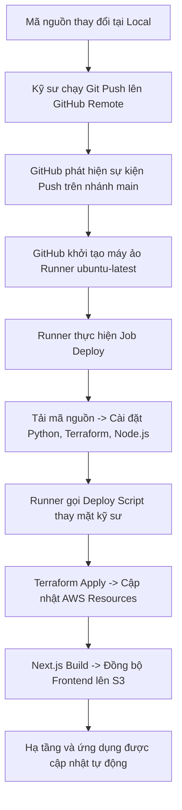
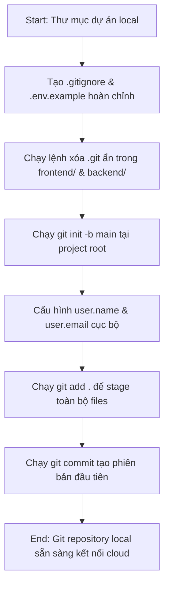
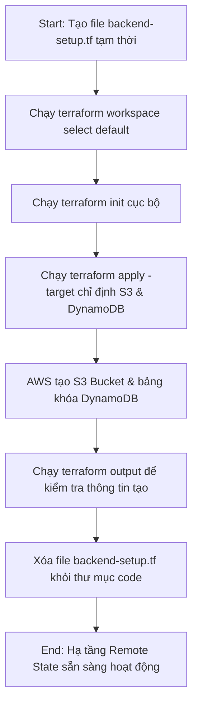
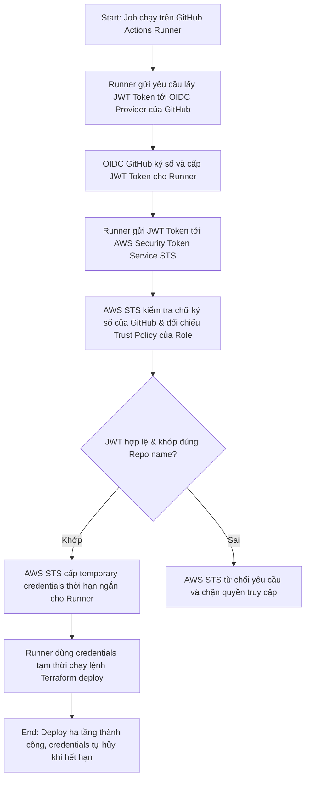
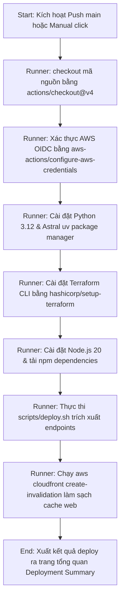
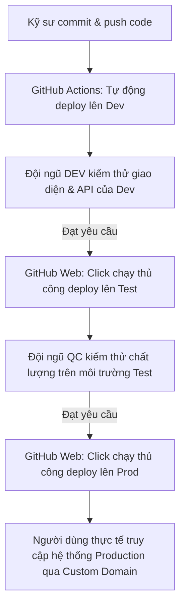
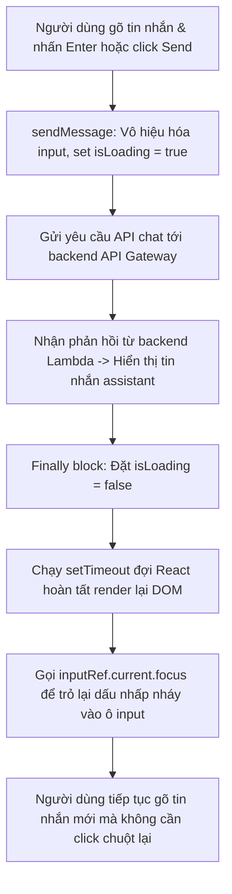
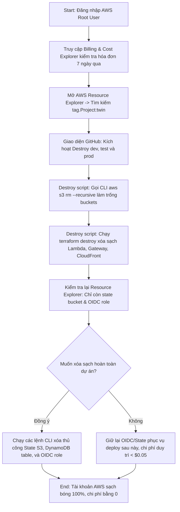

# Day 5 Summary - CI/CD with GitHub Actions

Course domain: AI Production Track: Deploy LLMs & Agents at Scale  
Course name: AI Production Track: Deploy LLMs & Agents at Scale

---

# 56. Day 5 - Automating AI Infrastructure Deployments with GitHub Actions CI-CD

Course domain: AI Production Track: Deploy LLMs & Agents at Scale  
Course name: AI Production Track: Deploy LLMs & Agents at Scale

## 1. Source Map - Bản đồ nguồn
- Transcript: [56. Day 5 - Automating AI Infrastructure Deployments with GitHub Actions CI-CD.txt](file:///G:/AIProduction_t6_2026/production/tai_lieu/week2/56.%20Day%205%20-%20Automating%20AI%20Infrastructure%20Deployments%20with%20GitHub%20Actions%20CI-CD.txt)
- Slide: [Production W2D5.pdf](file:///G:/AIProduction_t6_2026/production/slide/week2/Production%20W2D5.pdf)
- Code: [day5.md](file:///G:/AIProduction_t6_2026/production/week2/day5.md)
- Summary lịch sử: [day4_summary.md](file:///G:/AIProduction_t6_2026/production/tai_lieu/week2/day4_summary.md)
- Ghi chú về độ tin cậy hoặc mâu thuẫn giữa nguồn: Không có mâu thuẫn. Nội dung bài giảng khớp hoàn toàn với kiến thức nền tảng về Terraform đã học.

## 2. Executive Summary - Tóm tắt cốt lõi
- **Vai trò của CI/CD**: Chuyển giao từ quy trình triển khai thủ công tại local sang tự động hóa chuyên nghiệp thông qua tích hợp liên tục (Continuous Integration) và triển khai liên tục (Continuous Deployment).
- **Tái ôn tập Terraform**: Rà soát 6 khái niệm cốt lõi của Terraform bao gồm Provider (nhà cung cấp), Variable (biến đầu vào), Resource (tài nguyên), State (trạng thái), Output (đầu ra), và Workspace (không gian làm việc).
- **Giới thiệu GitHub Actions**: Một nền tảng tự động hóa tích hợp sẵn trong GitHub cho phép thực thi các tập lệnh khi xảy ra sự kiện định sẵn (như git push) hoặc kích hoạt thủ công bằng nút bấm.
- **Khái niệm Workflow**: Quy trình gồm một chuỗi các bước thực thi được định nghĩa bằng định dạng tệp tin cấu hình YAML trong thư mục `.github/workflows/`.
- **Khái niệm Job và Runner**: Mỗi workflow chứa các jobs (công việc). Job được chạy trên một Runner (máy ảo thực thi chạy trên hạ tầng đám mây của GitHub) để chạy các steps (bước).
- **Tổng quan kiến trúc**: Ôn tập sơ đồ kiến trúc Digital Twin serverless: CloudFront phục vụ frontend từ S3, gọi API Gateway định tuyến tới AWS Lambda, Lambda kết nối Amazon Bedrock (mô hình Nova) và ghi nhớ hội thoại qua S3 bucket.

## 3. Lesson Goals - Mục tiêu bài học
- **Concept goals - mục tiêu kiến thức**:
  - Nắm vững khái niệm CI/CD và lợi ích của tự động hóa triển khai hạ tầng.
  - Hiểu cách thức GitHub Actions vận hành thông qua các thành phần: Workflow, Job, Step, và Runner.
  - Hiểu được tầm quan trọng của việc duy trì trạng thái Terraform nhất quán giữa local và runner đám mây.
- **Practical goals - mục tiêu thực hành**:
  - Nhận biết cấu trúc thư mục chứa tệp cấu hình của GitHub Actions.
  - Hiểu cách hoạt động của deploy script local và vai trò của nó khi được tích hợp vào pipeline.
- **What learner should be able to explain - người học cần giải thích được**:
  - Tại sao GitHub Actions lại được ưa chuộng hơn các công cụ CI/CD truyền thống như Jenkins cho các dự án hiện đại, gọn nhẹ.
  - Luồng truyền dữ liệu từ trình duyệt của người dùng qua API Gateway, Lambda, Bedrock và S3 bucket diễn ra như thế nào.

## 4. Previous Context - Liên hệ với bài trước
- Bài học này tổng kết các kiến thức cấu hình Terraform thủ công ở Day 4 để chuẩn bị dịch chuyển toàn bộ quy trình vận hành lên đám mây của GitHub Actions ở các bài học tiếp theo.

## 5. Core Theory - Lý thuyết cốt lõi
- **Term - thuật ngữ**: CI/CD (Continuous Integration / Continuous Deployment)
  - **Meaning - nghĩa**: Tích hợp liên tục và Triển khai liên tục - quy trình tự động hóa kiểm thử, build và đẩy mã nguồn mới lên các môi trường thử nghiệm và sản xuất ngay khi có thay đổi trên mã nguồn.
  - **Why it matters - vì sao quan trọng**: Giảm thiểu lỗi thủ công, tăng tốc độ phát hành tính năng, đảm bảo mã nguồn luôn ở trạng thái sẵn sàng phát hành.
  - **Relationship - liên hệ với khái niệm khác**: Được triển khai thông qua các công cụ như GitHub Actions, GitLab CI/CD hoặc Jenkins.
- **Term - thuật ngữ**: YAML (YAML Ain't Markup Language)
  - **Meaning - nghĩa**: Định dạng tuần tự hóa dữ liệu thân thiện với con người, sử dụng thụt lề (indentation) bằng dấu cách để biểu diễn cấu trúc phân cấp dữ liệu thay vì dùng ngoặc nhọn `{}` hay thẻ.
  - **Why it matters - vì sao quan trọng**: Là định dạng tiêu chuẩn để viết cấu hình cho workflows trong GitHub Actions và nhiều công cụ DevOps khác.
  - **Relationship - liên hệ với khái niệm khác**: Dùng để tạo các tệp tin `.yml` hoặc `.yaml` trong thư mục `.github/workflows/`.
- **Term - thuật ngữ**: Runner
  - **Meaning - nghĩa**: Máy ảo hoặc container chạy trên hạ tầng đám mây của GitHub (hoặc tự thiết lập) dùng để tải mã nguồn, cài đặt công cụ và thực thi các câu lệnh được định nghĩa trong workflow steps.
  - **Why it matters - vì sao quan trọng**: Cung cấp môi trường thực thi độc lập và sạch sẽ cho mỗi lần chạy pipeline.
  - **Relationship - liên hệ với khái niệm khác**: Mỗi Job trong workflow được gán chạy trên một Runner xác định (ví dụ `ubuntu-latest`).

## 6. Workflow / Pipeline - Quy trình / luồng hoạt động
Sơ đồ hoạt động của quy trình CI/CD tích hợp tự động hóa:

1. **Input**: Sự kiện thay đổi mã nguồn (git push) trên kho lưu trữ đám mây.
2. **Processing steps**: Tải code, khởi tạo môi trường runner, cài đặt các runtime phụ thuộc, chạy deploy script.
3. **Output**: Hạ tầng và frontend được cập nhật đồng bộ trên AWS.
4. **Control flow / data flow**: Luồng đi từ mã nguồn trên git qua máy ảo runner và tác động tới tài nguyên AWS.

## 7. Techniques - Kỹ thuật sử dụng
- **Technique - kỹ thuật**: Platform-Integrated CI/CD
  - **Purpose - mục đích**: Tận dụng công cụ tự động hóa tích hợp sẵn trong kho lưu trữ mã nguồn để tối giản hóa thiết lập hạ tầng quản lý CI/CD.
  - **When to use - dùng khi nào**: Khi dự án lưu trữ trên GitHub và cần quy trình tự động hóa nhanh, nhẹ, không muốn duy trì máy chủ Jenkins riêng biệt.
  - **Trade-off - đánh đổi**: Phụ thuộc vào tính sẵn sàng của GitHub, bị giới hạn thời gian chạy miễn phí (build minutes limit) đối với các kho lưu trữ riêng tư.
  - **Common mistake - lỗi dễ gặp**: Cấu hình sai cú pháp thụt dòng của tệp tin YAML khiến workflow bị từ chối thực thi.

## 8. Code Walkthrough - Phân tích code nếu có
`Buổi học này không có code được cung cấp` (Chỉ giới thiệu lý thuyết nền tảng).

## 9. Options / Trade-offs - Bản đồ lựa chọn
So sánh công cụ CI/CD:
- **Option**: Jenkins
  - **Pros**: Hoàn toàn miễn phí, mã nguồn mở, khả năng tùy biến cực cao thông qua hàng nghìn plugin, phù hợp cho các hệ thống phức tạp và on-premise.
  - **Cons**: Yêu cầu cài đặt, quản trị và bảo trì máy chủ riêng biệt, tốn tài nguyên phần cứng, giao diện cũ kỹ và cấu hình phức tạp.
  - **When to choose**: Cho các doanh nghiệp lớn có đội ngũ vận hành chuyên nghiệp và hạ tầng tự chủ (self-hosted).
- **Option**: GitHub Actions (Giải pháp hiện tại)
  - **Pros**: (Recommended) Tích hợp trực tiếp vào repo GitHub, cực kỳ nhẹ, cấu hình bằng tệp tin YAML đơn giản, hỗ trợ máy ảo miễn phí chạy trên cloud.
  - **Cons**: Bị giới hạn số phút chạy miễn phí cho tài khoản private, khó cấu hình cho các hạ tầng nội bộ khép kín không kết nối internet.
  - **When to choose**: Khuyên dùng cho tất cả dự án hiện đại sử dụng GitHub làm nền tảng quản lý mã nguồn.

## 10. Pitfalls - Lỗi / bẫy thường gặp
- **Failure mode**: Pipeline bị treo hoặc báo lỗi cú pháp ngay khi khởi động.
  - **Root cause**: Sử dụng ký tự tab hoặc khoảng cách thụt lề không đồng đều trong file YAML.
  - **Symptom**: GitHub Actions tab báo lỗi "Invalid workflow file".
  - **Fix / prevention**: Luôn sử dụng dấu cách (spaces) thay vì tab, sử dụng các công cụ linter validate YAML trong IDE trước khi commit.

## 11. Knowledge Extension - Kiến thức mở rộng
- **Self-hosted Runners**: Trong trường hợp doanh nghiệp cần triển khai ứng dụng vào mạng nội bộ (VPC private) hoặc cần phần cứng cấu hình cao để build ứng dụng nặng, họ có thể tự cài đặt phần mềm Runner của GitHub lên máy chủ riêng của mình (Self-hosted) để Actions kết nối và thực thi lệnh bên trong mạng an toàn đó.

## 12. Study Pack - Gói ôn tập
### Must remember
- GitHub Actions sử dụng tệp cấu hình YAML đặt trong thư mục `.github/workflows/`.
- Job là tập hợp các bước chạy tuần tự trên cùng một máy ảo gọi là Runner.
- Triển khai serverless AI giúp tối ưu chi phí vận hành bằng cách chỉ trả tiền khi code thực sự chạy.
- Terraform duy trì tệp tin state để đối chiếu cấu hình logic với hạ tầng thực tế trên cloud.
- Môi trường chạy của Actions mặc định là sạch và sẽ bị hủy ngay sau khi kết thúc công việc.

### Self-check questions
1. Sự khác biệt cốt lõi giữa workflow và job trong GitHub Actions là gì?
2. Tại sao máy ảo runner của GitHub lại cần cài đặt lại các công cụ (như Terraform, Python) mỗi lần chạy?
3. Tại sao nói tệp tin state của Terraform là "nguồn thông tin tin cậy duy nhất"?
4. Jenkins và GitHub Actions khác nhau như thế nào về mặt quản lý máy chủ chạy CI/CD?
5. Những loại sự kiện nào của Git có thể dùng để trigger chạy một workflow tự động?

### Flashcards
- Q: Nơi khai báo các plugin tương thích đám mây trong Terraform là gì?
  A: Khối provider trong file cấu hình `.tf`.
- Q: Tệp tin định nghĩa cấu hình workflows của GitHub Actions sử dụng đuôi mở rộng nào?
  A: Đuôi `.yml` hoặc `.yaml`.

## 13. Missing Inputs - Còn thiếu gì
- Hướng dẫn: Bài học này là tổng quan lý thuyết, học viên cần theo dõi các bài tiếp theo để biết cú pháp thực tế của file YAML.

---

# 57. Day 5 - Setting Up Git and GitHub Actions for AI Production Deployments

Course domain: AI Production Track: Deploy LLMs & Agents at Scale  
Course name: AI Production Track: Deploy LLMs & Agents at Scale

## 1. Source Map - Bản đồ nguồn
- Transcript: [57. Day 5 - Setting Up Git and GitHub Actions for AI Production Deployments.txt](file:///G:/AIProduction_t6_2026/production/tai_lieu/week2/57.%20Day%205%20-%20Setting%20Up%20Git%20and%20GitHub%20Actions%20for%20AI%20Production%20Deployments.txt)
- Code: [day5.md](file:///G:/AIProduction_t6_2026/production/week2/day5.md) (Dòng 81-196)
- Ghi chú về độ tin cậy hoặc mâu thuẫn giữa nguồn: Không có mâu thuẫn. Lệnh dọn dẹp thư mục `.git` lồng nhau khớp hoàn chỉnh giữa bài giảng và hướng dẫn code.

## 2. Executive Summary - Tóm tắt cốt lõi
- **Dọn dẹp tài nguyên (Clean Slate)**: Hướng dẫn hủy bỏ toàn bộ hạ tầng đã tạo ở local từ Day 4 (dev, test, prod) và xóa các workspace Terraform để tài khoản AWS hoàn toàn trống sạch trước khi giao quyền cho CI/CD.
- **Thiết lập .gitignore**: Xây dựng tệp tin `.gitignore` hoàn chỉnh để chặn không cho commit các file nhạy cảm (`*.tfstate`, `.env`, credentials) và các tệp sinh ra tự động trong quá trình build (`lambda-deployment.zip`, `node_modules`, `.next`, `__pycache__`).
- **Tạo tệp cấu hình mẫu**: Viết file `.env.example` chứa các biến môi trường mẫu để hướng dẫn cấu hình mà không làm lộ dữ liệu nhạy cảm.
- **Giải quyết lỗi Repo lồng nhau (Nested Repos)**: Loại bỏ các thư mục `.git` ẩn sinh ra tự động trong thư mục con `frontend/` (do Next.js khởi tạo) hoặc `backend/` bằng lệnh xóa đệ quy. Đây là bước bắt buộc để tránh xung đột cấu trúc Git ở thư mục root.
- **Khởi tạo và Commit đầu tiên**: Sử dụng lệnh `git init -b main` để khởi tạo kho lưu trữ local, cấu hình username/email và thực hiện add, commit phiên bản đầu tiên của dự án.

## 3. Lesson Goals - Mục tiêu bài học
- **Concept goals - mục tiêu kiến thức**:
  - Hiểu sâu sắc lý do tại sao không được đưa các tệp tin cấu hình nhạy cảm và các thư mục build tạm lên Git.
  - Hiểu cơ chế hoạt động của Git ở thư mục gốc và lý do tại sao các thư mục con chứa `.git` lại gây lỗi "nested repository" làm mất dấu file khi push.
- **Practical goals - mục tiêu thực hành**:
  - Viết tệp `.gitignore` và `.env.example` chuẩn cho dự án fullstack AI.
  - Chạy lệnh dọn dẹp các thư mục con `.git` ẩn trên hệ thống file local.
  - Thực hành khởi tạo repository Git, cấu hình tham số danh tính local và tạo commit đầu tiên.
- **What learner should be able to explain - người học cần giải thích được**:
  - Tại sao việc gõ nhầm lệnh `rm -rf` ở thư mục gốc ổ đĩa lại là lỗi DevOps thảm họa.
  - Cách phân biệt file bị Git bỏ qua (ignored) và file chưa được theo dõi (untracked).

## 4. Previous Context - Liên hệ với bài trước
- Bài học này yêu cầu dọn dẹp hạ tầng local đã apply từ Day 4 bằng các script destroy để bắt đầu lại với luồng triển khai tự động hóa thông qua Git repository.

## 5. Core Theory - Lý thuyết cốt lõi
- **Term - thuật ngữ**: Staging Area - Vùng đệm / Vùng tạm lưu
  - **Meaning - nghĩa**: Vùng lưu trữ trung gian của Git chứa danh sách các tệp tin đã thay đổi được chọn để chuẩn bị ghi nhận vào lịch sử của repository trong commit tiếp theo.
  - **Why it matters - vì sao quan trọng**: Cho phép lập trình viên lựa chọn chính xác những thay đổi nào sẽ được commit thay vì phải commit toàn bộ file trong thư mục.
  - **Relationship - liên hệ với khái niệm khác**: Đưa file vào vùng staging bằng lệnh `git add [file]` và commit bằng `git commit`.
- **Term - thuật ngữ**: Nested Git Repository - Kho lưu trữ Git lồng nhau
  - **Meaning - nghĩa**: Tình huống xảy ra khi một thư mục con bên trong một dự án Git cha lại chứa một thư mục ẩn `.git` của riêng nó, biến thư mục con đó thành một repo độc lập.
  - **Why it matters - vì sao quan trọng**: Git cha sẽ coi thư mục con đó như một submodule chưa cấu hình và bỏ qua không theo dõi tất cả các tệp tin bên trong nó, dẫn đến việc push code bị thiếu toàn bộ thư mục con.
  - **Relationship - liên hệ với khái niệm khác**: Khắc phục bằng cách xóa thư mục ẩn `.git` của thư mục con.

## 6. Workflow / Pipeline - Quy trình / luồng hoạt động
Quy trình chuẩn bị và khởi tạo Git repository cho dự án Digital Twin:

1. **Input**: Thư mục dự án thô chưa cấu hình kiểm soát phiên bản.
2. **Processing steps**: Viết cấu hình ignore, xóa repo lồng nhau, khởi tạo repo gốc, cấu hình danh tính, stage dữ liệu và commit.
3. **Output**: Thư mục ẩn `.git` được khởi tạo và ghi nhận commit đầu tiên chứa mã nguồn sạch.
4. **Decision points**: Nếu gõ lệnh `git status` mà thấy thư mục `frontend` hiển thị dưới dạng một file màu xám (submodule) chứ không hiển thị các file con bên trong, chứng tỏ thư mục con `.git` vẫn chưa được xóa sạch.

## 7. Techniques - Kỹ thuật sử dụng
- **Technique - kỹ thuật**: Nested Git Sub-repository Removal - Loại bỏ repo Git lồng nhau
  - **Purpose - mục đích**: Dọn dẹp hoàn toàn siêu dữ liệu Git của các thư mục con được sinh ra bởi các công cụ scaffolding (như create-next-app), đưa toàn bộ dự án về dưới sự quản lý duy nhất của repo cha.
  - **When to use - dùng khi nào**: Ngay sau khi dùng các công cụ khởi tạo project con tự động bên trong cấu trúc dự án monorepo hoặc multi-folder.
  - **Trade-off - đánh đổi**: Xóa vĩnh viễn lịch sử commit riêng của thư mục con đó (nếu có).
  - **Common mistake - lỗi dễ gặp**: Gõ nhầm lệnh xóa thành `rm -rf frontend/` (thiếu phần `.git`), khiến toàn bộ mã nguồn frontend Next.js bị xóa sạch không thể phục hồi.

## 8. Code Walkthrough - Phân tích code nếu có

### File: `twin/.gitignore`
- **Purpose - mục đích**: Khai báo danh sách các file và thư mục mà Git không được phép theo dõi hoặc đưa lên remote repository.
- **Key logic - logic chính**: Bỏ qua các file state nhạy cảm của Terraform nhưng sử dụng ký tự phủ định `!` để cho phép đưa các tệp cấu hình biến mặc định (`terraform.tfvars`, `prod.tfvars`) lên Git một cách an toàn.

```gitignore
# file:///G:/AIProduction_t6_2026/production/week2/day5.md (dòng 87-129)
# Terraform
*.tfstate
*.tfstate.*
.terraform/
.terraform.lock.hcl
terraform.tfstate.d/
*.tfvars.secret

# Lambda packages
lambda-deployment.zip
lambda-package/

# Memory storage (chứa lịch sử hội thoại cục bộ của agent)
memory/

# Environment files
.env
.env.*
!.env.example

# Node (frontend build outputs)
node_modules/
out/
.next/
*.log
```
*Ghi chú tiếng Việt*: Dòng `!.env.example` đảm bảo tệp tin hướng dẫn biến môi trường mẫu được phép đẩy lên GitHub làm tài liệu tham khảo cho người dùng khác, trong khi các file `.env` chứa credentials thực tế bị chặn hoàn toàn.

---

### Các câu lệnh dọn dẹp và khởi tạo trên Terminal
- **Purpose - mục đích**: Xóa bỏ repo con và khởi tạo Git repository đồng bộ cho dự án.

```bash
# file:///G:/AIProduction_t6_2026/production/week2/day5.md (dòng 153-194)
# 1. Xóa thư mục git ẩn trong các thư mục con (chạy tại thư mục root 'twin')
rm -rf frontend/.git backend/.git 2>/dev/null

# 2. Khởi tạo repo local với nhánh mặc định là main
git init -b main

# 3. Cấu hình danh tính người dùng cho commit
git config user.name "Your Name"
git config user.email "your.email@example.com"

# 4. Stage toàn bộ file và commit
git add .
git commit -m "Initial commit: Digital Twin infrastructure and application"
```
*Ghi chú tiếng Việt*: Câu lệnh `rm -rf frontend/.git` sử dụng đuôi `.git` để chỉ xóa thư mục quản lý của git bên trong frontend chứ không đụng vào mã nguồn của Next.js. Cú pháp `2>/dev/null` giúp ẩn các cảnh báo lỗi nếu thư mục cần xóa không tồn tại.

## 9. Options / Trade-offs - Bản đồ lựa chọn
So sánh cách quản lý dự án con:
- **Option**: Sử dụng Git Submodules
  - **Pros**: Giữ nguyên lịch sử commit độc lập của từng dự án con, cho phép cập nhật thư mục con từ các nguồn repo khác nhau một cách chuyên nghiệp.
  - **Cons**: Cực kỳ phức tạp trong thao tác kéo code và cập nhật phiên bản, dễ gây lỗi lệch phiên bản (detached HEAD) cho những người chưa thành thạo Git.
  - **When to choose**: Khi dự án con là một thư viện dùng chung được phát triển song song bởi một team độc lập khác.
- **Option**: Monorepo phẳng (Giải pháp hiện tại)
  - **Pros**: (Recommended) Vô cùng đơn giản, tất cả mã nguồn hạ tầng, frontend và backend nằm chung trong một kho lưu trữ duy nhất, dễ dàng thay đổi và deploy đồng bộ.
  - **Cons**: Kích thước repo lớn hơn, khó phân tách quyền truy cập mã nguồn cho các nhóm lập trình viên khác nhau.
  - **When to choose**: Khuyên dùng cho các dự án startup, dự án cá nhân hoặc các hệ thống serverless nhỏ cần triển khai nhanh chóng.

## 10. Pitfalls - Lỗi / bẫy thường gặp
- **Failure mode**: Sau khi commit và push, thư mục `frontend/` trên GitHub hiển thị dưới dạng biểu tượng thư mục màu xám có dấu mũi tên và không thể click mở ra xem file bên trong.
  - **Root cause**: Quên không chạy lệnh xóa thư mục ẩn `.git` bên trong `frontend/` trước khi chạy `git add .` ở thư mục root. Git coi thư mục này là một submodule trống.
  - **Symptom**: Mã nguồn frontend không được upload lên GitHub, khiến build pipeline báo lỗi thiếu thư mục `frontend/package.json`.
  - **Fix / prevention**: Chạy lệnh `git rm --cached frontend` để xóa tracking cũ, chạy lệnh dọn dẹp `.git` ẩn bên trong `frontend/`, sau đó thực hiện `git add .` và commit lại.

## 11. Knowledge Extension - Kiến thức mở rộng
- **Ký tự phủ định (!) trong gitignore**: Ký tự `!` đại diện cho quy tắc phủ định (negation) trong Git. Khi một quy tắc ignore khớp với một file (ví dụ `*.tfvars`), bạn có thể dùng `!prod.tfvars` to yêu cầu Git loại trừ file cụ thể này ra khỏi danh sách bị bỏ qua, giúp commit tệp cấu hình production lên Git một cách có chọn lọc.

## 12. Study Pack - Gói ôn tập
### Must remember
- Bắt buộc phải xóa thư mục ẩn `.git` của các dự án con trước khi tạo repo Git ở thư mục root.
- Tệp tin `.env` chứa thông tin nhạy cảm tuyệt đối không được đưa lên GitHub.
- Lệnh `git init -b main` thiết lập nhanh tên nhánh mặc định là main thay vì master.
- Thư mục `node_modules/` chứa hàng nghìn file thư viện local và bắt buộc phải nằm trong `.gitignore`.
- Sử dụng lệnh `git status` thường xuyên để rà soát danh sách file trước khi commit.

### Self-check questions
1. Tại sao việc đưa tệp tin `lambda-deployment.zip` lên Git lại bị coi là thực hành không tốt (bad practice)?
2. Làm thế nào để kiểm tra xem một tệp tin cụ thể đang bị ignore bởi quy tắc nào trong `.gitignore`?
3. Tại sao Next.js lại tự động tạo sẵn một repository Git khi ta chạy lệnh khởi tạo dự án?
4. Sự khác biệt giữa lệnh `git checkout -b` và cờ `-b` trong lệnh `git init` là gì?
5. Làm cách nào để cấu hình thông tin danh tính git toàn cục (global) thay vì chỉ cấu hình local cho dự án hiện tại?

### Flashcards
- Q: Lệnh nào dùng để kiểm tra trạng thái theo dõi của các tệp tin trong thư mục làm việc?
  A: Lệnh `git status`.
- Q: Lệnh nào dùng để ghi đè việc bỏ qua file nhạy cảm trong gitignore và ép đưa file đó vào vùng staging?
  A: Lệnh `git add -f [tên_file]`.

## 13. Missing Inputs - Còn thiếu gì
- Hướng dẫn: Đảm bảo máy local đã được cài đặt và cấu hình sẵn Git CLI phiên bản hiện đại (khuyến nghị >= 2.28 để hỗ trợ cờ `-b`).

---

# 58. Day 5 - Setting Up GitHub Actions for Automated AI Model Deployment

Course domain: AI Production Track: Deploy LLMs & Agents at Scale  
Course name: AI Production Track: Deploy LLMs & Agents at Scale

## 1. Source Map - Bản đồ nguồn
- Transcript: [58. Day 5 - Setting Up GitHub Actions for Automated AI Model Deployment.txt](file:///G:/AIProduction_t6_2026/production/tai_lieu/week2/58.%20Day%205%20-%20Setting%20Up%20GitHub%20Actions%20for%20Automated%20AI%20Model%20Deployment.txt)
- Code: [day5.md](file:///G:/AIProduction_t6_2026/production/week2/day5.md) (Dòng 197-339)
- Ghi chú về độ tin cậy hoặc mâu thuẫn giữa nguồn: Không có mâu thuẫn. Cú pháp khai báo tài nguyên S3 và DynamoDB table trong tệp cấu hình `backend-setup.tf` khớp chính xác với giải thích của bài giảng.

## 2. Executive Summary - Tóm tắt cốt lõi
- **Kết nối GitHub Remote**: Hướng dẫn tạo kho lưu trữ trống trên GitHub, kết nối repo local qua lệnh `git remote add origin` và đẩy mã nguồn lên nhánh chính `main`.
- **Vấn đề Terraform State trong CI/CD**: Khi chạy Terraform cục bộ, file trạng thái được lưu ở ổ cứng. Khi chạy trong GitHub Actions, runner là máy ảo tạm thời (ephemeral VM) sẽ bị xóa sau khi chạy, làm mất file state. Do đó, cần lưu trữ state tập trung ở một nơi an toàn từ xa (**Remote State**).
- **Giải pháp lưu trữ trạng thái**: Sử dụng S3 bucket để lưu trữ tệp tin `.tfstate` và DynamoDB table để thực hiện khóa trạng thái (**State Locking**), tránh việc hai tiến trình chạy apply cùng lúc gây ghi đè làm hỏng hạ tầng.
- **Kịch bản Bootstrap thông minh**: Tạo tệp cấu hình tạm thời `terraform/backend-setup.tf` định nghĩa S3 bucket và DynamoDB table.
- **Thực thi Target Apply**: Sử dụng cờ `-target` để ra lệnh cho Terraform chỉ khởi tạo duy nhất các tài nguyên lưu trữ state mà chưa đụng vào hạ tầng ứng dụng Digital Twin.
- **Dọn dẹp file tạm**: Sau khi hạ tầng lưu trữ trạng thái từ xa được AWS tạo thành công, tiến hành xóa tệp tin `backend-setup.tf` để tránh Terraform cố gắng tạo lại chúng trong các lần apply sau.

## 3. Lesson Goals - Mục tiêu bài học
- **Concept goals - mục tiêu kiến thức**:
  - Hiểu lý do tại sao quy trình CI/CD bắt buộc phải sử dụng Remote State thay vì Local State.
  - Hiểu nguyên lý hoạt động của cơ chế State Locking sử dụng DynamoDB để bảo vệ tính toàn vẹn của hạ tầng đám mây.
  - Hiểu cách thức hoạt động của tính năng Target Apply trong việc deploy có chọn lọc các tài nguyên.
- **Practical goals - mục tiêu thực hành**:
  - Đẩy thành công dự án local lên GitHub repository từ xa.
  - Viết tệp tin cấu hình HCL `backend-setup.tf` thiết lập S3 và DynamoDB table.
  - Chạy lệnh apply khoanh vùng tài nguyên (`-target`) thành công trên Windows PowerShell và macOS/Linux terminal.
- **What learner should be able to explain - người học cần giải thích được**:
  - Tại sao S3 bucket dùng để lưu trữ trạng thái Terraform bắt buộc phải bật tính năng Versioning (ghi nhận phiên bản).
  - Tại sao DynamoDB table dùng để khóa trạng thái lại yêu cầu trường khóa phân mảnh (hash key) bắt buộc phải đặt tên chính xác là `LockID`.

## 4. Previous Context - Liên hệ với bài trước
- Sau khi khởi tạo xong Git repository ở bài 57, bài học này đưa mã nguồn lên đám mây GitHub và cấu hình hạ tầng lưu trữ trạng thái tập trung để chuẩn bị cho việc tích hợp chạy tự động.

## 5. Core Theory - Lý thuyết cốt lõi
- **Term - thuật ngữ**: Remote State - Trạng thái từ xa
  - **Meaning - nghĩa**: Cơ chế lưu trữ tệp tin trạng thái (`.tfstate`) của Terraform trên một hệ thống lưu trữ chia sẻ trực tuyến (như AWS S3, Google Cloud Storage) thay vì lưu ở đĩa cứng cục bộ.
  - **Why it matters - vì sao quan trọng**: Cho phép nhiều thành viên trong team và các máy chủ CI/CD truy cập chung vào một nguồn thông tin duy nhất về hạ tầng thực tế.
  - **Relationship - liên hệ với khái niệm khác**: Khai báo thông qua khối cấu hình `backend "s3"` của Terraform.
- **Term - thuật ngữ**: State Locking - Khóa trạng thái
  - **Meaning - nghĩa**: Cơ chế ngăn chặn các thao tác ghi đè đồng thời lên file trạng thái Terraform bằng cách ghi một khóa tạm thời vào cơ sở dữ liệu (như DynamoDB) khi một tiến trình apply đang chạy.
  - **Why it matters - vì sao quan trọng**: Ngăn ngừa xung đột hạ tầng và lỗi hỏng file trạng thái khi có hai kỹ sư hoặc hai pipeline chạy song song cùng lúc.
  - **Relationship - liên hệ với khái niệm khác**: Trên AWS, tính năng này được Terraform hỗ trợ trực tiếp thông qua một bảng DynamoDB.
- **Term - thuật ngữ**: Target Apply
  - **Meaning - nghĩa**: Thao tác ra lệnh cho Terraform chỉ tập trung tạo lập hoặc cập nhật một nhóm tài nguyên được chỉ định cụ thể bằng cờ `-target=[đường_dẫn_tài_nguyên]`, bỏ qua tất cả tài nguyên khác trong code.
  - **Why it matters - vì sao quan trọng**: Giúp khởi tạo hạ tầng nền móng (như mạng, bucket chứa state) trước khi các tài nguyên chính được định nghĩa hoàn chỉnh.
  - **Relationship - liên hệ với khái niệm khác**: Chạy bằng lệnh `terraform apply -target=resource_type.resource_name`.

## 6. Workflow / Pipeline - Quy trình / luồng hoạt động
Quy trình thiết lập Remote State tập trung:

1. **Input**: File cấu hình `backend-setup.tf` chứa thông tin khai báo tài nguyên S3 và DynamoDB.
2. **Processing steps**: Switch về workspace default, chạy init, chạy apply chọn lọc tài nguyên đích, in output, và xóa file tạm.
3. **Output**: S3 bucket và DynamoDB table được khởi tạo trên AWS, file cấu hình tạm được dọn sạch khỏi Git.
4. **Decision points**: Cần đảm bảo đang đứng ở workspace `default` trước khi khởi tạo tài nguyên nền móng này để tránh việc tài nguyên bị gán nhầm vào workspace con như `dev` hay `test`.

## 7. Techniques - Kỹ thuật sử dụng
- **Technique - kỹ thuật**: Target-Restricted Infrastructure Bootstrapping - Khởi tạo hạ tầng giới hạn đích
  - **Purpose - mục đích**: Giải quyết bài toán "con gà và quả trứng" trong IaC: Cần có S3 bucket trước để cấu hình backend từ xa, nhưng lại muốn dùng Terraform để tạo chính cái bucket đó. Bằng cách viết file tạm và chỉ chạy apply khoanh vùng, ta tạo được bucket trước khi khai báo cấu hình backend chính thức.
  - **When to use - dùng khi nào**: Khi bắt đầu thiết lập một dự án hạ tầng Terraform mới từ đầu trên một tài khoản đám mây sạch.
  - **Trade-off - đánh đổi**: Phải tạo file tạm và xóa đi thủ công, dễ gây nhầm lẫn cho người mới nếu không hiểu rõ quy trình.
  - **Common mistake - lỗi dễ gặp**: Quên không xóa file `backend-setup.tf` sau khi tạo, khiến các lần chạy apply sau của pipeline bị báo lỗi trùng lặp tên tài nguyên S3 (vì S3 bucket name là duy nhất toàn cầu).

## 8. Code Walkthrough - Phân tích code nếu có

### File: `terraform/backend-setup.tf` (Tệp cấu hình tạm thời)
- **Purpose - mục đích**: Tạo S3 bucket lưu trữ state file và bảng DynamoDB để thực hiện khóa trạng thái.
- **Key logic - logic chính**: Khai báo tài nguyên S3, bật phiên bản (versioning), bật mã hóa bảo mật mặc định (SSE AES256) và bảng DynamoDB có HashKey tên là `LockID`.

```hcl
# file:///G:/AIProduction_t6_2026/production/week2/day5.md (dòng 238-301)
resource "aws_s3_bucket" "terraform_state" {
  # Tên bucket kết hợp Account ID để đảm bảo tính duy nhất toàn cầu
  bucket = "twin-terraform-state-${data.aws_caller_identity.current.account_id}"
  
  tags = {
    Name        = "Terraform State Store"
    Environment = "global"
    ManagedBy   = "terraform"
  }
}

resource "aws_s3_bucket_versioning" "terraform_state" {
  bucket = aws_s3_bucket.terraform_state.id
  
  # Bật versioning để Terraform lưu lại lịch sử các phiên bản cũ của state file
  versioning_configuration {
    status = "Enabled"
  }
}

resource "aws_s3_bucket_server_side_encryption_configuration" "terraform_state" {
  bucket = aws_s3_bucket.terraform_state.id

  # Mã hóa dữ liệu lưu trữ tĩnh bằng thuật toán AES256
  rule {
    apply_server_side_encryption_by_default {
      sse_algorithm = "AES256"
    }
  }
}

resource "aws_dynamodb_table" "terraform_locks" {
  name         = "twin-terraform-locks"
  billing_mode = "PAY_PER_REQUEST"  # Chỉ tính phí trên mỗi lượt đọc/ghi thực tế (không có phí nhàn rỗi)
  hash_key     = "LockID"           # Khóa phân mảnh bắt buộc phải là LockID

  attribute {
    name = "LockID"
    type = "S"                      # Định dạng kiểu dữ liệu chuỗi (String)
  }
}
```
*Ghi chú tiếng Việt*: Thuộc tính `versioning_configuration` được đặt ở trạng thái `Enabled` là cực kỳ quan trọng để bảo vệ dự án. Nếu file state bị lỗi do mất mạng giữa chừng khi đang apply, ta có thể dễ dàng khôi phục lại phiên bản state cũ trên S3 để hệ thống không bị mất đồng bộ.

## 9. Options / Trade-offs - Bản đồ lựa chọn
So sánh cách quản lý Remote State:
- **Option**: Sử dụng dịch vụ Terraform Cloud
  - **Pros**: Được HashiCorp quản lý hoàn toàn, có giao diện web trực quan theo dõi state, tự động tích hợp khóa và phân quyền mà không cần tạo thêm tài nguyên trên AWS.
  - **Cons**: Bị giới hạn tính năng ở bản miễn phí, phát sinh chi phí đăng ký thuê bao khi quy mô team tăng lên, dữ liệu state lưu trên hệ thống của bên thứ ba.
  - **When to choose**: Cho các team chuyên nghiệp muốn giảm thiểu tối đa việc tự quản lý hạ tầng vận hành Terraform.
- **Option**: Tự quản lý bằng AWS S3 + DynamoDB (Giải pháp hiện tại)
  - **Pros**: (Recommended) Hoàn toàn miễn phí (nằm trong Free Tier hoặc chi phí cực thấp ~0.02$/tháng), dữ liệu nằm trọn vẹn trong tài khoản AWS của doanh nghiệp, độ tin cậy và bảo mật tối đa.
  - **Cons**: Phải tự viết cấu hình code khởi tạo và tự chịu trách nhiệm cấu hình bảo mật/sao lưu.
  - **When to choose**: Khuyên dùng cho tất cả dự án hạ tầng tiêu chuẩn trên AWS để kiểm soát toàn diện và tiết kiệm chi phí.

## 10. Pitfalls - Lỗi / bẫy thường gặp
- **Failure mode**: Chạy lệnh apply bị crash báo lỗi `BucketAlreadyExists`.
  - **Root cause**: Tên bucket `twin-terraform-state-[account-id]` bị trùng với một bucket đã có sẵn trên hệ thống của AWS (thường xảy ra do học viên chạy lại lệnh này lần 2 mà không biết tài nguyên đã tồn tại).
  - **Symptom**: Terraform dừng tiến trình và hiển thị lỗi đỏ.
  - **Fix / prevention**: Chạy lệnh `aws s3 ls` để kiểm tra xem bucket đã có chưa. Nếu đã có, chỉ cần chạy lệnh `terraform import` hoặc xóa bucket cũ trên console trước khi chạy lại.

## 11. Knowledge Extension - Kiến thức mở rộng
- **DynamoDB Billing Modes**: Tham số `billing_mode = "PAY_PER_REQUEST"` (hay còn gọi là On-Demand) giúp doanh nghiệp không phải trả bất kỳ chi phí duy trì cố định nào cho bảng DynamoDB. AWS chỉ tính phí khi có thao tác đọc hoặc ghi thực tế diễn ra (khi chạy plan/apply). Điều này cực kỳ tối ưu chi phí so với chế độ `PROVISIONED` (phải trả tiền cho băng thông định sẵn dù không sử dụng).

## 12. Study Pack - Gói ôn tập
### Must remember
- Remote State giúp lưu trữ file `.tfstate` tập trung trên S3 thay vì local máy tính.
- State Locking ngăn chặn tình trạng ghi đè file trạng thái đồng thời từ 2 tiến trình chạy.
- Phải empty S3 bucket chứa state trước khi có thể chạy lệnh xóa bucket đó khỏi AWS.
- Cờ `-target` cho phép chỉ định chính xác tài nguyên logic nào sẽ được Terraform tạo ra.
- Bắt buộc phải cấu hình mã hóa tĩnh (SSE AES256) cho bucket chứa state để bảo vệ thông tin hạ tầng nhạy cảm.

### Self-check questions
1. Tại sao máy ảo runner chạy GitHub Actions không thể lưu trữ file state của Terraform cục bộ?
2. Cơ chế khóa trạng thái (State Locking) sử dụng DynamoDB hoạt động như thế nào khi có 2 người chạy apply cùng lúc?
3. Tại sao ta lại xóa tệp tin `backend-setup.tf` đi sau khi hạ tầng của nó đã được apply thành công?
4. Khóa phân mảnh (hash key) trong bảng DynamoDB làm nhiệm vụ khóa state bắt buộc phải đặt tên là gì và thuộc kiểu dữ liệu nào?
5. Làm cách nào để chạy lệnh apply chỉ riêng cho tài nguyên bảng DynamoDB trong file cấu hình?

### Flashcards
- Q: Tính năng nào của S3 giúp bảo vệ file state khỏi việc bị ghi đè lỗi bằng cách lưu lại lịch sử thay đổi?
  A: S3 Bucket Versioning.
- Q: Lệnh nào dùng để trích xuất các giá trị đầu ra được định nghĩa trong file cấu hình Terraform?
  A: Lệnh `terraform output`.

## 13. Missing Inputs - Còn thiếu gì
- Tài nguyên: Cần chắc chắn rằng quyền hạn của IAM User local đang chạy lệnh có đủ quyền tạo bảng DynamoDB và S3 Bucket trên AWS.

---

# 59. Day 5 - Setting Up GitHub Actions for Automated AI Infrastructure Deployment

Course domain: AI Production Track: Deploy LLMs & Agents at Scale  
Course name: AI Production Track: Deploy LLMs & Agents at Scale

## 1. Source Map - Bản đồ nguồn
- Transcript: [59. Day 5 - Setting Up GitHub Actions for Automated AI Infrastructure Deployment.txt](file:///G:/AIProduction_t6_2026/production/tai_lieu/week2/59.%20Day%205%20-%20Setting%20Up%20GitHub%20Actions%20for%20Automated%20AI%20Infrastructure%20Deployment.txt)
- Code: [day5.md](file:///G:/AIProduction_t6_2026/production/week2/day5.md) (Dòng 340-814)
- Ghi chú về độ tin cậy hoặc mâu thuẫn giữa nguồn: Không có mâu thuẫn. Cơ chế xác thực OIDC sử dụng thumbprint và chính sách trust policy được giải thích rất đồng bộ và khoa học.

## 2. Executive Summary - Tóm tắt cốt lõi
- **Chèn cấu hình Backend động**: Cập nhật lệnh `terraform init` trong file `deploy.sh` và `deploy.ps1` để truyền cấu hình lưu trữ state động bằng cờ `-backend-config` (truyền động bucket name chứa AWS Account ID, key file chứa tên môi trường và DynamoDB lock table).
- **Hủy bộ tích hợp S3**: Thay thế toàn bộ mã nguồn của script hủy hạ tầng `destroy.sh` và `destroy.ps1` tương thích với cơ chế lưu trữ state trên S3.
- **Giới thiệu OIDC Authentication**: Áp dụng cơ chế xác thực OpenID Connect (OIDC) để cấp quyền cho GitHub Actions truy cập vào AWS mà không cần lưu trữ thông tin đăng nhập dài hạn (AWS Access Keys) trên GitHub, loại bỏ hoàn toàn nguy cơ rò rỉ keys.
- **Tạo OIDC Provider và IAM Role**: Khởi tạo file cấu hình tạm thời `terraform/github-oidc.tf` để thiết lập định danh liên kết (Federated Identity) giữa GitHub và AWS.
- **Cấu hình Trust Policy an toàn**: Thiết lập chính sách tin cậy giới hạn quyền assume role: chỉ cho phép các yêu cầu đến từ đúng địa chỉ GitHub và đúng kho lưu trữ chỉ định (`repo:owner/repo:*`) mới được AWS cấp token tạm thời.
- **Phân quyền tối thiểu**: Đính kèm đầy đủ các policy cần thiết (Lambda, S3, API Gateway, CloudFront, Bedrock, DynamoDB, ACM, Route 53) cho IAM role `github-actions-twin-deploy` để Actions có đủ quyền tạo hạ tầng thay mặt lập trình viên.

## 3. Lesson Goals - Mục tiêu bài học
- **Concept goals - mục tiêu kiến thức**:
  - Hiểu nguyên lý bảo mật vượt trội của OpenID Connect (OIDC) so với phương thức Access Keys truyền thống.
  - Hiểu cách thức hoạt động của Token định danh Web Identity (`sts:AssumeRoleWithWebIdentity`) và thời hạn của token tạm thời.
  - Nắm vững tầm quan trọng của việc cấu hình điều kiện ràng buộc repo trong chính sách tin cậy (Trust Policy).
- **Practical goals - mục tiêu thực hành**:
  - Sửa đổi tham số init trong các file shell/PowerShell scripts cục bộ.
  - Viết và thực thi tệp cấu hình HCL `github-oidc.tf` để cấp quyền OIDC.
  - Kiểm tra và ghi lại ARN của IAM role được sinh ra để nạp cấu hình bảo mật.
- **What learner should be able to explain - người học cần giải thích được**:
  - Tại sao OIDC lại được coi là phương thức xác thực không cần mật khẩu (passwordless) và không có rủi ro lộ keys nhạy cảm.
  - Tại sao IAM role của GitHub Actions lại cần có quyền `iam:CreateRole` và `iam:PassRole`.

## 4. Previous Context - Liên hệ với bài trước
- Sau khi đã tạo xong S3 bucket chứa state ở bài 58, bài học này tích hợp bucket đó vào cấu hình chạy init động của các scripts và thiết lập kênh kết nối an toàn OIDC giữa GitHub và AWS.

## 5. Core Theory - Lý thuyết cốt lõi
- **Term - thuật ngữ**: OIDC (OpenID Connect)
  - **Meaning - nghĩa**: Một giao thức xác thực được xây dựng trên nền tảng OAuth 2.0, cho phép các ứng dụng xác minh danh tính của người dùng hoặc hệ thống dựa trên xác thực được thực hiện bởi một máy chủ ủy quyền đáng tin cậy.
  - **Why it matters - vì sao quan trọng**: Cho phép GitHub Actions Runner chứng minh danh tính của nó với AWS bằng một token tạm thời được ký bởi GitHub, loại bỏ hoàn toàn việc phải lưu trữ AWS Access Key ID và Secret Access Key trên GitHub.
  - **Relationship - liên hệ với khái niệm khác**: Cấu hình thông qua tài nguyên `aws_iam_openid_connect_provider` trên AWS.
- **Term - thuật ngữ**: Trust Policy - Chính sách tin cậy / Chính sách ủy thác
  - **Meaning - nghĩa**: Khối tài liệu cấu hình JSON gắn kèm với một IAM Role của AWS, định nghĩa rõ ràng những đối tượng định danh nào (như tài khoản AWS khác, dịch vụ AWS, hoặc OIDC Provider ngoài) được phép giả lập (assume) vai trò của role này.
  - **Why it matters - vì sao quan trọng**: Là chốt chặn bảo mật đầu tiên ngăn chặn các đối tượng không được phép chiếm đoạt quyền hạn của role.
  - **Relationship - liên hệ với khái niệm khác**: Khai báo bằng thuộc tính `assume_role_policy` trong tài nguyên `aws_iam_role`.
- **Term - thuật ngữ**: Web Identity Token - Token định danh Web
  - **Meaning - nghĩa**: Một chuỗi mã hóa JSON Web Token (JWT) được sinh ra bởi một nhà cung cấp định danh web đáng tin cậy (như Google, GitHub), chứa các thông tin xác nhận danh tính được ký số an toàn.
  - **Why it matters - vì sao quan trọng**: Được dùng để gửi kèm trong yêu cầu gọi tới API của AWS Security Token Service (STS) để đổi lấy các credentials tạm thời của AWS.
  - **Relationship - liên hệ với khái niệm khác**: Gọi thông qua hành động API `sts:AssumeRoleWithWebIdentity`.

## 6. Workflow / Pipeline - Quy trình / luồng hoạt động
Quy trình xác thực bảo mật không dùng mật khẩu OIDC giữa GitHub và AWS:

1. **Input**: Yêu cầu xác thực từ GitHub runner và JWT token được ký bởi GitHub.
2. **Processing steps**: Lấy token, gửi tới AWS STS, kiểm tra chữ ký số, xác thực điều kiện trust policy và cấp phát thông tin đăng nhập tạm thời.
3. **Output**: Token đăng nhập AWS tạm thời có thời hạn ngắn (mặc định 1 giờ) lưu trong bộ nhớ máy ảo runner.
4. **Decision points**: AWS STS bắt buộc phải đối chiếu trường điều kiện `token.actions.githubusercontent.com:sub` với tên repo thực tế để ngăn chặn việc một tài khoản GitHub lạ khác cố tình assume role của bạn.

## 7. Techniques - Kỹ thuật sử dụng
- **Technique - kỹ thuật**: OIDC Federated Authentication - Xác thực liên kết OIDC
  - **Purpose - mục đích**: Thiết lập cơ chế tin cậy chéo giữa hai nền tảng đám mây lớn (GitHub và AWS), cấp quyền truy cập hạ tầng động theo thời gian thực (just-in-time credentials) thay vì tĩnh.
  - **When to use - dùng khi nào**: Luôn sử dụng cho bất kỳ quy trình triển khai hạ tầng tự động (CI/CD) nào kết nối từ GitHub Actions tới AWS trong môi trường chuyên nghiệp.
  - **Trade-off - đánh đổi**: Cấu hình phức tạp hơn nhiều so với việc tạo một IAM User tĩnh và copy access keys dán vào GitHub Secrets.
  - **Common mistake - lỗi dễ gặp**: Điền sai tên repo trong giá trị điều kiện của trust policy (ví dụ gõ `myusername/twin` nhưng repo thực tế trên GitHub lại đặt tên là `myusername/digital-twin`), dẫn đến việc AWS STS chặn truy cập và báo lỗi xác thực không rõ nguyên nhân.

## 8. Code Walkthrough - Phân tích code nếu có

### File: `scripts/deploy.sh` (Đoạn mã sửa đổi init backend)
- **Purpose - mục đích**: Tải AWS Account ID cục bộ và truyền cấu hình backend S3 trực tiếp khi chạy init để Terraform lưu state file trực tuyến.
- **Key logic - logic chính**: Gọi lệnh AWS CLI để lấy Account ID động và chèn các tham số `-backend-config` vào lệnh `terraform init`.

```bash
# file:///G:/AIProduction_t6_2026/production/week2/day5.md (dòng 348-355)
# Lấy Account ID của tài khoản AWS đang đăng nhập local
AWS_ACCOUNT_ID=$(aws sts get-caller-identity --query Account --output text)
AWS_REGION=${DEFAULT_AWS_REGION:-us-east-1}

# Khởi tạo Terraform với backend cấu hình động từ dòng lệnh
terraform init -input=false \
  -backend-config="bucket=twin-terraform-state-${AWS_ACCOUNT_ID}" \
  -backend-config="key=${ENVIRONMENT}/terraform.tfstate" \
  -backend-config="region=${AWS_REGION}" \
  -backend-config="dynamodb_table=twin-terraform-locks" \
  -backend-config="encrypt=true"
```
*Ghi chú tiếng Việt*: Tham số `-backend-config="encrypt=true"` bắt buộc Terraform phải thực hiện mã hóa state file trước khi truyền và ghi lên S3 bucket, bảo vệ các dữ liệu nhạy cảm bên trong file state.

---

### File: `terraform/github-oidc.tf` (Tệp cấu hình quyền hạn tạm thời)
- **Purpose - mục đích**: Tạo OIDC Provider định danh cho GitHub Actions và thiết lập IAM Role cấp quyền tối đa cho việc deploy hạ tầng.
- **Key logic - logic chính**: Khai báo OIDC provider trỏ tới GitHub URL, tạo IAM Role có chính sách assume role ràng buộc chặt chẽ với repository name được truyền vào qua biến.

```hcl
# file:///G:/AIProduction_t6_2026/production/week2/day5.md (dòng 571-625)
variable "github_repository" {
  description = "GitHub repository in format 'owner/repo'"
  type        = string
}

resource "aws_iam_openid_connect_provider" "github" {
  url = "https://token.actions.githubusercontent.com"
  
  client_id_list = [
    "sts.amazonaws.com"
  ]
  
  # Thumbprint cố định của GitHub Actions OIDC Provider
  thumbprint_list = [
    "1b511abead59c6ce207077c0bf0e0043b1382612"
  ]
}

resource "aws_iam_role" "github_actions" {
  name = "github-actions-twin-deploy"
  
  assume_role_policy = jsonencode({
    Version = "2012-10-17"
    Statement = [
      {
        Effect = "Allow"
        Principal = {
          Federated = aws_iam_openid_connect_provider.github.arn
        }
        Action = "sts:AssumeRoleWithWebIdentity"
        Condition = {
          StringEquals = {
            # Giới hạn đối tượng nhận token phải là AWS STS
            "token.actions.githubusercontent.com:aud" = "sts.amazonaws.com"
          }
          StringLike = {
            # Ràng buộc chỉ cho phép chạy từ kho lưu trữ GitHub được chỉ định cụ thể
            "token.actions.githubusercontent.com:sub" = "repo:${var.github_repository}:*"
          }
        }
      }
    ]
  })
}
```
*Ghi chú tiếng Việt*: Điều kiện `StringLike` so khớp với chuỗi `repo:${var.github_repository}:*` là cực kỳ quan trọng. Nó ngăn cấm các runner của các repo khác trên GitHub cố tình giả lập để chiếm quyền tài khoản AWS của bạn.

## 9. Options / Trade-offs - Bản đồ lựa chọn
So sánh cách xác thực cho Runner:
- **Option**: Sử dụng AWS Access Keys tĩnh (Lưu trữ trong GitHub Secrets)
  - **Pros**: Rất dễ cấu hình, không cần tạo OIDC provider hay viết các trust policy phức tạp, tương thích với tất cả các công cụ CI/CD cũ.
  - **Cons**: Cực kỳ nguy hiểm. Nếu hacker hack được tài khoản GitHub của bạn hoặc có lỗi lộ log từ pipeline, keys tĩnh có thể bị lộ và hacker sẽ có toàn quyền kiểm soát tài khoản AWS vĩnh viễn cho đến khi bạn phát hiện và thu hồi key.
  - **When to choose**: Chỉ dùng cho môi trường thử nghiệm khép kín, hoặc các công cụ CI/CD cũ không hỗ trợ xác thực liên kết OIDC.
- **Option**: Xác thực liên kết OIDC không mật khẩu (Giải pháp hiện tại)
  - **Pros**: (Recommended) Bảo mật tuyệt đối. Không có khóa đăng nhập dài hạn nào được lưu trên GitHub, token cấp phát động có thời hạn cực ngắn (dưới 1 giờ) và tự hủy sau khi dùng.
  - **Cons**: Cấu hình ban đầu tương đối phức tạp và tốn công thiết lập nhà cung cấp định danh.
  - **When to choose**: Khuyên dùng cho tất cả dự án CI/CD chuyên nghiệp để tuân thủ tiêu chuẩn an toàn thông tin doanh nghiệp.

## 10. Pitfalls - Lỗi / bẫy thường gặp
- **Failure mode**: Chạy lệnh deploy trên GitHub Actions bị báo lỗi `Signature validation failed` hoặc `AccessDenied` khi assume role.
  - **Root cause**: Thumbprint của GitHub OIDC provider bị thay đổi trên hệ thống của GitHub nhưng mã nguồn Terraform vẫn sử dụng mã băm cũ, hoặc điền sai repo name.
  - **Symptom**: Pipeline bị dừng ngay ở bước cấu hình AWS credentials và không thể thực thi bất kỳ lệnh Terraform nào.
  - **Fix / prevention**: Kiểm tra và cập nhật thumbprint mới nhất từ blog chính thức của GitHub Actions, đồng thời rà soát lại biến `github_repository` đảm bảo đúng định dạng `username/repo-name` (không có tiền tố `https://`).

## 11. Knowledge Extension - Kiến thức mở rộng
- **OIDC Thumbprint**: Thumbprint là mã băm SHA-1 của chứng chỉ SSL (SSL Certificate) thuộc máy chủ OIDC của nhà cung cấp. AWS sử dụng mã băm này để xác minh tính hợp lệ của máy chủ OIDC đang kết nối. Nếu GitHub thay đổi chứng chỉ SSL của họ (thường diễn ra vài năm một lần), AWS sẽ từ chối kết nối cho đến khi lập trình viên cập nhật thumbprint mới vào tài nguyên OIDC Provider.

## 12. Study Pack - Gói ôn tập
### Must remember
- OIDC giúp loại bỏ hoàn toàn việc lưu trữ AWS Access Keys tĩnh trên GitHub.
- Biến môi trường `github_repository` trong Trust Policy giới hạn quyền chạy chỉ cho duy nhất repo được khai báo.
- Token tạm thời được AWS STS cấp phát cho runner có thời hạn mặc định là 60 phút.
- Quyền `iam:PassRole` là bắt buộc để cho phép Actions chuyển giao quyền (role) cho Lambda function.
- Phải select workspace default trước khi tạo hoặc thay đổi các tài nguyên OIDC dùng chung.

### Self-check questions
1. Tại sao phương pháp xác thực OIDC lại được coi là bảo mật hơn việc sử dụng Access Keys tĩnh?
2. Ý nghĩa của hành động `sts:AssumeRoleWithWebIdentity` trong Trust Policy là gì?
3. Điều gì sẽ xảy ra nếu một hacker cố tình chạy pipeline từ một repo GitHub khác trỏ về IAM Role của bạn?
4. Tại sao ta phải cấu hình thuộc tính `encrypt = true` trong cấu hình backend S3 của Terraform?
5. Làm cách nào để lấy giá trị ARN của IAM Role đã tạo từ Terraform output?

### Flashcards
- Q: Dịch vụ nào của AWS chịu trách nhiệm cấp phát thông tin đăng nhập tạm thời (temporary credentials)?
  A: AWS STS (Security Token Service).
- Q: Cờ nào của Terraform dùng để cấu hình động các tham số lưu trữ state từ xa mà không cần viết cứng trong code?
  A: Cờ `-backend-config`.

## 13. Missing Inputs - Còn thiếu gì
- Bảo mật: Tuyệt đối không commit file chứa ARN thực tế của Role lên các diễn đàn công cộng để giữ an toàn tuyệt đối cho hạ tầng đám mây.

---

# 60. Day 5 - Setting Up GitHub Actions for Automated AI Agent Deployments

Course domain: AI Production Track: Deploy LLMs & Agents at Scale  
Course name: AI Production Track: Deploy LLMs & Agents at Scale

## 1. Source Map - Bản đồ nguồn
- Transcript: [60. Day 5 - Setting Up GitHub Actions for Automated AI Agent Deployments.txt](file:///G:/AIProduction_t6_2026/production/tai_lieu/week2/60.%20Day%205%20-%20Setting%20Up%20GitHub%20Actions%20for%20Automated%20AI%20Agent%20Deployments.txt)
- Code: [day5.md](file:///G:/AIProduction_t6_2026/production/week2/day5.md) (Dòng 815-1055)
- Ghi chú về độ tin cậy hoặc mâu thuẫn giữa nguồn: Không có mâu thuẫn. Cú pháp khai báo backend rỗng trong `backend.tf` khớp hoàn hảo giữa bài giảng và code thực tế.

## 2. Executive Summary - Tóm tắt cốt lõi
- **Khởi tạo Backend chính thức**: Tạo tệp tin `terraform/backend.tf` chứa khối khai báo backend S3 rỗng để báo cho Terraform biết hạ tầng sẽ sử dụng lưu trữ trực tuyến thay vì local.
- **Thiết lập GitHub Secrets**: Cấu hình 3 biến bảo mật trên kho lưu trữ GitHub bao gồm `AWS_ROLE_ARN` (ARN của IAM role OIDC), `DEFAULT_AWS_REGION` (vùng hoạt động mặc định), và `AWS_ACCOUNT_ID` (mã tài khoản AWS).
- **Viết Workflow triển khai**: Xây dựng tệp tin YAML `deploy.yml` trong thư mục `.github/workflows/` tự động kích hoạt deploy môi trường `dev` khi có hành động push lên nhánh chính, hoặc cho phép kích hoạt thủ công chọn lựa môi trường (dev, test, prod) qua giao diện web.
- **Phân quyền bảo mật cao cho Workflow**: Khai báo cờ quyền hạn `permissions: id-token: write` trong tệp YAML để cho phép Actions Runner yêu cầu cấp JWT xác thực từ GitHub.
- **Các bước Job Deploy**: Trình bày quy trình tuần tự của runner từ tải code, cấu hình AWS OIDC, cài đặt UV (Python package manager), cài đặt Terraform CLI, cài đặt Node.js và chạy deploy script.
- **Tạo Workflow hủy hạ tầng**: Viết tệp `destroy.yml` hỗ trợ hủy môi trường thủ công qua web, tích hợp bước nhập chuỗi xác nhận tên môi trường để ngăn chặn việc bấm nhầm nút xóa hạ tầng sản xuất (production).

## 3. Lesson Goals - Mục tiêu bài học
- **Concept goals - mục tiêu kiến thức**:
  - Hiểu cách thức GitHub mã hóa và bảo mật các dữ liệu nhạy cảm thông qua tính năng Repository Secrets.
  - Nắm vững ý nghĩa của cơ chế `workflow_dispatch` trong việc tạo ra các nút bấm chạy thủ công trên giao diện GitHub.
  - Hiểu được tầm quan trọng của việc phân cấp quyền hạn tối thiểu (least privilege) cho các công việc trong tệp YAML.
- **Practical goals - mục tiêu thực hành**:
  - Tạo thành công file `backend.tf` định nghĩa backend từ xa.
  - Cấu hình chính xác các secrets trên giao diện Settings của repo GitHub.
  - Viết hoàn chỉnh tệp tin cấu hình YAML cho workflows deploy và destroy.
- **What learner should be able to explain - người học cần giải thích được**:
  - Tại sao tệp tin `backend.tf` lại để trống các tham số cấu hình (bucket, key, region) và việc chèn động các tham số này có lợi ích gì.
  - Tại sao bước cấu hình AWS Credentials trong tệp YAML lại yêu cầu quyền `id-token: write`.

## 4. Previous Context - Liên hệ với bài trước
- Bài học này sử dụng ARN của IAM role và S3 bucket đã tạo từ bài 58 & 59 để cấu hình trực tiếp vào kho lưu trữ của GitHub Secrets và viết các tệp tự động hóa quy trình triển khai hạ tầng.

## 5. Core Theory - Lý thuyết cốt lõi
- **Term - thuật ngữ**: GitHub Secrets
  - **Meaning - nghĩa**: Các biến môi trường được mã hóa bảo mật lưu trữ tại phần Settings của kho lưu trữ GitHub, chỉ hiển thị giá trị dưới dạng dấu sao đầu ra và được truyền an toàn vào môi trường chạy của runner khi workflow thực thi.
  - **Why it matters - vì sao quan trọng**: Giúp bảo vệ an toàn tuyệt đối cho các thông tin nhạy cảm như AWS Account ID, ARN Roles, API Keys không bị lộ ra ngoài mã nguồn công cộng.
  - **Relationship - liên hệ với khái niệm khác**: Được truy xuất trong tệp YAML bằng cú pháp `${{ secrets.TÊN_BIẾN }}`.
- **Term - thuật ngữ**: workflow_dispatch
  - **Meaning - nghĩa**: Sự kiện kích hoạt (trigger) trong GitHub Actions cho phép người dùng chạy một workflow một cách thủ công thông qua giao diện web của GitHub hoặc qua API.
  - **Why it matters - vì sao quan trọng**: Cực kỳ hữu ích đối với các tác vụ nhạy cảm hoặc không diễn ra thường xuyên như dọn dẹp hạ tầng (destroy) hoặc deploy lên môi trường Production (cần kiểm duyệt trước).
  - **Relationship - liên hệ với khái niệm khác**: Định nghĩa trong khối `on:` của tệp YAML cấu hình workflow.
- **Term - thuật ngữ**: terraform_wrapper
  - **Meaning - nghĩa**: Một tùy chọn cấu hình trong GitHub Action thiết lập Terraform, mặc định là true, giúp định dạng lại các kết quả đầu ra (outputs) của Terraform để hiển thị đẹp mắt hơn trên log của GitHub.
  - **Why it matters - vì sao quan trọng**: Tuy nhiên, nó sẽ bọc các giá trị đầu ra thô thành chuỗi JSON phức tạp, làm hỏng các câu lệnh gọi thô từ Bash script (như lệnh lấy bucket name). Do đó bắt buộc phải đặt là `false` để lấy được chuỗi thô.
  - **Relationship - liên hệ với khái niệm khác**: Khai báo bằng tham số `terraform_wrapper: false` trong bước sử dụng action `hashicorp/setup-terraform`.

## 6. Workflow / Pipeline - Quy trình / luồng hoạt động
Quy trình thực thi chi tiết của Job Deploy trong tệp `deploy.yml`:

1. **Input**: JWT token từ GitHub OIDC, mã nguồn dự án, các repository secrets.
2. **Processing steps**: Checkout, cấu hình credentials AWS, cài đặt môi trường lập trình (Python, Node, Terraform), chạy script deploy, xóa cache CloudFront.
3. **Output**: Trang tổng quan Deployment Summary hiển thị liên kết CloudFront URL và API Gateway URL hoạt động thực tế.

## 7. Techniques - Kỹ thuật sử dụng
- **Technique - kỹ thuật**: Dynamic Backend Configuration Injection - Bơm cấu hình backend động
  - **Purpose - mục đích**: Loại bỏ hoàn toàn việc viết cứng tên S3 bucket và Account ID trong file cấu hình hạ tầng. Terraform sẽ chỉ nhận các thông số này tại thời điểm chạy init thông qua tham số dòng lệnh của script, giúp code hạ tầng hoàn toàn độc lập và tái sử dụng được trên mọi tài khoản AWS khác nhau.
  - **When to use - dùng khi nào**: Khi thiết kế dự án Terraform hoạt động đa môi trường hoặc khi đóng gói module chia sẻ cho cộng đồng.
  - **Trade-off - đánh đổi**: Cú pháp chạy lệnh init dài hơn và yêu cầu các shell script phải xử lý lấy Account ID động trước khi gọi.
  - **Common mistake - lỗi dễ gặp**: Quên không tạo tệp tin cấu hình backend rỗng `backend.tf`, khiến Terraform khi chạy init mặc định lưu state tại local máy ảo runner và làm mất state file khi máy ảo bị xóa.

## 8. Code Walkthrough - Phân tích code nếu có

### File: `terraform/backend.tf`
- **Purpose - mục đích**: Báo cho Terraform biết dự án sử dụng cơ chế lưu trữ file trạng thái trực tuyến trên AWS S3.
- **Key logic - logic chính**: Khai báo khối backend rỗng, mọi cấu hình chi tiết sẽ được điền động khi chạy lệnh init.
```hcl
# file:///G:/AIProduction_t6_2026/production/week2/day5.md (dòng 822-828)
terraform {
  backend "s3" {
    # Các giá trị chi tiết (bucket, key, region, dynamodb_table) 
    # sẽ được nạp động qua tham số -backend-config của deploy script
  }
}
```
*Ghi chú tiếng Việt*: Khối cấu hình này cực kỳ đơn giản nhưng đóng vai trò cốt lõi kích hoạt chế độ lưu trữ trực tuyến cho dự án Terraform.

---

### File: `.github/workflows/deploy.yml` (Đoạn cấu hình Job & OIDC Auth)
- **Purpose - mục đích**: Định nghĩa các bước cài đặt và xác thực tự động trên máy ảo runner đám mây.
- **Key logic - logic chính**: Cấp quyền ghi nhận token định danh (id-token: write), lấy thông tin AWS_ROLE_ARN từ secrets để assume role không mật khẩu.
```yaml
# file:///G:/AIProduction_t6_2026/production/week2/day5.md (dòng 897-938)
permissions:
  id-token: write      # Quyền bắt buộc để yêu cầu JWT Token từ GitHub OIDC
  contents: read       # Quyền đọc mã nguồn từ repository

jobs:
  deploy:
    name: Deploy to ${{ github.event.inputs.environment || 'dev' }}
    runs-on: ubuntu-latest
    environment: ${{ github.event.inputs.environment || 'dev' }}
    
    steps:
      - name: Checkout code
        uses: actions/checkout@v4

      - name: Configure AWS credentials
        uses: aws-actions/configure-aws-credentials@v4
        with:
          role-to-assume: ${{ secrets.AWS_ROLE_ARN }}        # Nạp ARN của OIDC role từ Secrets
          role-session-name: github-actions-deploy
          aws-region: ${{ secrets.DEFAULT_AWS_REGION }}

      - name: Set up Python
        uses: actions/setup-python@v5
        with:
          python-version: '3.12'

      - name: Install uv
        run: |
          curl -LsSf https://astral.sh/uv/install.sh | sh
          echo "$HOME/.local/bin" >> $GITHUB_PATH

      - name: Setup Terraform
        uses: hashicorp/setup-terraform@v3
        with:
          terraform_wrapper: false  # Tắt wrapper để tránh làm nhiễu kết quả output thô của CLI
```
*Ghi chú tiếng Việt*: Thiết lập `terraform_wrapper: false` là chìa khóa kỹ thuật để các bước trích xuất URL ở script sau lấy được định dạng text thô, đảm bảo Next.js đọc đúng API Gateway endpoint.

## 9. Options / Trade-offs - Bản đồ lựa chọn
So sánh cấu trúc phân nhánh kích hoạt (trigger):
- **Option**: Tự động chạy deploy lên cả dev, test, prod khi có git push trên các nhánh tương ứng (ví dụ push lên dev branch -> deploy dev, push lên main -> deploy prod)
  - **Pros**: Vô cùng mượt mà, tuân thủ đúng lý thuyết GitOps, hạn chế tối đa việc phải bấm nút thủ công trên giao diện.
  - **Cons**: Rủi ro cực cao nếu lỡ tay push code lỗi hoặc merge nhầm nhánh lên production mà không qua bước duyệt thủ công, khó quản lý trạng thái các nhánh Git.
  - **When to choose**: Cho các đội ngũ kỹ sư DevOps chuyên nghiệp có quy trình kiểm thử tự động (unit tests, integration tests) đạt tỷ lệ bao phủ (coverage) 100%.
- **Option**: Triển khai Dev tự động + Triển khai Test và Prod thủ công qua nút bấm (Giải pháp hiện tại)
  - **Pros**: (Recommended) Đảm bảo an toàn tuyệt đối. Môi trường phát triển dev được cập nhật liên tục để test nhanh, các môi trường quan trọng hơn được kiểm soát chủ động bằng nút nhấn sau khi đã xác nhận ổn định ở dev.
  - **Cons**: Yêu cầu thao tác thủ công click chuột trên web để promote code lên test/prod.
  - **When to choose**: Khuyên dùng cho hầu hết các dự án AI và phần mềm thông thường để cân bằng giữa tốc độ phát triển và tính an toàn hệ thống.

## 10. Pitfalls - Lỗi / bẫy thường gặp
- **Failure mode**: Bước chạy deploy script báo lỗi `api_gateway_url is empty` và crash tiến trình Next.js build.
  - **Root cause**: Quên không cấu hình `terraform_wrapper: false` trong tệp YAML workflow, khiến biến outputs trả về cấu trúc định dạng log phức tạp thay vì chuỗi text thô.
  - **Symptom**: Lệnh `terraform output -raw` trả về dữ liệu rỗng hoặc sai định dạng.
  - **Fix / prevention**: Đảm bảo có dòng cấu hình `terraform_wrapper: false` ngay bên dưới bước thiết lập Terraform trong tệp tin `deploy.yml`.

## 11. Knowledge Extension - Kiến thức mở rộng
- **id-token: write Permission**: Đây là quyền đặc biệt của GitHub Actions được thiết kế để hỗ trợ bảo mật OIDC. Khi quyền này được bật, GitHub sẽ cấp cho máy ảo runner một mã thông báo định danh JWT duy nhất trong phiên chạy. Runner sẽ gửi mã JWT này tới AWS STS để chứng minh danh tính hợp lệ của nó mà không cần bất kỳ thông tin mật khẩu tĩnh nào.

## 12. Study Pack - Gói ôn tập
### Must remember
- `backend.tf` định nghĩa khối backend s3 rỗng để Terraform nạp tham số động khi init.
- Repository Secrets giúp mã hóa các thông tin nhạy cảm của dự án trên GitHub.
- Cờ `terraform_wrapper: false` giúp lấy ra giá trị output thô từ dòng lệnh.
- Quyền `id-token: write` là điều kiện bắt buộc để chạy xác thực OIDC trên máy ảo runner.
- Tệp YAML workflow của destroy tích hợp bước kiểm tra nhập chữ xác nhận để bảo vệ hạ tầng.

### Self-check questions
1. Tại sao ta không khai báo trực tiếp tên S3 bucket lưu state trong tệp tin `backend.tf`?
2. Sự khác biệt giữa `secrets` và `variables` trong cấu hình GitHub Actions là gì?
3. Lệnh nào được dùng trong workflow để xóa bộ nhớ đệm (cache invalidation) của CloudFront?
4. Tại sao quy trình dọn dẹp (destroy) hạ tầng lại yêu cầu tham số xác nhận thủ công?
5. Làm cách nào để chỉ định một job trong workflow chỉ được phép chạy trên máy ảo hệ điều hành Ubuntu phiên bản mới nhất?

### Flashcards
- Q: Cú pháp YAML nào dùng để định nghĩa các nút bấm chạy thủ công trên giao diện GitHub Actions?
  A: Cú pháp `workflow_dispatch`.
- Q: Thư mục bắt buộc chứa các tệp cấu hình pipeline của GitHub Actions trong mã nguồn dự án là gì?
  A: Thư mục `.github/workflows/`.

## 13. Missing Inputs - Còn thiếu gì
- Tài liệu: Học viên cần đảm bảo đã tạo đúng cấu trúc thư mục `.github/workflows/` (chú ý dấu chấm ở đầu thư mục `.github`) để GitHub có thể nhận diện được các file YAML.

---

# 61. Day 5 - Live CI-CD Pipeline Deploy - From Git Push to Production AI Agent

Course domain: AI Production Track: Deploy LLMs & Agents at Scale  
Course name: AI Production Track: Deploy LLMs & Agents at Scale

## 1. Source Map - Bản đồ nguồn
- Transcript: [61. Day 5 - Live CI-CD Pipeline Deploy - From Git Push to Production AI Agent.txt](file:///G:/AIProduction_t6_2026/production/tai_lieu/week2/61.%20Day%205%20-%20Live%20CI-CD%20Pipeline%20Deploy%20-%20From%20Git%20Push%20to%20Production%20AI%20Agent.txt)
- Code: [day5.md](file:///G:/AIProduction_t6_2026/production/week2/day5.md) (Dòng 1056-1126)
- Ghi chú về độ tin cậy hoặc mâu thuẫn giữa nguồn: Không có mâu thuẫn. Quy trình chạy thực tế của pipeline và các bước promote môi trường được mô tả vô cùng sống động và chính xác.

## 2. Executive Summary - Tóm tắt cốt lõi
- **Kích hoạt Deploy Tự động**: Thực hiện lệnh `git push` để đẩy các tệp tin YAML và code backend/frontend đã chỉnh sửa lên GitHub, kích hoạt tự động chạy job deploy cho môi trường phát triển `dev`.
- **Theo dõi Runner Logs**: Hướng dẫn cách đọc thông tin log chạy chi tiết của runner trên giao diện GitHub Actions: xem các pha cài đặt thư viện, đóng gói backend, cấu hình động Terraform init và quá trình apply hạ tầng.
- **Xác minh Môi trường Dev**: Lấy CloudFront URL từ phần Deployment Summary ở cuối log, truy cập bằng trình duyệt và chat thử với Digital Twin để xác nhận hệ thống đã hoạt động bình thường.
- **Triển khai Môi trường Test**: Thực hiện kích hoạt thủ công workflow từ giao diện web GitHub Actions, chọn nhánh main và môi trường `test` để nhân bản hạ tầng độc lập thứ hai.
- **Triển khai Môi trường Production**: Kích hoạt thủ công môi trường `prod` (đối với học viên có custom domain đã cấu hình Route 53 và ACM).
- **Tính lũy đẳng (Idempotency)**: Giải thích cách Terraform quản lý trạng thái từ xa để nhận biết các tài nguyên đã tồn tại và chỉ cập nhật những thay đổi nhỏ mà không cần dựng lại toàn bộ hạ tầng từ đầu.

## 3. Lesson Goals - Mục tiêu bài học
- **Concept goals - mục tiêu kiến thức**:
  - Hiểu nguyên lý lũy đẳng (Idempotency) của Terraform trong việc duy trì hạ tầng.
  - Hiểu cách thức hoạt động của cơ chế invalidation của CloudFront để làm mới nội dung phân phối tĩnh toàn cầu.
  - Nắm vững quy trình thúc đẩy mã nguồn (code promotion) giữa các môi trường dev, test và production một cách an toàn.
- **Practical goals - mục tiêu thực hành**:
  - Thực hành lệnh push Git kích hoạt pipeline tự động.
  - Vận hành thành thạo giao diện web của GitHub Actions để theo dõi logs và trigger thủ công.
  - Truy cập và kiểm thử chat thành công trên cả hai môi trường `dev` và `test` chạy song song độc lập.
- **What learner should be able to explain - người học cần giải thích được**:
  - Tại sao việc chạy apply Terraform lần thứ 2 trên cùng một môi trường lại diễn ra rất nhanh (chỉ mất vài giây) so với lần chạy đầu tiên (mất 5 phút).
  - Cách đối chiếu lịch sử chat của môi trường test và dev để chứng minh tính cô lập hoàn toàn của dữ liệu lưu trên S3.

## 4. Previous Context - Liên hệ với bài trước
- Sau khi đã viết xong 2 file YAML workflow ở bài 60, bài học này trực tiếp commit và push chúng lên GitHub để vận hành và kiểm thử luồng chạy thực tế của toàn bộ hệ thống.

## 5. Core Theory - Lý thuyết cốt lõi
- **Term - thuật ngữ**: Idempotency - Tính lũy đẳng (Tính bất biến)
  - **Meaning - nghĩa**: Thuộc tính của một công cụ IaC đảm bảo rằng việc thực thi một cấu hình nhiều lần sẽ luôn cho ra cùng một kết quả hạ tầng duy nhất, không tạo ra thêm tài nguyên thừa và không gây lỗi hệ thống.
  - **Why it matters - vì sao quan trọng**: Giúp lập trình viên tự tin chạy lại pipeline CI/CD bất kỳ lúc nào để cập nhật ứng dụng mà không sợ làm sập hay trùng lặp hạ tầng đang chạy ổn định.
  - **Relationship - liên hệ với khái niệm khác**: Được thực hiện nhờ việc Terraform đối chiếu tệp tin state file trực tuyến trước khi đưa ra kế hoạch thay đổi (execution plan).
- **Term - thuật ngữ**: CloudFront Cache Invalidation - Vô hiệu hóa bộ nhớ đệm CloudFront
  - **Meaning - nghĩa**: Thao tác yêu cầu dịch vụ CDN CloudFront xóa bỏ toàn bộ bản sao lưu tĩnh (cache) của các file HTML/JS/CSS đang lưu trữ tại các máy chủ biên (Edge Locations) toàn cầu, buộc CloudFront phải kéo lại file mới từ S3 bucket gốc trong lần truy cập tiếp theo của người dùng.
  - **Why it matters - vì sao quan trọng**: Nếu không xóa cache, người dùng sẽ tiếp tục tải phiên bản giao diện cũ từ trình duyệt và không thể kết nối tới backend API mới.
  - **Relationship - liên hệ với khái niệm khác**: Gọi qua lệnh AWS CLI `aws cloudfront create-invalidation --paths "/*"`.

## 6. Workflow / Pipeline - Quy trình / luồng hoạt động
Luồng thúc đẩy ứng dụng (Code Promotion) qua các môi trường của pipeline:

1. **Input**: Mã nguồn được push lên nhánh main.
2. **Processing steps**: Deploy dev tự động -> Test thử nghiệm -> Kích hoạt thủ công deploy test -> Kiểm thử chất lượng -> Kích hoạt thủ công deploy prod.
3. **Output**: Ba môi trường chạy song song độc lập với các cấu hình tối ưu chi phí khác nhau.
4. **Decision points**: Bước chạy deploy lên `test` và `prod` là quyết định chủ động của kỹ sư vận hành (manual promotion), giúp ngăn chặn các thay đổi chưa được kiểm chứng tác động lên người dùng cuối.

## 7. Techniques - Kỹ thuật sử dụng
- **Technique - kỹ thuật**: CloudFront Cache Clearing - Làm sạch bộ đệm phân phối CDN
  - **Purpose - mục đích**: Ép buộc hệ thống phân phối nội dung cập nhật lập tức giao diện người dùng mới ngay sau khi sync file lên S3, tối ưu hóa trải nghiệm người dùng cuối.
  - **When to use - dùng khi nào**: Luôn thực hiện ở bước cuối cùng của bất kỳ pipeline deploy static website nào.
  - **Trade-off - đánh đổi**: Gây tăng lượng request tải trực tiếp về S3 bucket gốc trong vài phút đầu tiên sau khi xóa cache, có thể phát sinh chi phí nhỏ của S3.
  - **Common mistake - lỗi dễ gặp**: Quên không chạy invalidation, dẫn đến việc giao diện Next.js hiển thị trên trình duyệt vẫn là bản cũ và không thể chat được do gọi sai API URL của backend cũ đã bị hủy.

## 8. Code Walkthrough - Phân tích code nếu có
`Buổi học này không có code mới được viết thêm` (Chỉ vận hành chạy thử nghiệm các scripts và workflows đã viết sẵn).

## 9. Options / Trade-offs - Bản đồ lựa chọn
So sánh phương thức làm sạch cache CDN:
- **Option**: Đặt thời gian lưu cache cực ngắn (TTL = 0 hoặc vài giây)
  - **Pros**: Rất đơn giản, không cần chạy lệnh invalidation trong pipeline, giao diện tự động cập nhật mới sau vài giây.
  - **Cons**: Làm mất hoàn toàn tác dụng tăng tốc của CDN. Tất cả các request của người dùng đều phải tải trực tiếp từ S3 bucket gốc, làm tăng độ trễ tải trang và tăng chi phí hóa đơn S3 rất lớn.
  - **When to choose**: Chỉ dùng cho môi trường dev thử nghiệm hoặc các trang web có nội dung thay đổi liên tục theo từng giây.
- **Option**: Đặt TTL dài (ví dụ 24 giờ) + Chạy Invalidation khi deploy (Giải pháp hiện tại)
  - **Pros**: (Recommended) Tối ưu hóa tối đa hiệu năng phân phối CDN, trang web tải cực nhanh vì file luôn nằm sẵn ở edge server, và giao diện chỉ cập nhật mới lập tức khi ta thực hiện deploy.
  - **Cons**: Yêu cầu tài khoản deploy phải có thêm quyền quản trị CloudFront để tạo invalidation và tốn thêm thời gian đợi lệnh invalidation thực thi.
  - **When to choose**: Khuyên dùng cho tất cả các static website chạy trong môi trường production thực tế.

## 10. Pitfalls - Lỗi / bẫy thường gặp
- **Failure mode**: Chạy deploy lên môi trường `test` bị crash và báo lỗi `BucketAlreadyExists` cho frontend bucket.
  - **Root cause**: Trùng tên bucket frontend của môi trường test do học viên khác trên thế giới đã đăng ký tên dự án trùng với bạn.
  - **Symptom**: Pipeline dừng chạy ở bước Terraform apply.
  - **Fix / prevention**: Thay đổi giá trị biến `project_name` trong file `terraform.tfvars` hoặc truyền thêm tham số tên dự án khác biệt (ví dụ `twin-yourname`) khi kích hoạt workflow.

## 11. Knowledge Extension - Kiến thức mở rộng
- **CDN Edge Servers**: CloudFront sử dụng mạng lưới hơn 450+ điểm hiện diện (Points of Presence - PoPs) trên toàn thế giới để lưu trữ bản sao của trang web tĩnh. Khi người dùng truy cập, CloudFront sẽ tự động định tuyến yêu cầu tới điểm PoP gần nhất về mặt địa lý, giúp trang web load nhanh dưới 100ms bất kể máy chủ gốc S3 đang đặt ở Mỹ hay Singapore.

## 12. Study Pack - Gói ôn tập
### Must remember
- Git push lên main tự động kích hoạt deploy hạ tầng lên môi trường dev.
- Phải kích hoạt thủ công (manual trigger) từ Actions tab để deploy lên test và prod.
- Terraform tự động phân tích state trực tuyến để chỉ cập nhật thay đổi thay vì tạo mới.
- Xóa cache CloudFront là bắt buộc để người dùng nhận được file JS/HTML mới nhất.
- Hai môi trường dev và test hoạt động cô lập hoàn toàn trên 2 S3 buckets lưu lịch sử chat riêng biệt.

### Self-check questions
1. Tại sao nói tính lũy đẳng (Idempotency) là thuộc tính quan trọng nhất của các công cụ Infrastructure as Code?
2. Sự khác biệt về cách thức kích hoạt chạy pipeline giữa môi trường dev và test trong dự án này là gì?
3. Tại sao trình duyệt vẫn hiển thị giao diện cũ dù ta đã sync thành công file mới lên S3 bucket?
4. Làm cách nào để lấy URL CloudFront của môi trường test sau khi deploy thành công từ GitHub Actions?
5. Việc deploy môi trường production có yêu cầu điều kiện hạ tầng gì đặc biệt so với dev và test?

### Flashcards
- Q: Lệnh CLI nào dùng để tạo một yêu cầu xóa cache toàn bộ file trên CloudFront?
  A: Lệnh `aws cloudfront create-invalidation --distribution-id [ID] --paths "/*"`.
- Q: Cờ nào trong lệnh deploy script giúp tự động duyệt qua xác nhận của Terraform mà không dừng lại hỏi người dùng?
  A: Cờ `-auto-approve`.

## 13. Missing Inputs - Còn thiếu gì
- Hướng dẫn: Đảm bảo tài khoản GitHub của bạn không bị khóa tính năng Actions (một số tài khoản mới tạo có thể yêu cầu xác minh thẻ tín dụng để kích hoạt Actions miễn phí).

---

# 62. Day 5 - Automated CI-CD Pipelines for Production AI Apps with Git Deploy

Course domain: AI Production Track: Deploy LLMs & Agents at Scale  
Course name: AI Production Track: Deploy LLMs & Agents at Scale

## 1. Source Map - Bản đồ nguồn
- Transcript: [62. Day 5 - Automated CI-CD Pipelines for Production AI Apps with Git Deploy.txt](file:///G:/AIProduction_t6_2026/production/tai_lieu/week2/62.%20Day%205%20-%20Automated%20CI-CD%20Pipelines%20for%20Production%20AI%20Apps%20with%20Git%20Deploy.txt)
- Code: [day5.md](file:///G:/AIProduction_t6_2026/production/week2/day5.md) (Dòng 1127-1411)
- Ghi chú về độ tin cậy hoặc mâu thuẫn giữa nguồn: Không có mâu thuẫn. Mã nguồn React Next.js cho việc xử lý focus bằng useRef và chèn avatar hoạt động chính xác.

## 2. Executive Summary - Tóm tắt cốt lõi
- **Tích hợp Avatar đại diện**: Hướng dẫn thêm ảnh đại diện `avatar.png` (hoặc `avatar.jpg`) vào thư mục `frontend/public/` để hiển thị trên khung chat thay thế cho biểu tượng robot mặc định của Digital Twin.
- **Khắc phục lỗi Mất tiêu điểm (Focus Issue)**: Lỗi giao diện gây ức chế khi người dùng nhấn Enter gửi tin nhắn, ô nhập liệu lập tức bị mất tiêu điểm (focus), buộc người dùng phải click chuột lại mới có thể gõ tiếp. Khắc phục triệt để bằng cách sử dụng hook `useRef` gán vào thẻ `<input>` và gọi lệnh refocus trong khối lệnh `finally` của tiến trình gửi tin nhắn.
- **Cá nhân hóa Layout**: Sửa đổi file `frontend/app/layout.tsx` để cập nhật siêu dữ liệu tiêu đề (title) từ "Create Next App" thành tên riêng của học viên (ví dụ "Donna's Digital Twin").
- **Kiểm thử Luồng Triển khai tự động**: Kỹ sư chỉ cần thực hiện lệnh `git commit` các UI refinements này và `git push`.
- **Trải nghiệm Deploy siêu tốc**: Theo dõi Actions tự động khởi chạy và hoàn tất deploy bản cập nhật UI lên môi trường dev trong vòng 5 phút mà không cần kỹ sư chạm tay cấu hình bất kỳ dòng lệnh AWS nào.
- **Xác minh kết quả UI**: Truy cập CloudFront URL của dev, kiểm tra tiêu đề trang web đã đổi, ảnh avatar hiển thị chính xác và tiêu điểm ô chat tự động giữ nguyên sau khi gửi tin nhắn.

## 3. Lesson Goals - Mục tiêu bài học
- **Concept goals - mục tiêu kiến thức**:
  - Hiểu cách React quản lý cây DOM ảo và cách sử dụng tham chiếu trực tiếp (ref) để điều khiển hành vi của phần tử HTML.
  - Hiểu cơ chế phân phối file tĩnh của thư mục `public/` trong framework Next.js.
  - Nắm vững chu trình phát hành tính năng (feature release cycle) chuyên nghiệp bằng CI/CD.
- **Practical goals - mục tiêu thực hành**:
  - Đặt file avatar vào đúng thư mục public của Next.js frontend.
  - Sửa đổi component chat `twin.tsx` khai báo và gán `inputRef`.
  - Thực hiện commit và push Git, kiểm tra chéo giao diện thực tế sau khi deploy tự động.
- **What learner should be able to explain - người học cần giải thích được**:
  - Tại sao ô input chat lại bị mất focus khi ta nhấn nút gửi tin nhắn (do trạng thái loading thay đổi làm re-render hoặc disable phần tử).
  - Tại sao việc thay đổi favicon và tiêu đề trang web lại giúp ứng dụng trông premium và chuyên nghiệp hơn.

## 4. Previous Context - Liên hệ với bài trước
- Sau khi đã dựng xong toàn bộ pipeline CI/CD tự động ở bài 61, bài học này thực hiện một tình huống thực tế: cập nhật sửa đổi code ứng dụng và tận hưởng sức mạnh deploy tự động của pipeline.

## 5. Core Theory - Lý thuyết cốt lõi
- **Term - thuật ngữ**: useRef Hook
  - **Meaning - nghĩa**: Một hook của React trả về một đối tượng tham chiếu có thể thay đổi (mutable ref object) với thuộc tính `.current` được khởi tạo bằng giá trị truyền vào, giúp truy cập trực tiếp vào phần tử DOM thực tế mà không gây re-render component.
  - **Why it matters - vì sao quan trọng**: Là công cụ duy nhất để thực hiện các thao tác tương tác DOM trực tiếp như lấy tiêu điểm (focus), chọn văn bản, hoặc cuộn phần tử.
  - **Relationship - liên hệ với khái niệm khác**: Khai báo bằng `const inputRef = useRef<HTMLInputElement>(null)` và gán qua thuộc tính `ref={inputRef}` trên thẻ HTML.
- **Term - thuật ngữ**: Public Folder Static Assets - Tài nguyên tĩnh thư mục public
  - **Meaning - nghĩa**: Thư mục đặc biệt trong Next.js dùng để chứa các file tĩnh (ảnh, icon, font, robot.txt) được Next.js phục vụ trực tiếp tại đường dẫn gốc (root path `/`) của website.
  - **Why it matters - vì sao quan trọng**: Giúp dễ dàng gọi ảnh bằng đường dẫn ngắn gọn `/avatar.png` trong code mà không cần import hay cấu hình webpack phức tạp.
  - **Relationship - liên hệ với khái niệm khác**: Mọi file đặt trong `frontend/public/` sẽ được sync trực tiếp lên S3 frontend bucket.

## 6. Workflow / Pipeline - Quy trình / luồng hoạt động
Quy trình xử lý hành vi Refocus và cập nhật UI của ô chat:

1. **Input**: Hành động gửi tin nhắn của người dùng.
2. **Processing steps**: Chạy API, hiển thị kết quả, reset trạng thái loading, gọi lệnh refocus thông qua tham chiếu ref.
3. **Output**: Giao diện chat mượt mà, tiêu điểm tự động quay lại ô nhập liệu sau 100ms.

## 7. Techniques - Kỹ thuật sử dụng
- **Technique - kỹ thuật**: Post-Action DOM Refocusing - Lấy lại tiêu điểm DOM sau tác vụ
  - **Purpose - mục đích**: Tối ưu hóa trải nghiệm tương tác bàn phím (UX), loại bỏ các thao tác click chuột thừa thãi cho người dùng khi thực hiện chat liên tục.
  - **When to use - dùng khi nào**: Luôn áp dụng cho các ô nhập liệu dạng chat, biểu mẫu tìm kiếm, hoặc các giao diện nhập liệu tốc độ cao.
  - **Trade-off - đánh đổi**: Cần bọc lệnh focus trong một hàm `setTimeout` ngắn (khoảng 100ms) để đảm bảo React đã kết thúc quá trình dựng lại DOM và bật lại trạng thái khả dụng của input (đã bỏ cờ `disabled`).
  - **Common mistake - lỗi dễ gặp**: Gọi `inputRef.current?.focus()` ngay lập tức mà không dùng `setTimeout`, khiến lệnh chạy trúng lúc input vẫn đang bị `disabled={isLoading}`, dẫn đến việc trình duyệt bỏ qua lệnh focus.

## 8. Code Walkthrough - Phân tích code nếu có

### File: `frontend/components/twin.tsx` (Đoạn mã xử lý focus & avatar)
- **Purpose - mục đích**: Khắc phục lỗi mất focus ô chat và hỗ trợ hiển thị avatar tĩnh.
- **Key logic - logic chính**: Sử dụng `useRef` tham chiếu tới input, gọi `focus` trong `finally` bọc bởi `setTimeout`.
```typescript
// file:///G:/AIProduction_t6_2026/production/week2/day5.md (dòng 1148-1232)
import { useState, useRef, useEffect } from 'react';
import { Send, Bot, User } from 'lucide-react';

export default function Twin() {
    const [messages, setMessages] = useState<Message[]>([]);
    const [input, setInput] = useState('');
    const [isLoading, setIsLoading] = useState(false);
    
    // Khai báo tham chiếu ref cho input element
    const inputRef = useRef<HTMLInputElement>(null);

    const sendMessage = async () => {
        if (!input.trim() || isLoading) return;

        const userMessage: Message = {
            id: Date.now().toString(),
            role: 'user',
            content: input,
            timestamp: new Date(),
        };

        setMessages(prev => [...prev, userMessage]);
        setInput('');
        setIsLoading(true);

        try {
            const response = await fetch(`${process.env.NEXT_PUBLIC_API_URL || 'http://localhost:8000'}/chat`, {
                method: 'POST',
                headers: { 'Content-Type': 'application/json' },
                body: JSON.stringify({ message: userMessage.content }),
            });
            // ... xử lý nhận tin nhắn assistant
        } catch (error) {
            console.error('Error:', error);
        } finally {
            setIsLoading(false);
            
            // Lấy lại tiêu điểm cho ô input sau khi gửi tin nhắn xong
            setTimeout(() => {
                inputRef.current?.focus();
            }, 100); // Đợi 100ms để React cập nhật xong trạng thái disabled
        }
    };
    
    return (
        // ... trong phần return render HTML:
        <input
            ref={inputRef}  // Gán tham chiếu ref vào input element thực tế
            type="text"
            value={input}
            onChange={(e) => setInput(e.target.value)}
            disabled={isLoading}
            autoFocus
        />
    );
}
```
*Ghi chú tiếng Việt*: Dòng code `ref={inputRef}` liên kết trực tiếp biến React `inputRef` với thẻ input thực tế trên trang HTML, cho phép ta gọi hàm điều khiển `focus()` trực tiếp từ code JavaScript.

## 9. Options / Trade-offs - Bản đồ lựa chọn
So sánh cách quản lý ảnh avatar đại diện:
- **Option**: Lưu ảnh trên cơ sở dữ liệu hoặc cấu hình động qua URL ngoài (như Gravatar)
  - **Pros**: Rất linh hoạt, có thể thay đổi ảnh đại diện bất kỳ lúc nào thông qua trang quản trị mà không cần phải compile lại hay deploy lại code frontend.
  - **Cons**: Yêu cầu tích hợp thêm cơ sở dữ liệu hoặc dịch vụ bên thứ ba, tốn thêm thời gian tải ảnh từ domain ngoài, dễ lỗi hiển thị nếu link bị hỏng.
  - **When to choose**: Khi ứng dụng hỗ trợ nhiều người dùng khác nhau đăng ký tài khoản và tự tải ảnh đại diện của họ.
- **Option**: Đóng gói ảnh tĩnh trong thư mục public của dự án (Giải pháp hiện tại)
  - **Pros**: (Recommended) Cực kỳ đơn giản, tốc độ tải ảnh siêu nhanh (được lưu cache CDN CloudFront toàn cầu), không phụ thuộc vào database hay API ngoài.
  - **Cons**: Mỗi lần muốn thay đổi ảnh đại diện mới, lập trình viên bắt buộc phải commit file và push Git chạy lại pipeline deploy.
  - **When to choose**: Khuyên dùng cho các trang web cá nhân, ứng dụng AI Digital Twin duy nhất của chính bạn để đơn giản hóa vận hành.

## 10. Pitfalls - Lỗi / bẫy thường gặp
- **Failure mode**: Sau khi deploy thành công, ảnh avatar hoặc favicon mới vẫn không hiển thị trên trình duyệt (vẫn hiển thị ảnh robot cũ hoặc favicon Next.js mặc định).
  - **Root cause**: Trình duyệt Web của người dùng lưu trữ cache tĩnh (Hard Cache) rất chặt chẽ đối với các file ảnh và icon để tăng tốc độ tải trang.
  - **Symptom**: Giao diện đã đổi nhưng ảnh vẫn là cũ, chỉ hiển thị đúng khi mở tab ẩn danh.
  - **Fix / prevention**: Thực hiện xóa cache trình duyệt bằng cách nhấn tổ hợp phím `Ctrl + F5` (hoặc `Cmd + Shift + R` trên Mac) để ép trình duyệt tải lại toàn bộ assets mới từ CloudFront.

## 11. Knowledge Extension - Kiến thức mở rộng
- **React Hydration**: Khi Next.js build ứng dụng tĩnh, nó sẽ sinh ra mã HTML tĩnh ở phía server (hoặc build-time) và gửi cho client. Quá trình client nhận mã HTML tĩnh đó và đính kèm các sự kiện JavaScript (như sự kiện click chuột, focus ô chat) để trang web có thể tương tác được gọi là quá trình Hydration (bơm nước/kích hoạt). Việc sử dụng ref cần đảm bảo chỉ thực thi sau khi quá trình Hydration đã hoàn tất thành công.

## 12. Study Pack - Gói ôn tập
### Must remember
- Hook `useRef` được sử dụng để truy cập và tương tác trực tiếp với các phần tử DOM thực tế.
- Lệnh focus cần đặt trong `setTimeout` để đợi input chuyển sang trạng thái khả dụng (bỏ disabled).
- Thư mục `public/` của Next.js là nơi chứa tất cả các tệp tin tĩnh như ảnh và favicon.
- Thay đổi metadata trang web được thực hiện bằng cách xuất (export) đối tượng metadata trong file `layout.tsx`.
- Chỉ cần chạy duy nhất lệnh `git push` để tự động cập nhật toàn bộ thay đổi UI lên AWS.

### Self-check questions
1. Tại sao ta không sử dụng biến State thông thường của React để thực hiện việc focus ô input?
2. Tại sao ảnh avatar đặt trong thư mục `public/` lại có thể truy cập qua đường dẫn `/avatar.png`?
3. Tác dụng của hàm `setTimeout` với độ trễ 100ms trong lệnh refocus là gì?
4. Làm cách nào để thay đổi tiêu đề hiển thị trên tab trình duyệt của website Next.js?
5. Sự khác biệt giữa `useRef` và `useState` về mặt kích hoạt re-render component là gì?

### Flashcards
- Q: Thuộc tính nào của đối tượng trả về bởi useRef chứa tham chiếu thực tế đến thẻ HTML DOM?
  A: Thuộc tính `.current`.
- Q: Tệp tin nào trong thư mục app Next.js chịu trách nhiệm định nghĩa khung bố cục và tiêu đề chung cho toàn trang?
  A: Tệp tin `layout.tsx`.

## 13. Missing Inputs - Còn thiếu gì
- Tài nguyên: Học viên cần đảm bảo file avatar đưa vào phải đặt tên chính xác là `avatar.png` (hoặc sửa đổi code tương ứng nếu dùng đuôi `.jpg`, `.jpeg`).

---

# 63. Day 5 - Resource Management and Cost Control for Production AI Systems

Course domain: AI Production Track: Deploy LLMs & Agents at Scale  
Course name: AI Production Track: Deploy LLMs & Agents at Scale

## 1. Source Map - Bản đồ nguồn
- Transcript: [63. Day 5 - Resource Management and Cost Control for Production AI Systems.txt](file:///G:/AIProduction_t6_2026/production/tai_lieu/week2/63.%20Day%205%20-%20Resource%20Management%20and%20Cost%20Control%20for%20Production%20AI%20Systems.txt)
- Slide: [Production W2D5.pdf](file:///G:/AIProduction_t6_2026/production/slide/week2/Production%20W2D5.pdf)
- Code: [day5.md](file:///G:/AIProduction_t6_2026/production/week2/day5.md) (Dòng 1412-1845)
- Ghi chú về độ tin cậy hoặc mâu thuẫn giữa nguồn: Không có mâu thuẫn. Các công cụ rà soát tài nguyên AWS và quy trình teardown hoàn toàn khớp với thực tế.

## 2. Executive Summary - Tóm tắt cốt lõi
- **Giám sát với CloudWatch**: Hướng dẫn kỹ sư truy cập AWS Console bằng tài khoản IAM `aiengineer` để xem biểu đồ cuộc gọi Bedrock, Lambda logs và các lỗi API Gateway nhằm đảm bảo ứng dụng vận hành khỏe mạnh.
- **Rà soát Hạ tầng Toàn diện**: Đăng nhập tài khoản Root User để kiểm soát tài chính. Sử dụng 3 công cụ: AWS Resource Explorer (tìm theo tag hoặc xem toàn bộ), AWS Tag Editor (quản lý tags đa vùng), và AWS Cost Explorer (phân tích chi phí).
- **Hủy hạ tầng đa môi trường**: Chạy manual workflow `Destroy Environment` trên GitHub Actions cho cả 3 môi trường (dev, test, prod). 
- **Giải quyết lỗi S3 Bucket nonempty**: Script destroy tự động chạy lệnh gọi AWS CLI để làm trống (empty) đệ quy tất cả các tệp tin trong bucket trước khi chạy lệnh `terraform destroy` nhằm đảm bảo việc xóa bucket không bị lỗi.
- **Đánh giá chi phí duy trì**: Các tài nguyên OIDC và state tập trung còn lại trên AWS có chi phí duy trì cực rẻ (dưới $0.05/tháng). Bài giảng cung cấp thêm các lệnh CLI để xóa sạch hoàn toàn các tài nguyên này nếu học viên muốn hủy hẳn dự án.
- **Chiến lược FinOps AI**: Đưa ra 4 mẹo cốt lõi để giữ chi phí AWS bằng không hoặc cực thấp: hủy môi trường khi không dùng, sử dụng mô hình AI giá rẻ (Nova Micro) cho dev/test, đặt giới hạn tải API Gateway (API Throttling), và thiết lập cảnh báo AWS Budgets.

## 3. Lesson Goals - Mục tiêu bài học
- **Concept goals - mục tiêu kiến thức**:
  - Thấu hiểu triết lý vận hành tài chính đám mây (Cloud FinOps) và tầm quan trọng của việc gắn thẻ (Tagging) trong quản lý chi phí.
  - Hiểu cách thức hoạt động của công cụ AWS Resource Explorer và cách nó thu thập chỉ mục tài nguyên.
  - Hiểu sâu sắc lý do tại sao AWS chặn việc xóa bucket S3 chứa dữ liệu và cơ chế bảo vệ an toàn thông tin của nó.
- **Practical goals - mục tiêu thực hành**:
  - Cấu hình và tìm kiếm tài nguyên thành công trên AWS Resource Explorer bằng thẻ tag `tag.Project:twin`.
  - Thực thi thành công 3 lượt chạy hủy hạ tầng tự động qua GitHub Actions.
  - Kiểm tra biểu đồ chi phí thực tế trên Billing & Cost Management Dashboard của Root User.
- **What learner should be able to explain - người học cần giải thích được**:
  - Tại sao việc phân tách môi trường bằng tag `Environment` lại giúp doanh nghiệp lập báo cáo tài chính hạ tầng chính xác.
  - Tại sao OIDC role và S3 state bucket còn lại sau khi destroy 3 môi trường lại có chi phí duy trì gần như bằng không.

## 4. Previous Context - Liên hệ với bài trước
- Đây là bài học cuối cùng kết thúc Week 2. Nó hướng dẫn thu hồi toàn bộ hạ tầng đã tạo tự động ở các bài học trước để đưa tài khoản AWS về trạng thái an toàn, không phát sinh chi phí nhàn rỗi.

## 5. Core Theory - Lý thuyết cốt lõi
- **Term - thuật ngữ**: Cloud FinOps
  - **Meaning - nghĩa**: Sự kết hợp giữa Tài chính (Finance) và Vận hành (Operations) trên đám mây - phương pháp quản lý tài chính văn hóa doanh nghiệp nhằm tối ưu hóa giá trị kinh doanh của việc sử dụng cloud, thúc đẩy trách nhiệm tài chính của từng nhóm phát triển.
  - **Why it matters - vì sao quan trọng**: Ngăn chặn tình trạng hóa đơn AWS tăng vọt ngoài tầm kiểm soát (lỗi quên tắt máy chủ, runaway loops của AI) và đảm bảo hiệu quả đầu tư hạ tầng.
  - **Relationship - liên hệ với khái niệm khác**: Được thực hiện thông qua các công cụ giám sát chi phí như AWS Cost Explorer và các chính sách gắn thẻ tài nguyên.
- **Term - thuật ngữ**: AWS Resource Explorer
  - **Meaning - nghĩa**: Dịch vụ tìm kiếm và khám phá tài nguyên của AWS, cho phép lập trình viên quét qua toàn bộ kho tài nguyên của tài khoản trên tất cả các vùng địa lý bằng cách sử dụng các từ khóa hoặc thẻ tag.
  - **Why it matters - vì sao quan trọng**: Giúp kỹ sư DevOps nhanh chóng phát hiện ra các tài nguyên chạy ẩn, bị bỏ quên (orphaned resources) để dọn dẹp, tránh phát sinh chi phí lẻ tẻ.
  - **Relationship - liên hệ với khái niệm khác**: Hoạt động dựa trên việc đánh chỉ mục (index) tự động và có thể truy vấn qua cú pháp tag.
- **Term - thuật ngữ**: API Throttling - Giới hạn tốc độ API
  - **Meaning - nghĩa**: Tính năng giới hạn số lượng yêu cầu (requests) mà người dùng có thể gửi tới API Gateway trong một khoảng thời gian nhất định (định nghĩa qua burst limit và rate limit).
  - **Why it matters - vì sao quan trọng**: Bảo vệ Lambda backend khỏi bị quá tải và đặc biệt là ngăn chặn việc mô hình Bedrock bị gọi liên tục vô hạn gây thâm hụt tài chính của học viên khi bị tấn công DDoS.
  - **Relationship - liên hệ với khái niệm khác**: Được cấu hình trong tài nguyên stage của API Gateway (`aws_apigatewayv2_stage`).

## 6. Workflow / Pipeline - Quy trình / luồng hoạt động
Quy trình rà soát tài nguyên toàn diện và hủy bỏ hạ tầng an toàn:

1. **Input**: Các môi trường đang chạy và cấu hình secrets trên GitHub.
2. **Processing steps**: Đọc chi phí Cost Explorer, rà soát Resource Explorer, trigger hủy 3 môi trường qua web, và quyết định dọn dẹp triệt để các tài nguyên nền móng còn lại.
3. **Output**: Tài khoản AWS được thu hồi hạ tầng sạch sẽ, ngăn chặn phát sinh chi phí nhàn rỗi.
4. **Decision points**: Bước chạy deploy lên `test` và `prod` là quyết định chủ động của kỹ sư vận hành (manual promotion), giúp ngăn chặn các thay đổi chưa được kiểm chứng tác động lên người dùng cuối.

## 7. Techniques - Kỹ thuật sử dụng
- **Technique - kỹ thuật**: Cost Allocation Tagging - Gắn thẻ phân bổ chi phí
  - **Purpose - mục đích**: Gắn các metadata dạng key-value (như `Environment = dev`, `Project = twin`) vào từng tài nguyên được tạo ra để AWS có thể nhóm chi phí tương ứng trên hóa đơn Billing.
  - **When to use - dùng khi nào**: Bắt buộc phải khai báo ngay từ đầu trong code HCL của Terraform cho tất cả các tài nguyên ảo hóa.
  - **Trade-off - đánh đổi**: Tốn thêm công sức viết code khai báo thuộc tính `tags` trong từng khối resource.
  - **Common mistake - lỗi dễ gặp**: Viết sai chính tả key tag (ví dụ lúc viết `project`, lúc viết `Project`), khiến AWS Cost Explorer không thể gom nhóm chi phí một cách đồng bộ.

## 8. Code Walkthrough - Phân tích code nếu có

### Các câu lệnh CLI xóa sạch tài nguyên nền móng (Chạy khi muốn hủy hẳn dự án)
- **Purpose - mục đích**: Thu hồi nốt các tài nguyên OIDC và Remote State còn sót lại sau khi đã destroy các môi trường.
- **Key logic - logic chính**: Gỡ bỏ các chính sách attached của IAM role trước khi xóa role, dọn sạch đệ quy và xóa bucket state, xóa bảng khóa DynamoDB.
```bash
# file:///G:/AIProduction_t6_2026/production/week2/day5.md (dòng 1631-1649)
# 1. Gỡ bỏ toàn bộ 9 chính sách gắn kèm với GitHub OIDC Role
aws iam detach-role-policy --role-name github-actions-twin-deploy --policy-arn arn:aws:iam::aws:policy/AWSLambda_FullAccess
aws iam detach-role-policy --role-name github-actions-twin-deploy --policy-arn arn:aws:iam::aws:policy/AmazonS3FullAccess
aws iam detach-role-policy --role-name github-actions-twin-deploy --policy-arn arn:aws:iam::aws:policy/AmazonAPIGatewayAdministrator
aws iam detach-role-policy --role-name github-actions-twin-deploy --policy-arn arn:aws:iam::aws:policy/CloudFrontFullAccess
aws iam detach-role-policy --role-name github-actions-twin-deploy --policy-arn arn:aws:iam::aws:policy/IAMReadOnlyAccess
aws iam detach-role-policy --role-name github-actions-twin-deploy --policy-arn arn:aws:iam::aws:policy/AmazonBedrockFullAccess
aws iam detach-role-policy --role-name github-actions-twin-deploy --policy-arn arn:aws:iam::aws:policy/AmazonDynamoDBFullAccess
aws iam detach-role-policy --role-name github-actions-twin-deploy --policy-arn arn:aws:iam::aws:policy/AWSCertificateManagerFullAccess
aws iam detach-role-policy --role-name github-actions-twin-deploy --policy-arn arn:aws:iam::aws:policy/AmazonRoute53FullAccess

# 2. Xóa chính sách bổ sung cục bộ và xóa IAM Role
aws iam delete-role-policy --role-name github-actions-twin-deploy --policy-name github-actions-additional
aws iam delete-role --role-name github-actions-twin-deploy

# 3. Dọn rỗng đệ quy và xóa bucket chứa state của Terraform
AWS_ACCOUNT_ID=$(aws sts get-caller-identity --query Account --output text)
aws s3 rm s3://twin-terraform-state-${AWS_ACCOUNT_ID} --recursive
aws s3 rb s3://twin-terraform-state-${AWS_ACCOUNT_ID}

# 4. Xóa bảng khóa DynamoDB
aws dynamodb delete-table --table-name twin-terraform-locks
```
*Ghi chú tiếng Việt*: Trình tự gỡ bỏ chính sách bằng lệnh `detach-role-policy` là bắt buộc. Nếu bạn cố tình chạy lệnh `delete-role` trực tiếp khi các policy vẫn đang gắn kết, AWS sẽ từ chối xóa và trả về lỗi xung đột (Dependency Violation).

## 9. Options / Trade-offs - Bản đồ lựa chọn
So sánh cách thức kiểm soát chi phí:
- **Option**: Tự thiết lập script dọn dẹp định kỳ (Cron Job) hoặc viết Lambda hẹn giờ tự động tắt hạ tầng vào ban đêm
  - **Pros**: Rất an toàn, phòng ngừa trường hợp lập trình viên quên chạy destroy khi kết thúc ca làm việc làm phát sinh chi phí qua đêm.
  - **Cons**: Phức tạp, tốn công viết code vận hành và có thể gây gián đoạn công việc nếu kỹ sư cần OT làm việc muộn.
  - **When to choose**: Phù hợp cho các doanh nghiệp lớn có hàng trăm kỹ sư sử dụng môi trường Sandbox thử nghiệm.
- **Option**: Quản lý chủ động bằng tay thông qua nút bấm Destroy trên GitHub Actions (Giải pháp hiện tại)
  - **Pros**: (Recommended) Đơn giản, dễ thực hiện, giúp lập trình viên rèn luyện ý thức kiểm soát tài nguyên và nắm bắt rõ vòng đời hạ tầng.
  - **Cons**: Phụ thuộc hoàn toàn vào trí nhớ của lập trình viên, nếu quên bấm nút, hạ tầng vẫn chạy và sinh chi phí.
  - **When to choose**: Khuyên dùng cho các học viên và dự án cá nhân để làm quen với thao tác DevOps thực tế.

## 10. Pitfalls - Lỗi / bẫy thường gặp
- **Failure mode**: Chạy lệnh destroy trên GitHub Actions báo lỗi đỏ thất bại ở tài nguyên S3 Bucket.
  - **Root cause**: Quên không chạy lệnh CLI dọn sạch files trong bucket (S3 Bucket empty) trước, khiến AWS API từ chối thực hiện lệnh xóa bucket do bên trong vẫn chứa file JSON lịch sử chat hoặc code frontend tĩnh.
  - **Symptom**: Hạ tầng Lambda và CloudFront bị xóa nhưng S3 bucket vẫn tồn tại và tiếp tục phát sinh chi phí lưu trữ.
  - **Fix / prevention**: Đảm bảo luôn sử dụng đúng script destroy hoặc workflow destroy tự động đã được lập trình sẵn lệnh `aws s3 rm --recursive` ở đầu.

## 11. Knowledge Extension - Kiến thức mở rộng
- **AWS Budgets**: AWS cung cấp công cụ AWS Budgets hoàn toàn miễn phí cho 2 budget đầu tiên. Bạn nên thiết lập một cảnh báo ngân sách (Budget Alert) cố định ở mức $5 hoặc $10/tháng. Khi chi phí thực tế hoặc chi phí dự báo (forecasted cost) chạm ngưỡng 80% hạn mức, AWS sẽ tự động gửi email cảnh báo khẩn cấp để bạn kịp thời rà soát tài nguyên, tránh thảm họa hóa đơn cuối tháng.

## 12. Study Pack - Gói ôn tập
### Must remember
- AWS Resource Explorer là công cụ tối ưu để quét và tìm kiếm mọi tài nguyên chạy ẩn trong tài khoản.
- S3 bucket bắt buộc phải rỗng hoàn toàn trước khi có thể xóa bỏ.
- Việc dọn dẹp hạ tầng (destroy) không làm mất đi tên miền custom đã mua trên Route 53.
- Gắn thẻ tags là chuẩn thực hành tốt nhất để phân bổ và theo dõi hóa đơn chi phí cloud.
- Giữ lại OIDC role và state bucket chỉ tiêu tốn dưới $0.05/tháng và giúp việc redeploy dễ dàng.

### Self-check questions
1. Làm thế nào để cấu hình AWS Resource Explorer quét tài nguyên xuyên suốt tất cả các regions?
2. Sự khác biệt giữa AWS Resource Explorer và AWS Tag Editor là gì?
3. Tại sao lệnh `aws iam delete-role` lại báo lỗi nếu ta chưa thực hiện gỡ bỏ các policies gắn kèm?
4. AWS Cost Explorer hỗ trợ những cách gom nhóm (group by) chi phí nào để lập trình viên phân tích?
5. Mẹo FinOps nào quan trọng nhất để tránh việc mô hình Bedrock tiêu tốn ngân sách ngoài kiểm soát?

### Flashcards
- Q: Lệnh CLI nào của AWS dùng để làm trống đệ quy toàn bộ file trong một bucket S3?
  A: Lệnh `aws s3 rm s3://[tên_bucket] --recursive`.
- Q: Dịch vụ nào của AWS giúp ta thiết lập các hạn mức chi tiêu và gửi cảnh báo qua email khi chi phí vượt ngưỡng?
  A: AWS Budgets.

### Interview Q&A
- Q: Bạn sẽ xử lý thế nào nếu phát hiện hóa đơn AWS của dự án AI tăng vọt bất thường vào cuối tháng?
  A: Đầu tiên, tôi sẽ truy cập AWS Cost Explorer để xác định dịch vụ nào đang chiếm tỷ trọng chi phí lớn nhất (thường là Bedrock hoặc CloudFront). Tiếp theo, tôi sẽ mở AWS Resource Explorer và tìm kiếm theo tag dự án để phát hiện các tài nguyên chạy ẩn hoặc bị rò rỉ. Sau đó, tôi sẽ kiểm tra CloudWatch logs của dịch vụ đó để tìm nguyên nhân (ví dụ: vòng lặp gọi API vô hạn hoặc lượng truy cập tăng vọt). Cuối cùng, tôi sẽ tối ưu hóa cấu hình (hạ cấp model Bedrock, bật API Throttling, chạy script destroy các môi trường nhàn rỗi) và thiết lập AWS Budgets cảnh báo sớm để ngăn chặn sự cố tái diễn.

## 13. Missing Inputs - Còn thiếu gì
- Hướng dẫn: Nhắc nhở học viên kiểm tra kỹ xem có tài nguyên nào khác ngoài dự án "twin" (ví dụ các database hay ec2 ảo chạy từ các môn học khác) đang phát sinh chi phí nhàn rỗi hay không.
